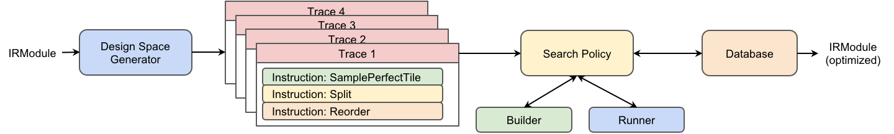

<!--- Licensed to the Apache Software Foundation (ASF) under one -->
<!--- or more contributor license agreements.  See the NOTICE file -->
<!--- distributed with this work for additional information -->
<!--- regarding copyright ownership.  The ASF licenses this file -->
<!--- to you under the Apache License, Version 2.0 (the -->
<!--- "License"); you may not use this file except in compliance -->
<!--- with the License.  You may obtain a copy of the License at -->

<!---   http://www.apache.org/licenses/LICENSE-2.0 -->

<!--- Unless required by applicable law or agreed to in writing, -->
<!--- software distributed under the License is distributed on an -->
<!--- "AS IS" BASIS, WITHOUT WARRANTIES OR CONDITIONS OF ANY -->
<!--- KIND, either express or implied.  See the License for the -->
<!--- specific language governing permissions and limitations -->
<!--- under the License. -->

* Feature Name: Meta Schedule (Formerly AutoTIR)
* Start Date: 2021-05-28
* RFC PR: TBD (apache/tvm-rfcs#0000)
* GitHub Issue: TBD (apache/tvm-rfcs#0000)

## 1. Summary

This proposal introduces Meta Schedule: a scheduling DSL on TIR that unifies the
approaches of AutoTVM and Auto Scheduler (Ansor). Meta schedule provides a pragmatic way to define
the space of automatic tuning, extensibility in terms of all possible TIR schedule primitives like
tensorization and loop partitioning, and customizability on every layer of the automation system.

Meta Schedule is our 3rd generation automatic scheduling system.

## 2. Motivation

**Scheduling and design space.** In TVM TensorIR, optimization of a TensorIR program is done via a
sequence of transformations. For example, reordering loops for better locality and tensorizing for
specific hardware intrinsics. The process of invoking such a set of pre-defined transformations is
called "**scheduling**", and each transformation is called a "**schedule primitive**". These
primitives form a domain-specific language (DSL) describing the transformation of TensorIR programs.
**Design space** is the set of all possible schedulings with respect to a TensorIR program.

### Problems with the current scheduling system

Currently there are have 3 sets of scheduling APIs in TVM:
* **Manual schedule**: Developers optimize their programs by manually invoking schedule primitives,
  i.e. explore points in the design space with humans in the loop. This can be a tedious and
  error-prone approach, hence the creation of AutoTVM and AutoScheduler (Ansor).
* **AutoTVM**: The automation system requires users to define the design space through
  per-operator "schedule templates." Therefore, programmer time is a bottleneck in scaling
  to hundreds of operators across many hardware platforms.
  hardware platforms.
* **AutoScheduler (Ansor)**: It automatically generates schedule templates as the design space,
  according to a set of predefined "search rules". However, it is non-trivial to extend
  AutoScheduler to new schedule primitives (tensorize, loop partition, software pipelining, etc).
* The three systems above have isolated sets of APIs with several layers of their own abstraction,
  which are not only hard to learn, but also engineering-intensive to customize.

### Benefits of Meta Schedule

Meta schedule provides:
* Succinct syntax, consistent APIs to TensorIR schedule with no other layer of abstraction.
* Unified APIs for implementing manual schedules, AutoTVM-style schedules, and AutoScheduler-style
  schedules.
* Extensibility of all the schedule primitives, including tensorization and loop partitioning.
  Almost no extra effort is needed to use a new primitive in auto-tuning.
* The automation infrastructure is extensible on every of its components. Every component of the
  system can be customized easily in pure python or C++ or both. For example, one can develop a new
  design space generator in python, a new ProgramRunner in python, etc.


## 3. Guide-level explanation

Meta Schedule DSL is a flexible way to define or auto-generate the design space.

This section introduces its syntax of meta schedule DSL and usage in terms of describing and
auto-generating the design space, more specifically, its APIs for:
1) Manually constructing a schedule using existing schedule primitives (Section 3.1);
2) Defining composite schedule to simplify the ap sequence of schedule primitives (Section 3.2);
3) Describing a design space of possible schedules,
a.k.a. AutoTVM-style schedule templates (Section 3.3);
4) Automatically generating the design space, a.k.a. Ansor-style search rules (Section 3.4);
5) Mixing the usage of manual schedule, AutoTVM and Ansor-style design space specification in
Meta Schedule (Section 3.5).

### 3.1. Manual Schedule

Meta schedule APIs are almost the same as TE or TensorIR scheduling. Here is an example of a manual
schedule for matrix multiplication:

```python
# Designate a set of tile sizes
i_tiles = [16, 8, 8, 8]
j_tiles = [16, 8, 8, 8]
k_tiles = [256, 8]

# Tile the loops according to the tile sizes
i_0, i_1, i_2, i_3 = sch.split(loop=i, factors=i_tiles)
j_0, j_1, j_2, j_3 = sch.split(loop=j, factors=j_tiles)
k_0, k_1           = sch.split(loop=k, factors=k_tiles)

# Organize the loops into "SSRSRS" 6-level tiles
sch.reorder(
    i_0, j_0, # S: the 1st spatial tile
    i_1, j_1, # S: the 2nd spatial tile
    k_0,      # R: the 1st reduction tile
    i_2, j_2, # S: the 3rd spatial tile
    k_1,      # R: the 2nd reduction tile
    i_3, j_3, # S: the 4th spatial tile
)
```

In this manual scheduling example, the developers tweak the tile sizes and measure the performance of the
generated kernels to explore the opportunities of potential optimization.

Generally speaking, while writing a schedule, there are often some parameters that are hard to
determine ahead of time, for example, tile sizes, unroll steps, or which tensor intrinsics to use.
Developers may manually enumerate possible combinations of these unknown factors, and then pick the
best schedule according to measurement results on their device.

### 3.2. Composite Schedule Rules

As introduced in the previous section, in TensorIR, each schedule primitive handles only a very
basic transformation of the IR. For example, `split` only splits a loop into two new loops. In the
real world, the over-fine granularity of those primitives usually leads to repetitive and verbose
scheduling code. Take the code snippet in the previous section as an example, a sequence of `split`s
are invoked, followed by a `reorder`, and all these together are called "SSRSRS" tiling.

To make it more convenient and modular, users are allowed to register **composite schedules** that apply
a sequence of schedule primitives according to certain analysis of the IR. The word *composite* here
is used against the word *primitive*, which means it is a transformation *composed* of those
*primitives*.

For example, suppose there is a composite schedule called `Inline-All-Elementwise-Operations`, which
inlines all the elementwise computation into their consumers. Applying it to the following TensorIR:

```python
@tvm.script.tir
def example_func(...):
  for i, j in ...:
    with tir.Block("B") ...:
      B[i, j] = A[i, j] + 1
  for i, j in ...:
    with tir.Block("C") ...:
      C[i, j] = B[i, j] + 1
  for i, j in ...:
    with tir.Block("D") ...:
      D[i, j] = C[i, j] + 1

sch = tir.Schedule(example_func)
InlineAllElementwiseOperations().apply(sch, sch.get_block("D"))
print(tvm.script.asscript(sch.mod))
```

The result after applying the composite schedule is:

```python
@tvm.script.tir
def example_func(...):
  for i, j in ...:
    with tir.Block("D") ...:
      D[i, j] = A[i, j] + 1 + 1 + 1
```

### 3.3. AutoTVM-style Design Space Description

Meta schedule extends the schedule DSL with a set of new schedule primitives with randomness,
called **sampling instructions**. These primitives do not transform the TensorIR,
but instead will generate random decisions from specific distributions in each run,
for example, uniformly pick a set of tile sizes of loop within all the possible choices.
When included in a schedule,
the new instructions parameterize the schedule from a single deterministic point
to a space supported by random variables (tile size, etc.),
making it possible for developers to describe the design space with meta schedule APIs.

The matmul example above is extended to cover all possible tilings using these sampling
instructions:

```python
# Sample tile sizes
i_tiles = sch.sample_perfect_tile(i, n=4)  # was: i_tiles = [16, 8, 8, 8]
j_tiles = sch.sample_perfect_tile(j, n=4)  # was: j_tiles = [16, 8, 8, 8]
k_tiles = sch.sample_perfect_tile(k, n=2)  # was: k_tiles = [256, 8]
# Tile the loops according to the random variables
i_0, i_1, i_2, i_3 = sch.split(loop=i, factors=i_tiles)
j_0, j_1, j_2, j_3 = sch.split(loop=j, factors=j_tiles)
k_0, k_1           = sch.split(loop=k, factors=k_tiles)
# Organize the loops into "SSRSRS" 6-level tiles
sch.reorder(
    i_0, j_0, # S: the 1st spatial tile
    i_1, j_1, # S: the 2nd spatial tile
    k_0,      # R: the 1st reduction tile
    i_2, j_2, # S: the 3rd spatial tile
    k_1,      # R: the 2nd reduction tile
    i_3, j_3, # S: the 4th spatial tile
)
```

### 3.4. AutoScheduler-style Design Space Generation

To generate design space, AutoScheduler (Ansor) applies a set of rules to each TE stage.
The rules analyze the TE operations and apply an internal DSL to manipulating its internal IR,
which is in the end mapped to TE schedule primitives. This process is called *sketch generation*.

Composite schedule rules work in a similar way scheduling TensorIR, as introduced in Section 3.2.
It analyzes the TensorIR and apply schedule primitives directly to TensorIR accordingly.
When applying such rules to each TensorIR block in certain order (e.g. Post-DFS Order),
it generates a sequence of schedule primitives.
If the sampling instructions are present in this sequence, 
the support of the probability space form a design space of possible schedulings.
This process is similar to the *sketch generation* phase in AutoScheduler.

Several built-in composite schedule rules are shipped with our system to align with the design
space generated by AutoScheduler:

* Multi-level tiling
* Inline pure spatial blocks
* Parallelize & vectorize & unroll
* Auto tensorize

Developers may implement their own rules in either Python or C++. They may specify which rules to
use with the following syntax:

```python
from tvm import meta_schedule as ms

design_space_generator = ms.PostOrderApply(rules=[
    ms.MultiLevelTiling(...),
    CustomRule(...),
    ms.OtherBuiltinRules(...),
])

```

### 3.5. Unifying manual schedule / AutoTVM / Ansor

This subsection shows that the design space induced by TE manual schedule, AutoTVM and Ansor are
all subsets of meta schedule, and meta schedule further allows mixing those three styles to search
jointly.

- **Manual schedule**. The TE schedule is a special case of a meta schedule program, where there is no
randomness introduced by sampling instructions. It is a single point in terms of design space.
- **AutoTVM (Template-based tuning)**. It is more natural representation of AutoTVM’s schedule
templates (knobs) by writing one or more schedule functions in meta schedule with sampling
instructions. The probability space supported by the sampling instructions is the design space to
be explored.
- **AutoScheduler (Ansor, Template-free tuning)**. As mentioned in the previous section, application
of composite schedule rules generates the design space, which is equivalent to Ansor’s sketch
generation.
- **Mixing styles in design space definition**. By taking union of the spaces induced by the three
special cases, our system allows developers to combine generic rules that Ansor provides and
operator-specific scheduling.

## 4. Reference-level explanation

This section introduces the underlying techniques for the automation system to extract and
explore the design space. The figure below briefly illustrates the workflow of the system:



### 4.1. Execution trace as the design space

**Trace**. To represent the design space defined by the meta schedule DSL, the underlying system
records all the instructions users applied to the schedule class, including sampling and schedule
primitives. This list of instructions a trace is called a trace.

For instance, executing the example above results in the following trace:

```
Instruction 0. Sample-Perfect-Tile
Instruction 1. Sample-Perfect-Tile
Instruction 2. Sample-Perfect-Tile
Instruction 3. Split
Instruction 4. Split
Instruction 5. Split
Instruction 6. Reorder
```

**Trace forms design space.** A trace may contain zero or more sampling instructions, which
introduces the uncertainty in scheduling - one instance of sampling results in one point in the
design space. Therefore, the trace itself forms a design space to explore, e.g. which set of tile
sizes works best on a specific hardware.

**Union of design space**. Our system works on a set of traces, representing the union of the design
spaces represented by every single trace.

**Fork a trace**. When two different decisions in the scheduling process are equally important to
generate high-performance schedules, it is allowed to fork the trace into two, and the design space is
the union of the forked traces.

The trace is not strictly user-facing, but can be accessed and printed with the following syntax:

```python
# requires to trace the execution
sch = tir.Schedule(..., traced=True)
# do a lot of scheduling
...
# print the trace
print(sch.trace)
```

And below is an example of the printed trace, which honestly reflects the schedule as a snippet of
python scheduling function:

```python
b0 = sch.get_block(name="matmul", func_name="main")
l1, l2, l3 = sch.get_loops(block=b0)
v4, v5, v6, v7 = sch.sample_perfect_tile(loop=l1, n=4, max_innermost_factor=16, decision=[32, 1, 16, 2])
v8, v9, v10, v11 = sch.sample_perfect_tile(loop=l2, n=4, max_innermost_factor=16, decision=[64, 4, 2, 2])
v12, v13 = sch.sample_perfect_tile(loop=l3, n=2, max_innermost_factor=16, decision=[64, 16])
l14, l15, l16, l17 = sch.split(loop=l1, factors=[v4, v5, v6, v7])
l18, l19, l20, l21 = sch.split(loop=l2, factors=[v8, v9, v10, v11])
l22, l23 = sch.split(loop=l3, factors=[v12, v13])
sch.reorder(l14, l18, l15, l19, l22, l16, l20, l23, l17, l21)
```

### 4.2. Exploring the Design Space

Meta Schedule provides several built-in exploration strategies to exhaustively or efficiently search
for efficient schedules. Those strategies are mostly supported by re-execute either a function or a
trace with a builtin interpreter in our system, and this process is called **replay**.

#### Random search by replaying schedule functions

With a user-provided schedule function
as a black-box design space generator, our system could repetitively invoke such an opaque TVM
packed function without doing any extra analysis.
If sampling instructions are present in the trace, then scheduling is non-deterministic
(random decisions may not be repeated across runs)
Effectively, it is equivalent to random exploration without trace,
allowing the flexibility for users to define arbitrary functions
that trace may not well support (e.g. control flow divergence based on the value of intermediate
random variables), but it forbids future opportunity of any trace-based analysis.

#### Random search by replaying traces

A builtin interpreter directly replays the traces obtained
from manual schedule, template-based or template-free design space generation.
If sampling instructions are present on the traces,
then their random decisions are mutated during each replay, i.e. jumps to a new point in the
design space. Therefore, repetitive replay of those traces are equivalent to exploration of the
design space. Our system could potentially benefit from trace-based analysis, making the search more
efficient, including rejecting obviously invalid schedules (e.g. using too much CUDA resources),
doing dead-code elimination to simplify a trace, extracting trace-based features used in the cost
model, etc.

#### Cost-model-guided evolutionary search

A more efficient exploration strategy, introduced in the Section 5.1 of Ansor's paper [1].

The evolutionary search strategy requires two extra sets of rules:

* Mutator: defines how to jump to a point’s "neighbor" in the design space
* Postprocessor: after the trace is executed, there are some extra rules we want to execute, for
  example:
  * Check CUDA resource limits: There is a hard requirement in CUDA that the maximum number of
    threads should not exceed 1024, but it is a random variable that cannot be determined before
    actually executing the trace. In this case, we write a postprocessor that errors out when the
    condition is not satisfied.
  * Fuse outer loops until the extent of the fused loops is large enough: The number of outer loops
    to be fused together depends on their extents, which are random variables. In this case, we
    annotate the maximum extent allowed on the block, and do actual fusion in a postprocessor.

Our evolutionary search algorithm uses mutators to find possible schedules in the design space, then
applies postprocessors, and asks the cost model to predict its performance. After several
iterations, the new schedules with the highest scores are finally compiled and measured on device.
Epsilon-greedy is used in this process to balance exploitation and exploration.

### 4.3. Database

All the measure records are serialized and stored in a database. The schema of the database has the
following information:

- The workload, a serialized TensorIR;
- The hardware target where the measure is conducted;
- Argument type: the shapes and dtypes of the input tensors fed to the measured PrimFunc.
This field can be useful for future dynamic-shape workloads;
- The trace, including the schedule primitives used and their corresponding decisions (if any);
- The measured running time;
- The version of the log.

### 4.4. Python-first for flexibility & customizability

The system is implemented in a way that all levels are decoupled and open to customization, aiming
at providing a playground for developers to try out new ideas and potentially deliver performance
quickly.

While all the important APIs are implemented in C++ for efficiency, every part of the system can be
easily switched to customized python implementation. For example,

#### Customize design space in python

The design space can be defined as a python function

```python
def schedule_matmul(sch) -> sch:
    i, j, k = sch.get_loops(sch.get_block("matmul"))
    i_tiles = sch.sample_perfect_tile(i, n=4)
    j_tiles = sch.sample_perfect_tile(j, n=4)
    k_tiles = sch.sample_perfect_tile(k, n=2)
    # Tile the loops according to the random variables
    i_0, i_1, i_2, i_3 = sch.split(loop=i, factors=i_tiles)
    j_0, j_1, j_2, j_3 = sch.split(loop=j, factors=j_tiles)
    k_0, k_1 = sch.split(loop=k, factors=k_tiles)
    # Organize the loops into "SSRSRS" 6-level tiles
    sch.reorder(
        i_0, j_0, # S
        i_1, j_1, # S
        k_0,      # R
        i_2, j_2, # S
        k_1,      # R
        i_3, j_3, # S
    )
    return sch
```

#### Customize composite schedule in python

The system provides two interfaces to define a composite schedule in python, one is more succinct,
and the other is more comprehensive:

Method 1. Derive from `PyCompositeSchedule`, and implement two methods `initialize` and `apply`:

```python
class MultiLevelTiling(PyCompositeSchedule):
    def initialize(...):
        # initialize the class, usually this method is empty
        ...

    def apply(sch: Schedule, block: BlockRV) -> Union[Schedule, List[Schedule]]:
        # write any python code, including:
        # - analyze `block`
        # - invoke schedule primitives in `sch`
        # - do debug printing
        ...
```

Method 2. A decorator as the syntactic sugar if the `initialize` method is empty, which converts the
function to the `apply` method.

```python
@tir.as_composite_schedule(name="multi-level-tiling")
def multi_level_tiling(sch: Schedule, block: BlockRV) -> Union[Schedule, List[Schedule]]:
    # write any python code, including:
    # - analyze `block`
    # - invoke schedule primitives in `sch`
    # - do debug printing
    ...
```

#### Customize exploration strategies in python

Developers can implement any search algorithm in python as well by deriving from `PySearchPolicy`,
and the syntax is identical to customizing with `PyCompositeSchedule`.

#### Other customizable components

This list includes:

* Cost model
* Database
* Measure callbacks
* Feature extractor
* Program builder & runner
* Analysis methods
* ...

In a short summary, almost every component of the system is decoupled with each other and extensions
could be easily plugged in.

## 5. Drawbacks

TBD

## 6. Rationale and alternatives

The system is designed with the principle of minimalism: Assuming users already know TensorIR
scheduling APIs, there is no more extra API set to learn; The previous programs that schedules
TensorIR still work out of box with the meta schedule DSL. It could potentially lower the bar of
adopting this system.

Unifying manual scheduling, AutoTVM's semi automatic templates and AutoScheduler's fully automatic
sketch generation provides flexible way to balance injection new domain knowledge and automation.

Flexibility in customization allows quick try-out on new tasks, new strategies and new hardware
targets without deep knowledge of the system.

## 7. Prior art

**Tensor Expression (TE)** in TVM is a DSL that decouples compute and schedule, which provides
convenient ways to handcraft optimized kernels for different hardware targets.

**TensorIR** is the latest generation of TVM’s low-level IR. Its capability of eagerly applying
schedule primitives opens the door for meta schedule, our proposed new-generation auto scheduling
system.

**AutoTVM** is the 1st generation automation framework in TVM, which requires developers to
implement per-operator scheduling templates, and the system could handle the tuning process.

**AutoScheduler (Ansor)** is the 2nd generation automation framework in TVM, whose built-in rules
could automatically generate schedule templates for almost all the operators on CPU, GPU, etc.

## 8. Unresolved questions

**Supporting Control Flow and Assertions**

Right now the meta schedule DSL does not support control flow. Although there is no report of
real-world use case right now, it is possible that it could appear in some future workloads.

A real-world issue we could see is that sampling may lead to wrong schedules on CUDA, e.g. the
schedule results in a CUDA program that uses too much shared memory, too many threads, etc. In this
case, we need to halt the program immediately. Therefore, introducing assertion may be helpful.

## 9. Future possibilities

**Unifying Manual Scheduling, AutoTVM and Ansor in TOPI**

As described in Section 3.5, meta schedule provides an idiomatic approach to unify the three
existing scheduling APIs in TVM:

* Manual schedules are meta schedules without sampling instructions;
* AutoTVM templates are meta schedules where knobs are replaced by sampling instructions;
* Each of Ansor’s search rules generates a snippet of a meta schedule;
* Mixture of the above three approaches to cover larger design space.

It is future work to unify these existing scheduling APIs on TOPI operators.


[1] Zheng, Lianmin, et al. "Ansor: Generating high-performance tensor programs for deep learning."
14th {USENIX} Symposium on Operating Systems Design and Implementation ({OSDI} 20). 2020.

