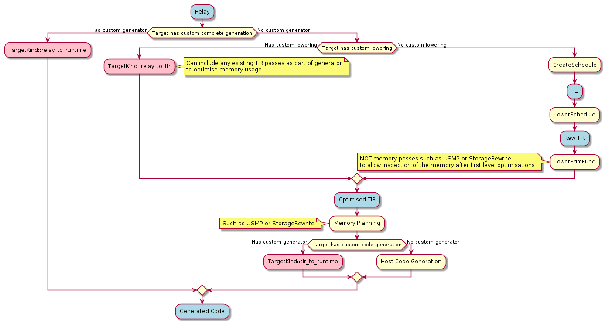

# Summary
[summary]: #summary

In order to enable flexibility in how individual targets are lowered and built within TVM, this RFC proposes supporting additional hooks on the `Target` and that the target becomes the central place for such hooks, for example:

```
TVM_REGISTER_TARGET_KIND("cmsisnn", kDLCPU)
    .set_attr<String>("relay_to_tir", "target.cmsisnn.lower")
    .set_attr<String>("tir_to_runtime", "target.cmsisnn.build");
```

This defines two new hooks as attributes on the target, referencing functions registered into the central TVM registry. In similar fashion, external generators (currently accessed directly in the compile engine) would be grouped with an appropriate `Target` as well:

```
TVM_REGISTER_TARGET_KIND("ethos-n", kDLCPU)
    .set_attr<String>("relay_to_runtime", "relay.ext.ethos-n")
    .set_attr<String>("constant_updater", "relay.ext.ethos-n.constant_updater");
```

Collecting all targets under the `Target` functionality and making it clearer which hooks apply to each target.

# Motivation
[motivation]: #motivation

Currently to introduce an external code generator, the entire compilation pipeline must be recreated; this is necessary for some targets but in the case of simply re-using existing libraries or introducing a function call to use for an operator it can become more than is necessary. It also exists outside of the main `PrimFunc`, meaning it can't be inspected as part of the entire main graph; this limits the effectiveness of techniques such as memory planning. By introducing the hook `relay_to_tir`, which is similar to the default `lower` pass in that it returns TIR, it can be inspected by the memory planner and other analysis passes that only work at the TIR level. If all that is necessary is transforming into a flat `call_extern` (such is the case for the [CMSIS NN Softmax function](https://github.com/ARM-software/CMSIS_5/blob/develop/CMSIS/NN/Source/SoftmaxFunctions/arm_softmax_s8.c#L86)) then this can be left represented as TIR and be collected by the host code generation.

In the more complex case, we still want to take advantage of memory planning by using `relay_to_tir` and inspecting the liveness within the TIR graph, but instead want to generate out more complex calls (such as using the [CMSIS NN Structures](https://github.com/ARM-software/CMSIS_5/blob/def6f800f95661eb3451d317f7d0dde504f6020d/CMSIS/NN/Include/arm_nn_types.h#L81-L90)); the `tir_to_runtime` hook can be used to build our intermediary TIR into a Runtime module similarly to how the existing external code generation works. This allows writing of external code generators that also get the benefits of any intermediary analysis or transformation that TVM offers. Alongside being able to use the analysis passes, code generators can extend from existing host code generators, customising only the generation which is relevant to them and gaining maximum benefit from the existing optimisations made in TVM.

# Guide-level explanation
[guide-level-explanation]: #guide-level-explanation

As a user, you can pick from additional hooks to bypass certain behaviours of the `Target`:
* `relay_to_tir` - Custom lowering direct to TIR
* `tir_to_runtime` - Custom code generation into a runtime module from TIR
* `relay_to_runtime` - Full compilation flow from Relay to a runtime module

To illustrate where the hooks are placed, please refer to the following diagram:



These can be registered on targets using `set_attr`:
```
TVM_REGISTER_TARGET_KIND("cmsisnn", kDLCPU)
    .set_attr<String>("relay_to_tir", "target.cmsisnn.lower")
    .set_attr<String>("tir_to_runtime", "target.cmsisnn.build");

TVM_REGISTER_TARGET_KIND("ethos-n", kDLCPU)
    .set_attr<String>("relay_to_runtime", "relay.ext.ethos-n")
    .set_attr<String>("constant_updater", "relay.ext.ethos-n.constant_updater");
```

## Relay -> TIR
With this change, this path splits, depending on whether you wanted to generate a full `Module` or introduce some specific TIR nodes into the code generation flow; the addition of the `relay_to_tir` hook allows you to write trivial external TIR generators such as calling out to a third party library:
```python
@tvm.register_func("target.woofles.lowering")
def tir_generator(relay_func):
    """A simple TIR generator for testing"""
    ib = tvm.tir.ir_builder.create()
    A = tvm.tir.decl_buffer(shape=(8,8,), dtype=relay_func.params[0].checked_type.dtype)
    B = tvm.tir.decl_buffer(shape=(8,8,), dtype=relay_func.params[0].checked_type.dtype)
    C = tvm.tir.decl_buffer(shape=(8,8,), dtype=relay_func.params[0].checked_type.dtype)
    ib.emit(
        tvm.tir.call_extern('int32', 'woofles', A.data, B.data, 8, 8, C.data)
    )

    prim_func = tvm.tir.PrimFunc([A, B, C], ib.get())
    ir = tvm.lower(prim_func, name=relay_func.attrs["global_symbol"])

    return ir
```
This is then registered on a target:
```
TVM_REGISTER_TARGET_KIND("woofles", kDLCPU)
    .set_attr<String>("relay_to_tir", "target.woofles.lowering");
```

## TIR -> Runtime
Extending from the above, a second hook is introduced to do further transformations from TIR -> Runtime named `tir_to_runtime`, this bypasses the default `target.build.X` and instead uses the registered `tir_to_runtime` build:
```
runtime::Module BuildWooflesHost(IRModule mod, Target target) {
// ... Custom Code generation here
}

TVM_REGISTER_GLOBAL("target.build.woofles").set_body_typed(BuildWooflesHost);
TVM_REGISTER_TARGET_KIND("woofles", kDLCPU)
    .set_attr<String>("tir_to_runtime", "target.build.woofles");
```

# Reference-level explanation
[reference-level-explanation]: #reference-level-explanation

This functionality is an extension of the existing use of `attr::kCompiler` to provide a hint that we can use to lookup attached target attribute, the compile engine and code generation flows can choose to store TIR and/or generate runtime modules based on the registered hooks.

## Relay to TIR Hook
[relay-to-tir-hook]: #relay-to-tir-hook

This can be added into the `compile_engine.cc` by cross referencing the existing `attr::kCompiler` with the `TargetKind` registry:
```
auto code_gen_name = key->source_func->GetAttr<String>(attr::kCompiler).value();
auto target_kind = tvm::TargetKind::Get(code_gen_name).value();
if (target_kind.defined()) {
    auto map = tvm::TargetKind::GetAttrMap<String>("relay_to_tir");
    std::string custom_lowering = map[target_kind];
    auto lowering_function = tvm::runtime::Registry::Get(custom_lowering);
    cache_node->target = key->target;
    cache_node->funcs = (*lowering_function)(key->source_func, key->target);
    return CachedFunc(cache_node);
}
```
By placing this where lowering currently takes place, it means minimal changes to executor code generators as they call into `Lower` in `CompileEngine`.

## TIR to Runtime Hook
[tir-to-runtime-hook]: #tir-to-runtime-hook
Instead of replicating the current external code generation hook, it is proposed that this hook exists in `build_module.cc`:
```
auto target_built_mods = FindFuncsWithTargetBuild(lowered_funcs);
auto ext_mods = executor_codegen_->GetExternalModules();
auto extra_mods = ext_mods->Concat(target_built_mods);
ret_.mod = tvm::codegen::CreateMetadataModule(ret_.params, ret_.mod, extra_mods, GetTargetHost(),
                                                executor_codegen_->GetMetadata());
```
This means the hook is integrated at a higher level and included in the compile flow without executors having to be aware of how these modules exist. See [Relay to TIR Hook](#relay-to-tir-hook) for how the `TargetKind` registry would be used.

## Relay to Runtime Hook
[relay-to-runtime-hook]: #relay-to-runtime-hook
This would replace the existing `relay.ext.<target>` lookup in `compile_engine.cc`, essentially using the same logic as [Relay to TIR Hook](#relay-to-tir-hook) to cross reference with `kCompiler`.

# Drawbacks
[drawbacks]: #drawbacks

* Different hooks are currently dealt with in quite disparate parts of the codebase which are being heavily refactored

# Prior art
[prior-art]: #prior-art

This is all based upon the existing external code generation infrastructure within TVM by placing additional hooks in the same areas as existing external generation. Instead of replicating this with named functions in the `relay.ext.` namespace of the function registry it instead begins to follow the pattern outlined as B1 in https://discuss.tvm.apache.org/t/target-and-attributes/6013/6 by @tqchen.

# Future possibilities
[future-possibilities]: #future-possibilities

In future, this approach enables rapid integration of anything that can be represented in TIR into the main compilation graph; this simplifies the transformation process for a multitude of external libraries.

Alongside this, adding further hooks means external code generation can gain benefits from the normal `lower` and `build` flow in TVM. This then expands to exposing more granular methods in the driver api to leverage the compiler passes in TVM, similar to how they've been exposed in https://github.com/apache/tvm/pull/8110 with `lower_primfunc` and `lower_schedule`. This can is then regulated by the normal Target mechanism to route as appropriate.

Refactoring the target splitting logic into `build_module.cc` alongside any external module generation makes this a first class series of hooks into a simplified compilation flow; this would enable the removal of external generators from executor code generators which currently proxy to `compile_engine.cc`. Eventually this could also be used for CPU/GPU split as a specialisation of a `Target`/`Target`s split.
