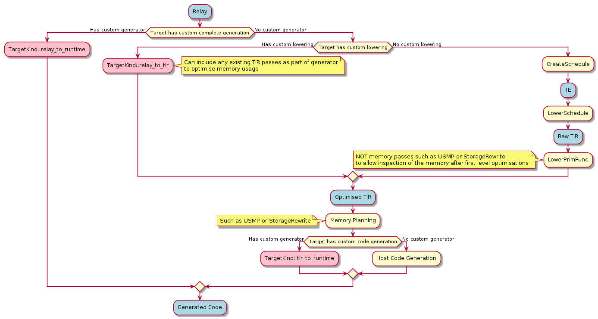

- Feature Name: `Target` registered compiler flow customisation
- Start Date: 2021-07-14
- RFC PR: https://github.com/apache/tvm-rfcs/pull/10
- GitHub Issue: https://github.com/apache/tvm/issues/8589

# Summary
[summary]: #summary

In order to enable flexibility in how individual targets are lowered and built within TVM, this RFC proposes additional hooks on the `Target` and that the target becomes the central place for such hooks, for example:

```c++
using FTVMRelayToTIR = Pass;
using FTVMTIRToRuntime = runtime::TypedPackedFunc<runtime::Module(IRModule, Target)>;

TVM_REGISTER_TARGET_KIND("cmsisnn", kDLCPU)
    .set_attr<FTVMRelayToTIR>("RelayToTIR", CMSISNNLowering)
    .set_attr<FTVMTIRToRuntime>("TIRToRuntime", CMSISNNCodeGen);
```

This defines two new hooks as attributes on the target, referencing functions registered into the central TVM registry. In similar fashion, external code generators (registered under the `relay.ext.` namespace currently) would be grouped with an appropriate `Target` as well:

```c++
using FTVMRelayToRuntime = runtime::TypedPackedFunc<runtime::Module(const Function&)>;
using FTVMConstantUpdater = runtime::TypedPackedFunc<Map<String, runtime::NDArray>(Expr, std::string)>;

TVM_REGISTER_TARGET_KIND("ethos-n", kDLCPU)
    .set_attr<FTVMRelayToRuntime>("RelayToRuntime", EthosNCodeGen)
    .set_attr<FTVMConstantUpdater>("UpdateConstants", EthosNConstantUpdater);
```

Collecting all targets under the `Target` functionality (as opposed to registering additional `Target`s through the function registry using the namespace `relay.ext.`) and makes it clearer which hooks apply to each target.

# Motivation
[motivation]: #motivation

We want to make external code generation (otherwise known as [BYOC](https://tvm.apache.org/docs/dev/relay_bring_your_own_codegen.html)) more modular; instead of going from a Relay `IRModule` to `runtime::Module` in one big step, you can break it into phases and make use of existing transformations between phases.

Currently to introduce an external code generator, the entire compilation pipeline must be recreated; this is necessary for some targets but in the case of simply re-using existing libraries or introducing a function call to use for an operator it can become more than is necessary; to implement an external code generator requires going directly from Relay to a `runtime::Module` and re-implementing any compiler passes and code generation functionality rather than being able to extend upon the existing compiler infrastructure.

The generated `runtime::Module` also exists outside of the main graph, meaning it can't be inspected in combination with other operators; this limits the effectiveness of techniques such as memory planning. By introducing the hook `RelayToTIR`, which is similar to the default `LowerTEPass` in that it returns TIR, it can be inspected by the memory planner and other analysis passes that only work at the TIR level. If all that is necessary is transforming into a flat `call_extern` (such is the case for the [CMSIS NN Softmax function](https://github.com/ARM-software/CMSIS_5/blob/develop/CMSIS/NN/Source/SoftmaxFunctions/arm_softmax_s8.c#L86)) then the hook may simply return that TIR to be collected by the host code generation.

In the more complex case, we still want to take advantage of memory planning by using `RelayToTIR` and inspecting the liveness within the TIR graph, but instead want to generate out more complex calls (such as using the [CMSIS NN Structures](https://github.com/ARM-software/CMSIS_5/blob/def6f800f95661eb3451d317f7d0dde504f6020d/CMSIS/NN/Include/arm_nn_types.h#L81-L90)); the `TIRToRuntime` hook can be used to build our intermediary TIR into a Runtime module similarly to how the existing external code generation works. This allows writing of external code generators that also get the benefits of any intermediary analysis or transformation that TVM offers. Alongside being able to use the analysis passes, code generators can extend from existing host code generators, customising only the generation which is relevant to them and gaining maximum benefit from the existing optimisations made in TVM.

# Guide-level explanation
[guide-level-explanation]: #guide-level-explanation

As a user, you can pick from additional hooks to bypass certain behaviours of the `Target`:
* `RelayToTIR` - Customize the lowering flow to TIR
* `TIRToRuntime` - Customize code generation into a runtime module from TIR
* `RelayToRuntime` - Full compilation flow from Relay to a runtime module

To illustrate where the hooks are placed, please refer to the following diagram:



These can be registered on targets using `set_attr`:

```c++
TVM_REGISTER_TARGET_KIND("cmsisnn", kDLCPU)
    .set_attr<FTVMRelayToTIR>("RelayToTIR", CMSISNNLowering)
    .set_attr<FTVMTIRToRuntime>("TIRToRuntime", CMSISNNCodeGen);

TVM_REGISTER_TARGET_KIND("ethos-n", kDLCPU)
    .set_attr<FTVMRelayToRuntime>("RelayToRuntime", EthosNCodeGen)
    .set_attr<FTVMConstantUpdater>("UpdateConstants", EthosNConstantUpdater);
```

## Relay -> TIR
With this change, this path splits, depending on whether you wanted to generate a full `Module` or introduce some specific TIR nodes into the code generation flow. The `RelayToTIR` hook is a full `IRModule` `Pass` which expects that `Function`s will either be annotated with `kTarget` or `kCompiler` as part of a previous `Pass`, and the resultant `IRModule` is also expected to have any created `PrimFunc`s annotated. The addition of the `RelayToTIR` hook allows you to write trivial external TIR generators such as calling out to a third party library:

```c++
void CallExternalLibraryInTIR(const GlobalVar& new_global_var, const Function& func) {
    tir::Buffer x_buffer = tir::decl_buffer({8}, DataType::Float(32), "x");
    tir::Var x_var("x", DataType::Handle());

    Map<String, ObjectRef> dict_attrs;
    dict_attrs.Set("global_symbol", new_global_var->name_hint);
    dict_attrs.Set("tir.noalias", Bool(true));

    Map<tir::Var, tir::Buffer> buffer_map = {{x_var, x_buffer}};
    tir::Stmt body =
        tir::Evaluate(tvm::tir::Call(DataType::Int(8), tir::builtin::call_extern(), {x->data}));

    tir::PrimFunc replacement_func = tir::PrimFunc({x_var}, body, VoidType(),
                                                    buffer_map, DictAttrs(dict_attrs));
    replacement_func = WithAttr(replacement_func, ::tvm::attr::kTarget, host_target_);
    ir_module_->Add(new_global_var, replacement_func);
}
```

This is then registered on a target:

```c++
TVM_REGISTER_TARGET_KIND("woofles", kDLCPU)
    .set_attr<FTVMRelayToTIR>("RelayToTIR", relay::contrib::woofles::RelayToTIR());
```

The signature for this hook is as the same as any other `Pass`, which takes an `IRModule` with `Function`s and returns an `IRModule` with transformed `PrimFunc`s. The registered `RelayToTIR` `Pass` is responsible for both establishing the `PrimFunc` definitions (with any caching) and rewriting Relay calls to those functions. At this time we feel it's not worth worrying about code sharing between different custom passes.

## TIR -> Runtime
Extending from the above, a second hook is introduced to do further transformations from TIR -> Runtime named `TIRToRuntime`, this bypasses the default `target.build.X` and instead uses the registered `TIRToRuntime` build:

```c++
runtime::Module BuildWooflesHost(IRModule mod, Target target) {
// ... Custom Code generation here
}

TVM_REGISTER_TARGET_KIND("woofles", kDLCPU)
    .set_attr<FTVMTIRToRuntime>("TIRToRuntime", BuildWooflesHost);
```

Notably the generation hook is passed the unified `IRModule` and is responsible for plucking the `Target` relevant functions into the eventual `runtime::Module`.

# Reference-level explanation
[reference-level-explanation]: #reference-level-explanation

This functionality is an extension of the existing use of `attr::kCompiler` to provide a hint that we can use to lookup attached target attribute, the compiler and code generation flows can choose to store TIR and/or generate runtime modules based on the registered hooks.

## Relay to TIR Hook
[relay-to-tir-hook]: #relay-to-tir-hook

This can be added before the `LowerTEPass`, as a `Pass` which iterates over `Target`s and transforming the relevant functions which will then be skipped by the `Function`-level passes until the `PrimFunc` passes begin:


```c++
for (Target target : targets_) {
    auto target_kind = target->kind;
    auto map = tvm::TargetKind::GetAttrMap<FTVMRelayToTIR>("RelayToTIR");
    if (map.count(target_kind)) {
        ir_mod = map[target_kind](ir_mod, pass_context);
    }
}
```

By placing this above the `LowerTEPass`, this means any functions which are not processed in this way can be processed by the default lowering without interfering with `LowerTEPass`. To achieve this initially `kCompiler` would be used to carry the relevant target information, but the goal is to ensure all `Target`s are visible as `kTarget`.

```c++
return tvm::transform::Sequential({tvm::relay::transform::RelayToTIRTargetHook(), // Additional Pass to call RelayToTIR
                                    tvm::transform::CreateModulePass(pass_func, 0, "LowerTE", {}),
                                    InferType()});
```

## TIR to Runtime Hook
[tir-to-runtime-hook]: #tir-to-runtime-hook
It is proposed that this hook is implemented as part of `codegen.cc` as a direct override of the code generation:

```c++
runtime::Module Build(IRModule mod, Target target) {
  if (transform::PassContext::Current()
          ->GetConfig<Bool>("tir.disable_assert", Bool(false))
          .value()) {
    mod = tir::transform::SkipAssert()(mod);
  }

  if (target->kind->HasHook("TIRToRuntime")) { // Hooked here for Codegen
      return target->kind->GetAttr<FTVMTIRToRuntime>("TIRToRuntime")(mod, target);
  }

  // the build function.
  std::string build_f_name = "target.build." + target->kind->name;
  const PackedFunc* bf = runtime::Registry::Get(build_f_name);
  ICHECK(bf != nullptr) << build_f_name << " is not enabled";
  return (*bf)(mod, target);
}
```
See [Relay to TIR Hook](#relay-to-tir-hook) for how the `TargetKind` registry would be used.

## Relay to Runtime Hook
[relay-to-runtime-hook]: #relay-to-runtime-hook
This would replace the existing `relay.ext.<target>` lookup in `te_compiler.cc` with a `Pass` which runs beforehand, essentially using the same logic as [Relay to TIR Hook](#relay-to-tir-hook) to cross reference with `kCompiler`.

```c++
return tvm::transform::Sequential({tvm::relay::transform::RelayToTIRTargetHook(),
                                    tvm::relay::transform::RelayToRuntimeTargetHook(), // Additional Pass to call RelayToRuntime
                                    tvm::transform::CreateModulePass(pass_func, 0, "LowerTE", {}),
                                    InferType()});
```
# Drawbacks
[drawbacks]: #drawbacks

* Different hooks are currently dealt with in quite disparate parts of the codebase which are being heavily refactored
* Introducing custom TIR has the potential to add edge cases to the compiler which may uncover new bugs

# Prior art
[prior-art]: #prior-art

This is all based upon the existing external code generation infrastructure within TVM by placing additional hooks in the same areas as existing external generation. Instead of replicating this with named functions in the `relay.ext.` namespace of the function registry it instead begins to follow the pattern outlined as B1 in https://discuss.tvm.apache.org/t/target-and-attributes/6013/6 by @tqchen.

# Future possibilities
[future-possibilities]: #future-possibilities

In future, this approach enables rapid integration of anything that can be represented in TIR into the main compilation graph; this simplifies the transformation process for a multitude of external libraries.

Alongside this, adding further hooks means external code generation can gain benefits from the normal `lower` and `build` flow in TVM. This then expands to exposing more granular methods in the driver api to leverage the compiler passes in TVM, similar to how they've been exposed in https://github.com/apache/tvm/pull/8110 with `lower_primfunc` and `lower_schedule`. This can is then regulated by the normal Target mechanism to route as appropriate.

Refactoring the target splitting logic into `build_module.cc` alongside any external module generation makes this a first class series of hooks into a simplified compilation flow; this would enable the removal of external generators from executor code generators which currently proxy to `te_compiler.cc`. Eventually this could also be used for CPU/GPU split as a specialisation of a `Target`/`Target`s split.
