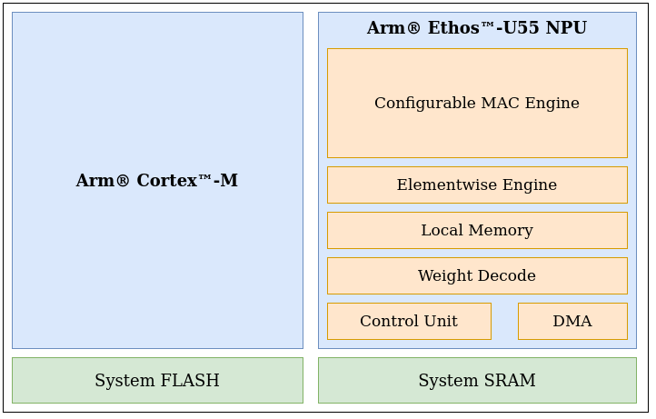
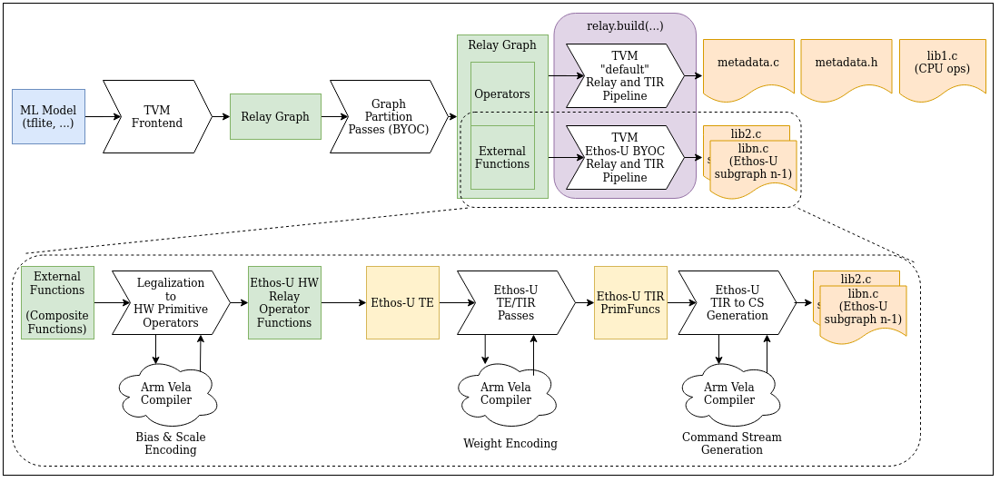

    Feature Name: Arm® Ethos™-U Integration
    Start Date: 2020 May
    RFC PR: https://github.com/apache/tvm-rfcs/pull/11
    GitHub Issue: https://github.com/apache/tvm/issues/8482

# Motivation

Arm® Ethos™-U is a series of Neural Processing Units (NPUs) that will enable low-cost and highly efficient AI solutions for a wide range of embedded devices. This RFC introduces the port of the NPU into the microTVM compilation flow. The process of compilation relies on the multiple levels of abstraction in TVM and a variety of analysis and optimisation passes to produce c output. In the process of compilation, we rely on the many levels of TVM's Intermediate Representation (and the passes) to perform optimizations to create c-sources that can work with current microTVM deployments.

## Scope:

### Ethos™-U55



Ethos™-U55 is a NPU that is designed to uplift ML performance by working as an offload target for micro-controllers. It can accelerate quantized ML operators such as Convolution2D, Depthwise Convolution, Pooling and Elementwise Operators.  For convolution-type operators, NPU supports hardware enabled loseless de-compression of weights to increase inference performance and reduce power.

The scope for this RFC is to add support for offloading to the Arm® Ethos™-U55 NPU. The initial machine learning framework that we use for testing this is TensorFlow Lite. Future RFCs and pull requests will address additional NPUs such as the Ethos™-U65, optimization to the compilation pipeline and other frameworks as the port evolves.

Please refer to [Technical Reference Manual (TRM)](https://developer.arm.com/documentation/102420/0200) for more details.
* Reference : https://www.arm.com/products/silicon-ip-cpu/ethos/ethos-u55

# Guide-level explanation

## TVMC User Interface
```
tvmc compile my_model.tflite 
--executor=aot \
--output-format=mlf \ 
--target="ethos-u --accelerator-config=ethos-u55-xxx",c" ---> Model Library Format

# where xxx indicate the possible variant of the accelerator that can take values : [32, 64, 128, 256]
```

The users should be able to use the above command to compile to NPU that would generate [Model Library Format(MLF)](https://github.com/apache/tvm/blob/main/docs/dev/model_library_format.rst) output.

## Design Architecture Overview



We rely on the graph partitioning infrastructure in Relay (commonly known as BYOC) to integrate the Relay and TIR pass pipeline to generate c-source artifacts that could be used in an embedded deployment environment. Therefore, the generated c-sources are expected to be bundled with AOT executor in the Model Library Format (MLF) tarball. The embedded user can easily use MLF.tar as he/she would use it with the AOT executor in a typical embedded environment.

### Why are the operators lowered to TIR before runtime.Module is created ?

The two main reasons are as follows :

#### Cascading-style performance and memory optimizations :

Given the deterministic nature of the hardware, we intend to utilize the the TVM's scheduling language to perform inter and intra operator optimizations to reduce memory footprint while maintaining good performance.

Please refer to this discuss post for more information : https://discuss.tvm.apache.org/t/rfc-cascade-scheduling/8119/8

#### Unified static memory planning :

The NPU is aimed at running with microTVM. Therefore,  as with typical usecases of microTVM, NPU will require aggressive memory optimizations by sharing buffers with intermediaries used by the CPU.
We envision a flow to expose the TIR generated by codegen to future unified static memory planner to be optimized. 

For more information about the proposed unified static memory planner, please refer to the [RFC](https://github.com/apache/tvm-rfcs/pull/9)

# Reference-level explanation

## Compilation flow

### C1. TVM Frontend and Partitioning

The Relay graph as lowered from the TVM's frontend will be partitioned into subgraphs via running AnnotateTarget, MergeCompilerRegions and PartitionGraph Relay passes. Therefore, this procedure will result in the creation of "external" Relay functions that are re-directed to NPU Relay and TIR pass pipeline for the creation of c-source as stated above.

```
# A Partitioned IRModule for Conv2D

def @main(%input: Tensor[(1, 300, 300, 3), int8]) -> Tensor[(1, 298, 298, 32), int8] {
    @ethosu_0(%input) /* ty=Tensor[(1, 298, 298, 32), int8] */
}

def @ethosu_0(%ethosu_0_i0: Tensor[(1, 300, 300, 3), int8], Compiler="ethosu", ...) {
    %2 = fn (%FunctionVar_0_0: Tensor[(1, 300, 300, 3), int8],
                PartitionedFromPattern="qnn.conv2d_nn.bias_add_qnn.requantize_",
                Composite="ethosu.qnn_conv2d") {
        %0 = qnn.conv2d(%FunctionVar_0_0, meta[relay.Constant][0], -26, ...);
        %1 = nn.bias_add(%0, meta[relay.Constant][2], axis=3);
        qnn.requantize(%1, meta[relay.Constant][3], 0, 12341.8f, 0, out_dtype="int8")
    };
    %2(%ethosu_0_i0)
}
```


### C2. Relay Legalization to Ethos™-U NPU HW Primitive operations.

In the design, we have decided to introduce TEs that closely describes the compute of each primitive operation that the hardware can natively execute – that we define as Ethos™-U NPU HW primitive operations in their own Relay operators. The rationale behind adding new relay operations are that they represent a pattern of conventional relay operations that is executed atomically in the hardware. 

Moreover, there are many Relay operators that could be lowered to the  HW primitives (e.g., dense could be legalized to a conv2d operator). This component will legalize the external Relay function to HW primitive operations.

The NPU supports per-channel quantization through via encoding a scale with each bias value. Thus, the weight scales are converted to that format and packed with the biases. Thereafter, the packed bias and scales are made to a constant input to the Relay operator. The weights are not compressed at this stage, they are compressed later in the subsequent TIR lowering phase.

For more details, please refer to : https://developer.arm.com/documentation/102420/0200

```
# This is the above partitioned function legalized to ethosu.conv2d operator.

fn (%ethosu_0_i0: Tensor[(1, 300, 300, 3), int8], ..., global_symbol="ethosu_0", Primitive=1) {
    contrib.ethosu.conv2d(%ethosu_0_i0, meta[relay.Constant][0], meta[relay.Constant][1], -26, ...)
}
```


### C3. NPU TE/TIR Compiler Passes

At this stage, we should have a TE representation of all HW primitive operations that belong to the offloaded function. We will be scheduling the TE representation to TIR Primfunc that describes the intermediary storage and hardware operations that needed to be executed. In future, we are intending to add more TE/TIR passes make the NPU TE/TIR compiler perform memory and performance optimizations (See https://discuss.tvm.apache.org/t/rfc-cascade-scheduling/8119) . Therefore, its vital to have all the operations represented in TE/TIR. Its important to note that the hardware requires weights to be 'encoded' in a certain way to be readable by the hardware. Therefore, the weight encoding is performed here and represented in the TIR primfunc with post-encoding sizes as buffers.

```
primfn(placeholder_1: handle, placeholder_2: handle, placeholder_3: handle, ethosu_write_1: handle) -> ()
    attr = {"global_symbol": "main", "tir.noalias": True}
    buffers = {buffer: Buffer(buffer_2: Pointer(uint8), uint8, [320], []),
                placeholder: Buffer(placeholder_4: Pointer(int8), int8, [1, 300, 300, 3], []),
                buffer_1: Buffer(buffer_3: Pointer(uint8), uint8, [1312], []),
                ethosu_write: Buffer(ethosu_write_2: Pointer(int8), int8, [1, 298, 298, 32], [])}
    buffer_map = {placeholder_3: buffer, ethosu_write_1: ethosu_write, placeholder_2: buffer_1, placeholder_1: placeholder} {
    attr [placeholder.global: Pointer(uint8)] "storage_scope" = "global";
    allocate(placeholder.global, uint8, [1312]);
    attr [placeholder.d.global: Pointer(uint8)] "storage_scope" = "global";
    allocate(placeholder.d.global, uint8, [320]) {
        @tir.call_extern("ethosu_copy", (uint8*)buffer_3[0], 1312, (uint8*)placeholder.global[0], dtype=handle)
        @tir.call_extern("ethosu_copy", (uint8*)buffer_2[0], 320, (uint8*)placeholder.d.global[0], dtype=handle)
        @tir.call_extern("ethosu_conv2d", "int8", 300, 300, 3, 300, 0, 300, (int8*)placeholder_4[0], ...)
    }
}
```

### C4. Translating TIR Primfuncs to C-sources that call to the driver APIs to perform the execution.

The hardware is used from the host CPU via invoking a driver API call with a command stream (a hardware specific binary artifact) that describes the hardware operators that need to execute. This component will use the TIR Primfunc to extract the hardware operators and buffer information. Thereafter, we'll be using Arm® Vela (https://pypi.org/project/ethos-u-vela/) compiler's backend python APIs to convert the TIR Primfunc to a command stream. Finally, the generated command stream will be wrapped in a c-source that invokes it using the driver APIs.

```
#include <stdio.h>
#include <stdlib.h>
#include <dlpack/dlpack.h>
#include <tvm/runtime/crt/module.h>

static const size_t weights_size = 1632;
static const size_t scratch_size = 1632;
// Update linker script to place weights_sec and cms_data_sec in memory that can be accseed by the hardware
__attribute__((section("weights_sec"), aligned(16))) static int8_t weights[1632] = "\xc1\x1a...";
__attribute__((section("cms_data_sec"), aligned(16))) static int8_t cms_data_data[396] = "\x43\x4f...";
static const size_t cms_data_size = sizeof(cms_data_data);

static int32_t ethosu_0_(int8_t* in0, size_t in0_size, int8_t* out0, size_t out0_size) {
    int num_tensors = 5;
    void* cms_data = (void*)(cms_data_data);
    int64_t device_type = kDLCPU;
    int64_t device_id = 0;
    int8_t* scratch = (int8_t*) TVMBackendAllocWorkspace(device_type, device_id, (uint64_t)scratch_size, 0, 16);
    size_t base_addrs_size[num_tensors];
    uint64_t base_addrs[num_tensors];
    
    base_addrs[0] = (uint64_t)(weights);
    base_addrs_size[0] = weights_size;
    base_addrs[1] = (uint64_t)(scratch);
    base_addrs_size[1] = scratch_size;
    base_addrs[2] = (uint64_t)(scratch);
    base_addrs_size[2] = scratch_size;
    base_addrs[3] = (uint64_t)(in0);
    base_addrs_size[3] = in0_size;
    base_addrs[4] = (uint64_t)(out0);
    base_addrs_size[4] = out0_size;
    
    struct ethosu_driver *drv = ethosu_reserve_driver();
    int32_t result = ethosu_invoke_v3(drv, cms_data, cms_data_size, base_addrs, base_addrs_size, num_tensors);
    ethosu_release_driver(drv);
    TVMBackendFreeWorkspace(device_type, device_id, scratch);
    if (result != 0) {
        return -1;
    } else {
        return 0;
    }
}

// Wrapper function is provided to allow for easier debugging
inline static int32_t ethosu_0_wrapper_(DLTensor* arg0, DLTensor* out0) {
    size_t input_data_size = 270000;
    size_t output_data_size = 2841728;
    return ethosu_0_((int8_t*)(arg0->data), input_data_size, (int8_t*)(out0->data), output_data_size);
}

TVM_DLL int32_t ethosu_0(TVMValue* args, int* type_code, int num_args, TVMValue* out_value, int* out_type_code) {
    DLTensor* arg0 = (DLTensor*)(((TVMValue*)args)[0].v_handle);
    DLTensor* ret1 = (DLTensor*)(((TVMValue*)args)[1].v_handle);
    return ethosu_0_wrapper_(arg0,ret1);
}
```

## Build system

The only dependency of TVM compilation for Ethos™-U NPU is using [Arm® Vela compiler](https://pypi.org/project/ethos-u-vela/).
However, to run inferences with the sources generated by TVM, we would need to use the [Ethos™-U NPU core driver](https://git.mlplatform.org/ml/ethos-u/ethos-u-core-driver.git/about/). The user is expected to include the necessary sources if they were looking to use this bare-metal.

## Testing

Firstly, we will be providing unit tests for the components described above.

Secondly, we are planning to use [Arm® Corstone™-300 reference system](https://developer.arm.com/ip-products/subsystem/corstone/corstone-300) in the CI to be able to simulate the codegen'd artifacts of TVM on a SoC that has Arm® Cortex™-M55 and Ethos™-U55.

We will be providing end-to-end tests in two categories :

* Operator tests :  single operator tests will be executed.
* Network tests : a few interested networks will be executed.

We are introducing a test_runner application that uses the [AoT executor](https://discuss.tvm.apache.org/t/implementing-aot-in-tvm/9206). Moreover, the included test_runner application would be a harness that could serve as a sample application for inferences on the hardware.

## Code location

    python/tvm/relay/backend/contrib/ethosu/ – Main directory that holds the relay legalization passes, TIR to Command Stream translation and the integration of the codegen.
        python/tvm/relay/backend/contrib/ethosu/op – The definition of NPU relay operators
        python/tvm/relay/backend/contrib/ethosu/te – The TE compute definitions of NPU relay operators
        python/tvm/relay/backend/contrib/ethosu/tir – The TIR compiler for performance and memory optimization of NPU Relay operators

    src/relay/backend/contrib/ethosu/ – C++ sources for implementation of passes (where compile-time performance is critical) and the generation of C-source module.
    tests/python/contrib/test_ethosu/ – The test directory

# Upstreaming Plan

The scope for the initial upstreaming is adding support for Conv2D offloading to the NPU. Please refer to the [tracking issue](https://github.com/apache/tvm/issues/8482).


Once the initial PRs are landed – we are planning to improve operator coverage.