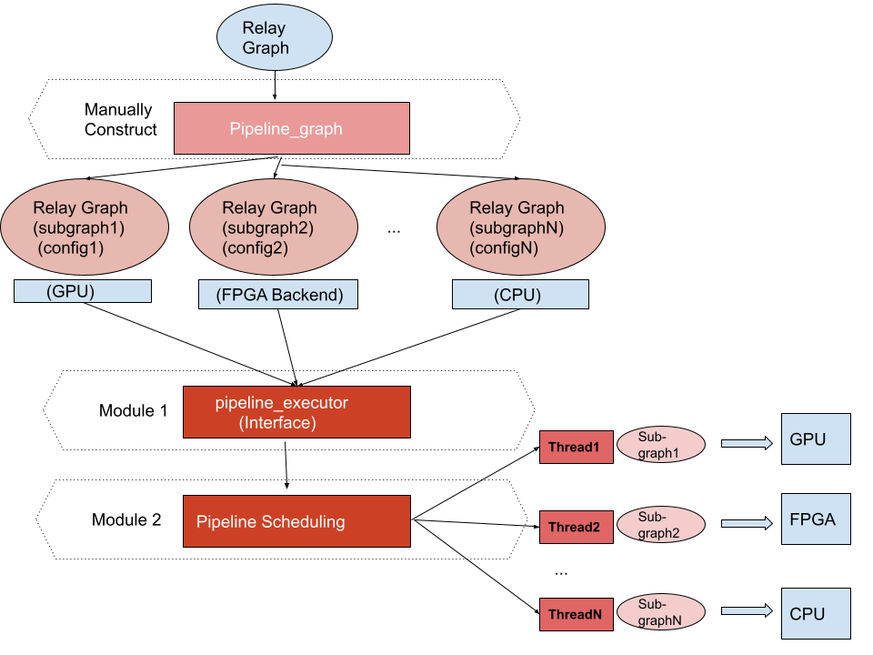
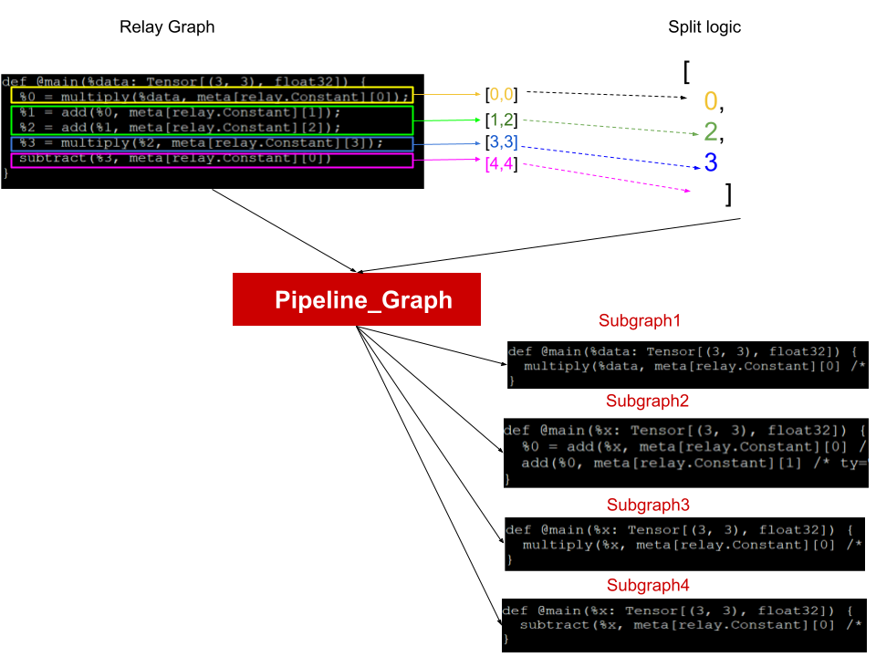
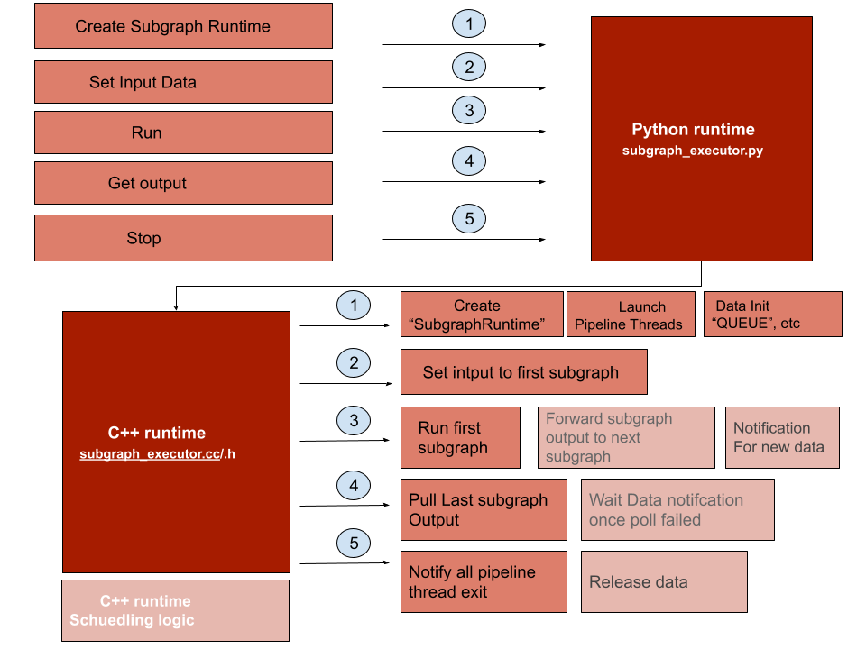
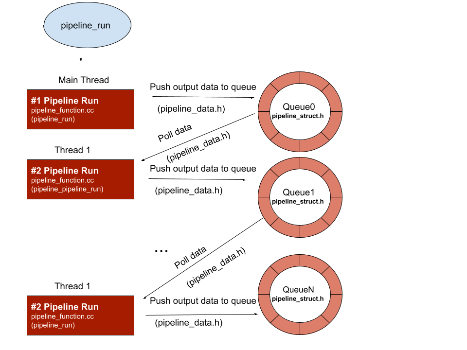
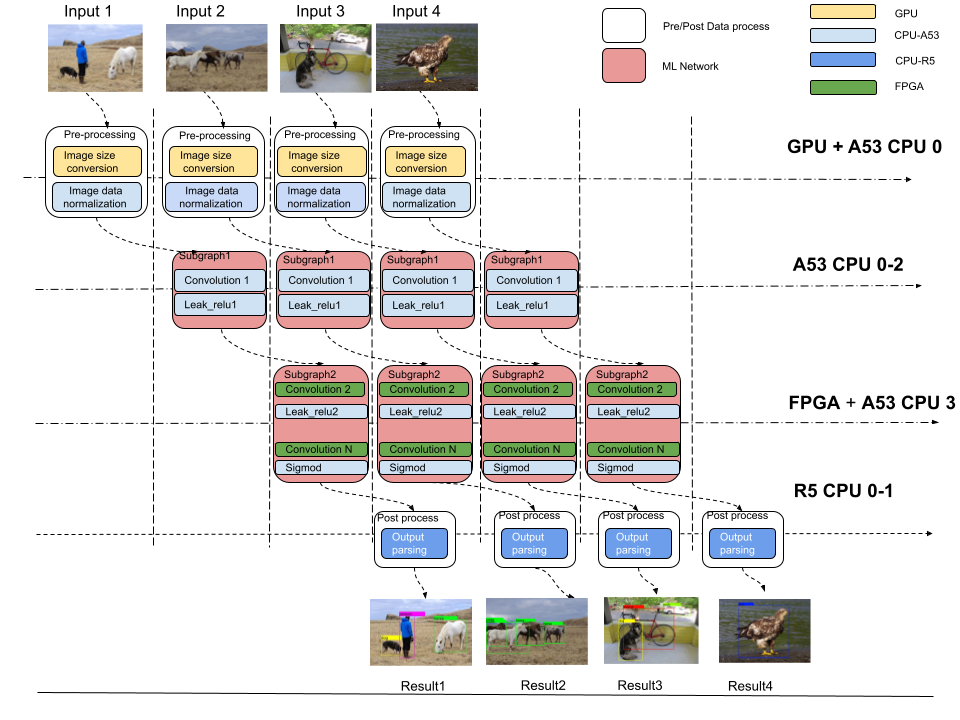

<!--- Licensed to the Apache Software Foundation (ASF) under one -->
<!--- or more contributor license agreements.  See the NOTICE file -->
<!--- distributed with this work for additional information -->
<!--- regarding copyright ownership.  The ASF licenses this file -->
<!--- to you under the Apache License, Version 2.0 (the -->
<!--- "License"); you may not use this file except in compliance -->
<!--- with the License.  You may obtain a copy of the License at -->

<!---   http://www.apache.org/licenses/LICENSE-2.0 -->

<!--- Unless required by applicable law or agreed to in writing, -->
<!--- software distributed under the License is distributed on an -->
<!--- "AS IS" BASIS, WITHOUT WARRANTIES OR CONDITIONS OF ANY -->
<!--- KIND, either express or implied.  See the License for the -->
<!--- specific language governing permissions and limitations -->
<!--- under the License. -->
- Feature Name: Pipeline Executor
- Start Date: 2021-07-30
- RFC PR: [apache/tvm-rfcs#0014](https://github.com/apache/tvm-rfcs/pull/0014)
- GitHub Issue: [apache/tvm#8596](https://github.com/apache/tvm/issues/8596)

## 1. Summary


This proposal introduces Pipeline Executor: A runtime executor that schedules
a list of Relay modules in pipeline to achieve task level parallelism to improve
computation throughput.

## 2. Motivation


Currently more and more edge device inference deployments happen on SOC devices.
Since SOC devices have heterogeneous chipset like GPU, FPGA, CPU, DSP, etc. To reach the best
performance, there is a requirement to run an ML network in these heterogeneous chipsets.
However, currently graph executor does not have parallelism logic, and the existing data parallelism
solution only supports parallel on homogeneous chipset(device). Then, the only way to do batch processing
on heterogeneous devices with TVM is to treat a whole ML network as a schedule unit and run it on
different heterogeneous devices, but that would cause latency issue (low speed chipset becomes the
latency bottleneck for single data processing).

Therefore, we need a runtime executor that can provide parallel scheduling functionality
with a finer-grained schedule unit like subgraph (a group of operator with dependency relation)
to be more efficient to use SOC heterogeneous hardware resource to achieve a better performance.


### Benefits of Pipeline Executor

There are three benefits for Pipeline Executor

Pipeline Executor provides:
* Compute a single network on multiple backends in parallel to improve performance.

* Use RPC to perform distributed computation cross multiple remote devices.

* Pipeline executor provide the capability to integrate non-DNN model function.

## 3. Guide-level explanation
Pipeline Executor is a runtime executor which implements pipeline execution logic for multiple
subgraphs and relies on graph_executor for operator storage and execution.

This section introduces the use case for Pipeline Executor.

* 1. Manually split/partition Relay module to a list of Relay modules and generate modules configuration (automatic module splitting is out of scope of this RFC and will be a future work).
* 2. Use pipeline_executor to build a pipeline module with the subgraphs and configuration.
* 3. Use pipeline_executor to load the pipeline module to run network in pipeline parallelism mode.

### 3.1. Manually Split relay module a list relay modules and generate modules configuration.

```python

mod1, mod2, mod3 = my_manual_partitioner(mod)
pipe_cfg = PipelineModuleConfig()

# Define pipeline inputs. Here I assume two inputs of mod1 and one input of mod3 are the pipeline inputs.
pipe_cfg.inputs["data_0"] = (mod1, "data_0")
pipe_cfg.inputs["data_1"] = (mod1, "data_1")
pipe_cfg.inputs["data_2"] = (mod3, "data_0")

# Define pipeline outputs to be the first output of mod3.
pipe_cfg.outputs.append((mod3, 0))

# Define connections.
pipe_cfg.connect(mod1, 0, mod2, "data_0") # mod1.output(0) -> mod2.data_0
pipe_cfg.connect(mod2, 0, mod3, "data_1") # mod2.output(0) -> mod3.data_1

# Print config for debugging
print(str(pipe_cfg))
# Inputs:
#   |- data_0: mod1.data_0
#   |- data_1: mod1.data_1
#   |- data_2: mod3.data_0
# Outputs:
#   |- mod3.output(0)
# Connections:
#   |- mod1.output(0) -> mod2.data_0
#   |- mod2.output(0) -> mod3.data_1


```

### 3.2. Use pipeline_executor to build pipeline module with the said subgraph and configuration.

The interface is mostly the same as the graph executor but accepts a pipeline configuration instead of a Relay module. Here is an example.

```python

# Use the config to build a pipeline executor
with relay.build_config(opt_level=3):
    lib = pipeline_executor.build_pipeline(pipe_cfg)

```

### 3.3. Use pipeline_executor to load pipeline module to run network in pipeline parallism mode.

Pipeline executor works asynchronously. Unlike the graph executor that launches a task by calling a blocking
`run` API, we can kick off a task by calling a non-blocking `set_input` API in pipeline executor:

set_input: queue the input in the buffer.
run: run with the input at the front.
set_input: queue the input in the buffer.
run: run with the input at the front.
get_output
set_input: queue the input in the buffer.
run: run with the input at the front.
get_output
get_output

`get_output` can be called anytime, and it will return an empty array if no output is ready.

following is one example

```python
#...

datas = []
for _ in range(5):
    # Each data includes 3 tensors (i.e., data_0, data_1, data_2 for the pipeline).
    datas.append([np.full(shape[i], 0).astype("float32") for i in range(3)])

# Feed all available inputs.
for data in datas:
    pipeline_module.set_input("data_0", data[0])
    pipeline_module.set_input("data_1", data[1])
    pipeline_module.set_input("data_2", data[2])
    pipeline_module.run()

# Get all outputs.
while pipeline_module.has_next_output():
  pipeline_outputs.append(pipeline_module.get_output())

```

## 4 Reference-level explanation
This section introduces the underlying techniques for the pipeline executor.
The figure below briefly illustrates the workflow of the system

Pipeline executor architecture


Manually construct the subgraph


How pipeline executor runtime work


The pipeline executor schedule logic


The network pipeline compute effect



## 5. Drawbacks


Pipeline executor currently needs manually subgraph splitting and configuration construction.
Further graph splitting feature would do automatically split.

## 6. Rationale and alternative


whithout pipeline executor, current tvm still can run network in Heterogeneous hardware but
that running is serialized instead of parallel run operator in different hardware


## 7. Prior art


**Schedule Primtive like Vectorize etc** the schedule primtive implement data parallism
on same device.

## 8. Unresolved questions


Automatically split compute graph

## 9. Future possibilities

### Using Automatic Graph Split feature to construct pipeline subgraph and configuration.

This feature not in this RFC scope. the logic as following.

this future solution include 3 steps, 1. Operator Auto tune, 2. Graph dependency tree build and balance, 
3. Graph Auto Tune. following are more detail.

#### 1. Operator Auto Tune :

* a. In operator Auto tune tune section, user would using existing tuning logic to tune the every operator,
but the tune would separately and serialized happen in all target involved by pipeline executor.

* b. After operator tune done , here can get performance data, for example , con2d_0 best perf in
GPU is 3ms, in VTA is 2ms etc, this perf data would get used in later Graph dependency tree build
balance step.

#### 2. Graph dependency tree build balance

* a. Initialize a DAG, the node of the DAG is subgraph, initially for a N node DAG, first [1, N -1] node mapping to
[1 , N-1] layer(compute density operator and others) of original compute graph, the number N node is
mapping to [N, M] layer , M here is the original compute layer number.

* b. by using the perf data generated in 3.1.1.b , every dependency tree node can get a time consume value,
the time consume value for difference node not at beginning is not same, then we call this DAG is not balanced in 
weight of node, by using the way to adjust the node(subgraph) scope(how many operator in this node), we make
every node of the DAG become same or value closed on weight(same time consume), then such DAG is a graph split
solution,
here we use DAG is to record the parent/child relation that child only can run after parent runned, and the scope
adjustment only can hapen between parent and child.

#### 3. Graph Auto Tune.
* a. 2 can generate more than one subgraph split solution DAG, in this step, Graph Auto Tune would try these
multiple solution to get best configuration.

after 1. 2. 3. , here can get an automatic graph split configuration.
