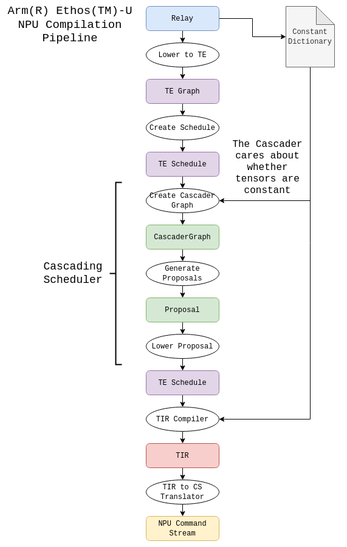
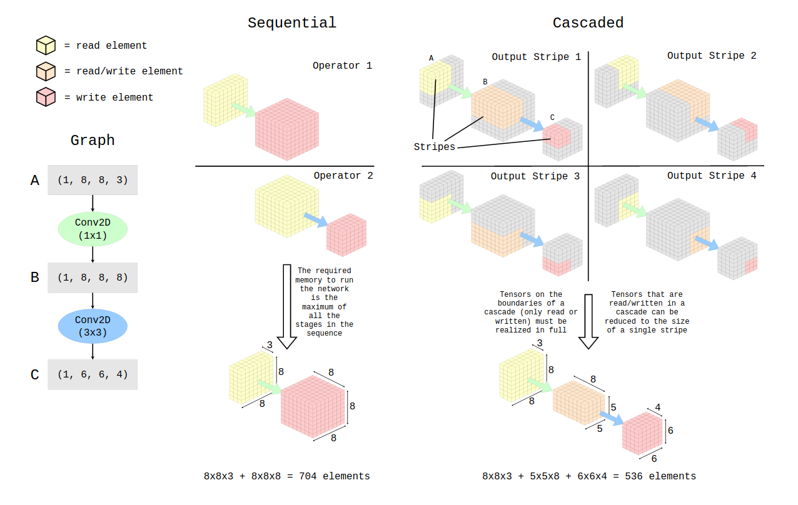
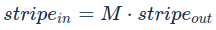
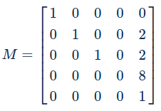
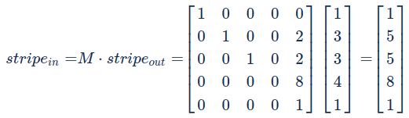
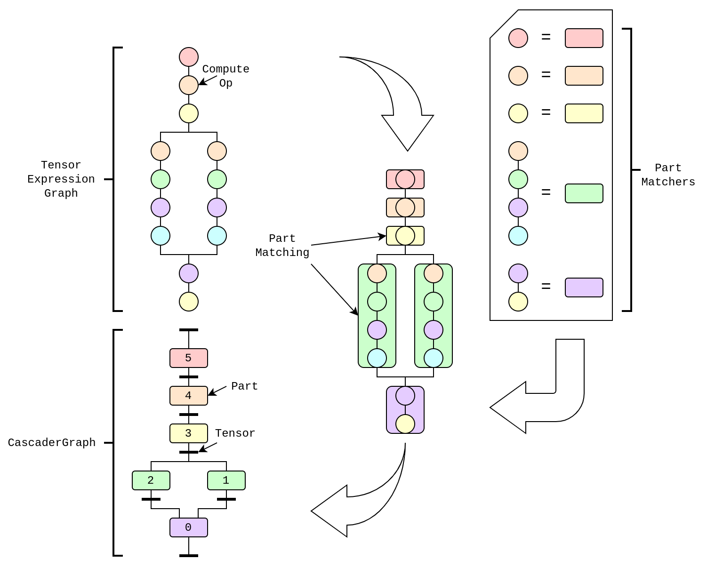
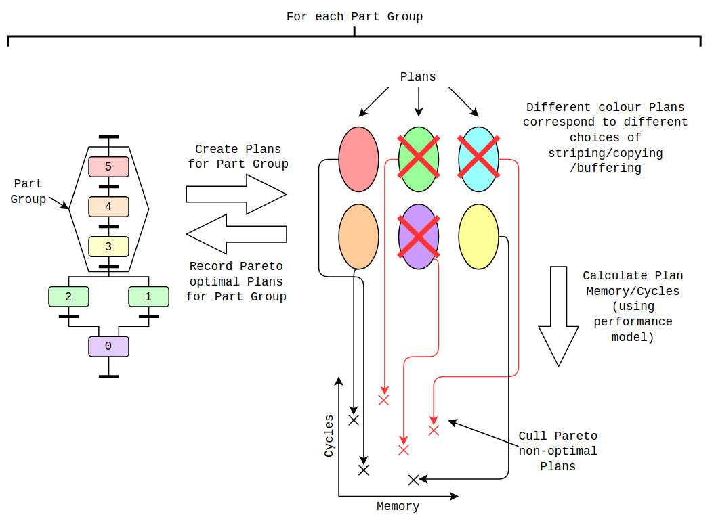
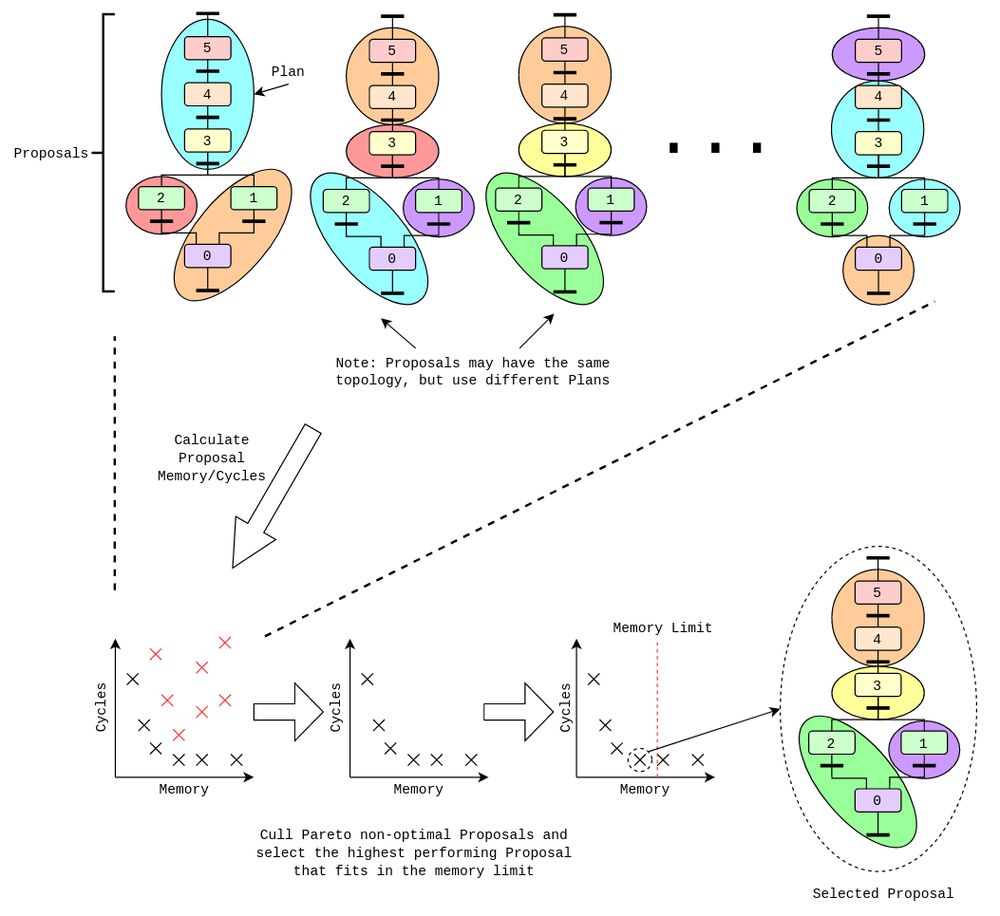

- Feature Name: Arm® Ethos™-U Cascading Scheduler
- Start Date: 2021-09-22
- RFC PR: [apache/tvm-rfcs#0037](https://github.com/apache/tvm-rfcs/pull/37)
- GitHub Issue: [apache/tvm#9429](https://github.com/apache/tvm/issues/9429)

# Summary
[summary]: #summary

This feature builds upon the support introduced into TVM to compile for Arm® Ethos(TM)-U NPUs (see [RFC](https://github.com/apache/tvm-rfcs/pull/11)). In that work, we represent NPU operators using Tensor Expressions, allowing them be scheduled using TVM’s scheduling language. The Cascader aims to take advantage of this by deriving scheduling strategies for graphs off-loaded to the NPU which are optimal in both performance and the memory required to run the network. The Cascader primarily searches for inter-operator scheduling opportunities rather than intra-operator which is more common in both AutoTVM and the Auto-Scheduler. In particular, it seeks to leverage the technique of ‘cascading’.

# Motivation
[motivation]: #motivation

On deeply embedded devices, working memory in the form of SRAM is at a premium. It may typically be measured in kilobytes and this severely limits the selection of networks that can be run on such devices. For Arm® Ethos™-U NPUs, this becomes a significant issue as the NPU provides sufficient compute power to run larger models but the system may not have the memory necessary to execute them. The Cascading Scheduler seeks to alleviate this by rescheduling the networks such that they use less working memory and accordingly can take advantage of the considerable compute capabilities of the NPU.

# Guide-level explanation
[guide-level-explanation]: #guide-level-explanation

The Cascading Scheduler will act as a scheduler for the Arm(R) Ethos(TM)-U NPU compiler in TVM. This means it will make decisions about the order in which operations are executed, as well as which memories tensors are assigned to and whether they need copying between memories. It's primary objective is to reduce the required working memory needed to run the network until it fits into a user-specified memory budget. The behaviour of the Cascader will be controlled by a number of user-configurable options which will ultimately be exposed all the way up to TVMC (exact interface TBD). However, it is expected that for most ordinary use-cases, the Cascader will be invisible to the user as it will be configured with sensible defaults.

Additionally, the Cascader will rely on a description of the device's memory layout to know the bandwidth and size of the different sections. This allows the Cascader to effectively optimize models such that they fit within the memory constraints while still giving good performance. It is expected that this information will be derived from the 'PoolInfo' mechanism that is proposed to be used by the Unified Static Memory Planner ([RFC](https://github.com/apache/tvm-rfcs/pull/9)).

Schedulers for the NPU are required to expose an interface of TE Schedule -> TE Schedule. Note that a side-channelled constant dictionary is required due to the inability to express constants in TE/TIR. Should progress be made in resolving that restriction, this side-channel would be dropped from the design. Refer to the following diagram to see where the Cascader fits into the compilation flow for Ethos-U:

# Reference-level explanation
[reference-level-explanation]: #reference-level-explanation

## Cascading

Cascading is the term we use for a form of inter-operator scheduling by which a series of operations are executed together as a sequence of dependent N-dimensional tiles. Those 'N-dimensional' tiles we refer to as 'stripes', corresponding to calculating only part of a tensor at a time. By employing this technique, we can reduce the amount of memory required to run the network. The following diagram demonstrates a simple example of this for a small network containing only two NHWC convolutions. It considers both the 'standard' sequential way of scheduling where operators are executed one after the other, and a cascaded scheduling using an output stripe size of (1, 3, 3, 4). Also note that the diagram omits the weight and bias tensors.

Depending on the choice of stripe sizes, cascading groups and the network architecture, the memory saved can be substantial. For example, for Mobilenetv1 when run naively it requires in excess of 1.2MB of memory. However, intelligent application of the cascading technique can reduce this to around 300kB making it much more accessible to deeply embedded devices. In addition, where a hierarchical memory is present with faster and slower regions, reducing the memory requirement can improve performance by allowing the intermediate results to fit entirely within the fast memories or caches.

## Affine Transforms

Deciding on exactly which operators should be cascaded and with what striping parameters is a non-trivial problem. Most local solutions are not globally optimal and the search space is very large. We therefore introduce a technique using affine transforms to allow for the quick calculation of the memory and performance of a given cascading option without having to perform a proper scheduling using TE/TIR.

The key piece of information to calculate in order to characterize a cascade is how the stripe size changes throughout. This is a function of the data dependency between an operator's inputs and outputs. For many operators that we're interested in, an affine transform matrix can be used to represent this dependency if we represent the input and output stripe sizes as vectors. Affine transforms typically consider 'augmented' matrices and vectors (https://en.wikipedia.org/wiki/Affine_transformation#Augmented_matrix) which allow for the representation of constant changes. Concretely, we define the transform matrix M as being the matrix for which the following holds:

Let's briefly consider how to derive such a transform matrix for a 3x3 unstrided, undilated and unpadded NHWC convolution. Immediately, the '3x3' kernel tells us something important: a single element in the output depends on 3x3 elements in the height/width of the input. If we were instead to consider a 2x2 region of the output in the height/width dimensions, we'd then need a 4x4 region in the input. So in general, the rule is that we need 2 more elements in height and width when calculating the dependencies of an output stripe. It can be shown that more generally this number is the kernel_size-1 in each axis. Now to consider the channels, in a convolution no matter how many output elements you are computing you'll always need every input channel. This is because the input channel axis is a reduction axis in a convolution, in a sense it isn't 'reflected' in the output. Combining these two observations, we arrive at the following transform matrix:

The first row is simply an identity for the batch axis. The second and third rows are more interesting, corresponding to the data dependencies in the height and width axes. Here we see that the matrix is taking the output size and adding a fixed value of 2, as we described above. The fourth row is the channels axis, and as we expect this is constant and always 8 - the number of channels of the input tensor. The final row is simply the augmentation row and can be ignored.

We can use this matrix on the example in the diagram using output stripe of size (1, 3, 3, 4). Note this becomes (1, 3, 3, 4, 1) due to the augmentation, but the extra '1' can be dropped once the multiplication is complete.

The result of a (1, 3, 3, 4) output stripe requiring a (1, 5, 5, 8) input stripe is exactly what's observed in the diagram. By chaining these transforms together for multiple operations we can analyse an arbitrary cascade using fast and simple matrix arithmetic. This mathematical system underpins all the logic in the Cascader and is essential to being able to rapidly explore a very large search space.

For each Arm(R) Ethos(TM)-U NPU operator, we manually define the correct transform matrices as there are relatively few NPU operators and their transforms are quite complex. We do, however, envision that in future it may be possible to derive the matrices directly from Tensor Expressions.

## Rolling Buffers

In a cascade, if intermediate stripes 'overlap' (that is to say, two or more stripes share elements) then TVM will recompute the overlapping values. This is optimal behaviour in terms of memory usage, but sub-optimal for performance. Rolling buffers provide a compromise between the two, requiring no recomputation of values but slightly more memory. You can read more about rolling buffers and our intent to add support for them [here](https://discuss.tvm.apache.org/t/rfc-introducing-a-rolling-buffer-scheduling-primitive/9836). One of the decisions the Cascader needs to make is whether to realize a buffer using a 'recompute' or 'rolling' strategy.

## The Planning Algorithm

The Cascader makes the following scheduling decisions:

- How to group operators into ‘cascades’
- How to select ‘stripe’ sizes for the ‘cascades’
- What buffering strategy to use for ‘stripes’ (recompute/rolling/double buffering)
- Whether to copy tensors between different memories

Even with this limited selection of scheduling options, the search space is still very large. To explore this space and arrive at optimal solutions, a four-step algorithm is utilized alongside an approximate performance model of the NPU. Auto-tuning is explicitly avoided to reduce the search time.

### Step 1: Create a CascaderGraph to represent the Tensor Expression graph

First, we convert the Tensor Expression graph that is produced from lowering Relay into a 'CascaderGraph' which is used by the planning algorithm. The CascaderGraph consists of linked 'Parts' and 'Tensors'. While the Tensors correspond closely with TE Tensors (although holding some additional information), Parts differ from ComputeOps in a number of ways. Firstly, a Part can represent multiple ComputeOps. This is needed because for the NPU, hardware operations are represented as a sequence of ComputeOps. All the operations in that sequence must be scheduled identically, so they are encapsulated jointly within a Part. Further to this, Parts store 'Propagators' for each of their inputs, which are effectively the affine transforms described earlier. This allows for cascading analysis to take place on Parts.

The conversion to a CascaderGraph takes place through a simple traversal of the Tensor Expression graph and a set of 'Part matchers'. The Part matchers have a pattern of ComputeOps which when encountered is replaced with the corresponding Part (see diagram below). Cascader Tensors are created trivially from TE Tensors but some additional information is stored, for instance whether the Tensor is constant and if it gets compressed.

This step has O(N) complexity.

### Step 2: Generate ‘Plans’ for the entire CascaderGraph

With the CascaderGraph having been created, we generate a large number of so-called 'Plans' covering all the possible Part groups in the graph. Parts in a Part group are cascaded, with the Plan storing information on how to execute a Part group - meaning what stripe sizes to use as well as buffering strategies and any memory copies. For each Part group, a large number of possible Plans are created which cover it. The memory usage and relative performance of these Plans is then determined (using the affine transform system) and Plans which aren't Pareto efficient (https://en.wikipedia.org/wiki/Pareto_efficiency) are culled. At the end of this step, we have a mapping between every possible Part group and a set of Pareto efficient Plans that covers that Part group.

This step has O(P^B*N) complexity where P = max number of Parts in a Plan and B = the average branching factor (https://en.wikipedia.org/wiki/Branching_factor) of the CascaderGraph. P is a configurable constant and for most reasonable neural networks B does not exceed 2. Therefore, under those assumptions this step has pseudo-linear complexity O(N).

### Step 3: Combine ‘Plans’ to form ‘Proposals’ and select the best one

'Proposals' are groups of disjoint Plans which cover every Part in a CascaderGraph (i.e. every Part belongs to exactly one Plan in a Proposal). They are constructed from the Plans found in the previous step using a bottom-up dynamic programming algorithm. As the Proposals are created, their working memory usage and performance are determined by combining the respective values of their constituent Plans. Proposals which are not Pareto efficient are incrementally culled. Once the Pareto frontier of Proposals has been created, the Proposal with the best performance that doesn't exceed the memory budget is selected.

This step has O(N) complexity.

### Step 4: Convert the selected Proposal to a Schedule

With the Proposal selected, it needs to be converted to a Tensor Expression schedule which can be applied to the original Tensor Expression graph. This involves traversing all the Plans in the Proposal and generating the appropriate scheduling instructions (split/compute_at/cache_read etc.) The schedule can then be lowered to TIR at which point the NPU TIR compiler takes over.

# Drawbacks
[drawbacks]: #drawbacks

- This component is complex which may present maintenance difficulties in future.
- The concept of cascading is not specific to Arm(R) Ethos(TM)-U NPUs, but this implementation will only support them.
- Due to the size of the search space, this component is relatively slow.

# Rationale and alternatives
[rationale-and-alternatives]: #rationale-and-alternatives

We considered whether AutoTVM or the auto-scheduler could be extended to support cascading. However, both of these techniques focus principally on intra-operator scheduling and don't have robust mechanisms to do whole-graph analysis. Furthermore, their use of tuning on device would make them impractically slow for the size of search space that needs exploring.

We also considered implementing the cascader as a Relay to Relay pass. This has some advantages as cascading only splits operators into smaller operators which could in principle be described in Relay. However, this would have meant rewriting a considerable amount of the TE/TIR infrastructure to work on Relay and would complicate the division of responsibilities between TVM's internal representations.

This algorithm arrived upon was desirable for a number of reasons. Firstly, it explores a large search space and so can regularly arrive at near-optimal solutions. Secondly, it executes in linear time which is important when thinking about very large networks. Additionally, the design is not tightly coupled to TE which will ease migration to TensorIR when that's possible.

# Prior art
[prior-art]: #prior-art

There is not a great deal of prior art on this topic specifically. Arm have given presentations on cascading before - see the following: https://workshops.inf.ed.ac.uk/accml/keynotes/AccML_2020_R_Holm.pdf.

# Unresolved questions
[unresolved-questions]: #unresolved-questions

How should this feature land in the source tree? In particular, what should we name it, what namespaces should it live in and should it be tightly scoped to Ethos-U?

# Future possibilities
[future-possibilities]: #future-possibilities

We hope to migrate the Cascader to TensorIR once it has all the features of TE and is stable. Furthermore, while this initial work is heavily focused on Ethos-U, the underlying algorithms used by the Cascader are not specific to any particular device. It would therefore in principle be possible to enable this work for other devices in future, like for instance Cortex-M CPUs.
