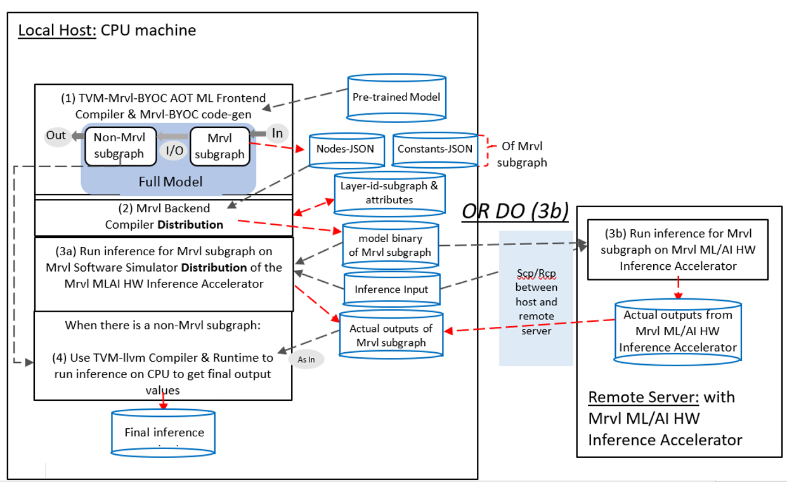
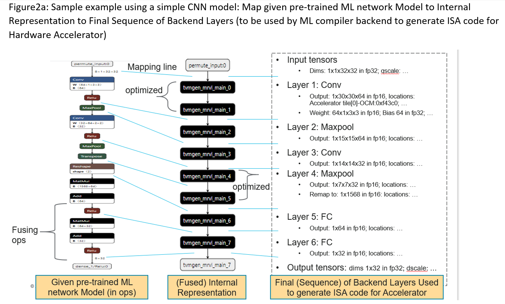
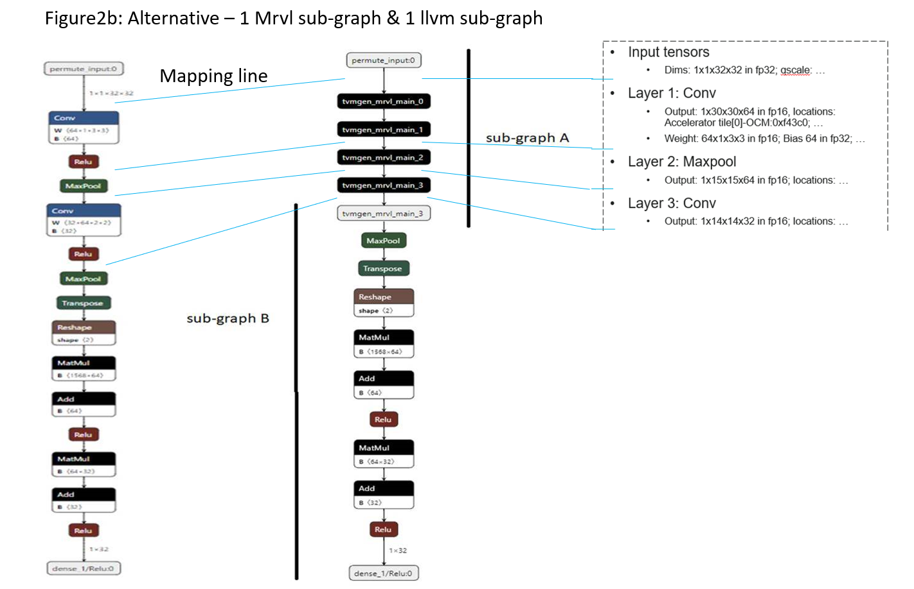
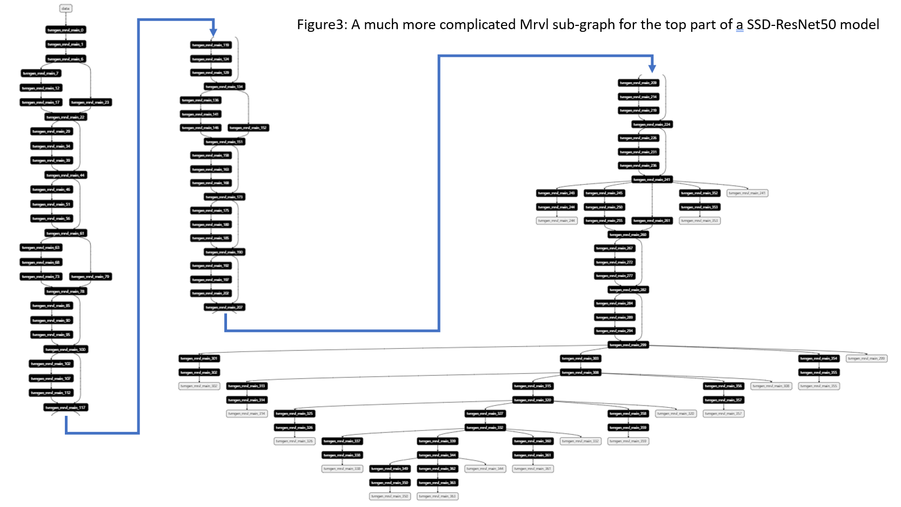

- Feature Name: (fill me in with a unique identifier, `my_awesome_feature`)
- Start Date: (fill me in with today's date, YYYY-MM-DD)
- RFC PR: [apache/tvm-rfcs#0000](https://github.com/apache/tvm-rfcs/pull/0000)
- GitHub Issue: [apache/tvm#0000](https://github.com/apache/tvm/issues/0000)
- GitHub pre-RFC PR: [apache/tvm-PR-9730](https://github.com/apache/tvm/pull/9730)
- GitHub pre-RFC discussion: [BYOC-Marvell](https://discuss.tvm.apache.org/t/pre-rfc-byoc-marvell-ml-ai-accelerator-integration/11691)

# Summary
[summary]: #summary

Integrate Marvell’s ML/AI accelerator with TVM BYOC framework in order to bring the TVM ecosystem to Marvell customers.

# Motivation
[motivation]: #motivation

Marvell MLIP is an ML/AI inference accelerator and is embedded on our ARM Neoverse N2-based OCTEON 10 processor.  We are building an easy-to-use, open, software suite for our customers by integrating and utilizing TVM so that we can bring TVM capability and experience to our customers.

# Guide-level explanation
[guide-level-explanation]: #guide-level-explanation

We follow what the TVM BYOC flow does (e.g., as done by others) to create our TVM-BYOC-Marvell POC code files and flow under the following folders -- refer to the up-loaded appache/tvm-PR-9730 POC for details:

```
  - cmake/modules/contrib/Mrvl.cmake
  - python/tvm/relay/op/contrib/mrvl.py
  - src/relay/backend/contrib/mrvl/codegen.cc, drop_noop_transpose.cc,
    graph_executor_codegen_mrvl.cc
  - src/runtime/contrib/mrvl/mrvl_runtime.cc
  - tests/python/contrib/test_mrvl/__init__.py, infrastructure.py,
    test_mrvl_codegen.py
  - plus, other corresponding changes
```

Based on what Marvell ML/AI inference accelerator does the best, a given pre-trained network model
will be applied to a TVM-BYOC-Marvell AOT compilation and code-gen flow as illustrated in Figure1 and
STEPs (1), (2), (3a), (3b), and (4) below.

### Figure 1: TVM-BYOC-Marvell AOT Compilation, Code-gen Flow


### STEP (1) Run TVM-BYOC-Marvell AOT ML Frontend Compilation and TVM-BYOC-Marvell code-gen using typical TVM flow.

The main input to STEP (1) is a pre-trained ONNX or MXNet model; and two outputs coming out of STEP (1) include a pair of Nodes-JSON file and Constants-JSON file for each Marvell sub-graph. This pair of JSON files represents the meta-data information of a Marvell sub-graph, which is a part of the given pre-trained model identified by the TVM-BYOC-Marvell flow.

Utilizing up-loaded POC changes in appache/tvm-PR-9730, sample code snippet for STEP (1) is illustrated below:

```
  import tvm
  from tvm import relay
  from tvm.relay.op.contrib import mrvl
  from gluoncv import model_zoo, data, utils

  ...

  ssd_resnet50 = model_zoo.get_model("ssd_512_resnet50_v1_voc", pretrained=True)
  inp_shape = (1, 3, 512, 512)
  raw_model_ir, weight_bias_params = relay.frontend.from_mxnet(model, {"data": inp_shape})

  # call mrvl.partition_for_mrvl()
  (model_mrvl, model_other, orig_params, opt_level, disabled_pass, orig_mod,
      mrvl_layers_in_mrvl_subgraph) = mrvl.partition_for_mrvl(
      raw_model_ir, params=weight_bias_params, tvm_custom_dict={},
      gen_non_mrvl_subgraph=False, flow_pass=1)

  # call relay.build() and mrvl.dump_json_meta_data_files()
  build_target, device_id = "llvm", 0
  mod_name = relay.backend.utils.mangle_module_name("")
  byoc_executor = relay.build(model_mrvl, target=build_target, mod_name=mod_name)
  byoc_const_params = byoc_executor.get_params()
  byoc_external_graph_json = byoc_executor.get_external_graph_json()
  nodes_json_filename, consts_json_filename = mrvl.dump_json_meta_data_files(
      byoc_external_graph_json, byoc_const_params,
      filename_prefix=f"{model_name}-tvm-mrvl-byoc-ir")
...
```

First, we can download a pre-trained SSD-ResNet50 model from the MXNet-gluoncv site; then, call the mrvl.partition\_for\_mrvl() function to trigger the TVM-BYOC-Marvell flow; and finally, call relay.build() function and mrvl.dump\_json\_meta\_data\_files() function to generate a pair of JSON files for each Marvell sub-graph identified by the TVM-BYOC-Marvell flow.

We are calling the byoc\_executor.get\_external\_graph\_json() function and the byoc\_executor.get\_params() function in order to generate both Nodes-JSON file and Constants-JSON file, respectively.

* The get\_external\_graph\_json() function is a new addition to Python class BuildModule(object).
* The get\_params() function exists for Python class BuildModule(object), but to make it work, we need to disable the "removal external params" CPP code block in the CPP class RelayBuildModule.

Sub steps involved in STEP (1) are (refer to Figures 1, 2a, 2b, 3 with descriptions below):

* Load pre-trained network into TVM IR graph.
* Do Marvell-specific layout conversions to transform IR graph in order to meet requirements of the accelerator.
* Do Marvell-specific composite-merging/fusing to transform IR graph in order to utilize available HW capability in the accelerator.
* Do additional Marvell-specific transform pass(es) to further optimize IR graph.
* Partition IR graph into one or more for-accelerator Marvell sub-graphs and/or one or more LLVM-non-Marvell sub-graphs (e.g., for running inference on ARMv9):

    * These sub-graphs cover the whole pre-trained network.

    * For-accelerator Marvell sub-graph here means & contains a set of connected, composite-merged/fused Call nodes (i.e., not just one compoiste-merged/fused Call node function).  NOTE: the term sub-graph defined here can be different from existing TVM sub-graph definition.

    * As shown in Figure 2a, a pre-trained CNN ONNX model (on the left) is processed by the TVM-BYOC-Marvell flow into only one Marvell sub-graph (illustrated in the middle of Figure 2a) where operators of given ONNX model are composite-merged/fused into 8 fused composition function in the Marvell sub-graph. For example, near bottom left a set of MatMul + Add + Relu operators of the ONNX model are fused into one tvmgen\_mrvl\_main\_7 composition function in the Marvell sub-graph.

    * As another example in Figure 2b, given the same CNN ONNX model, we can apply a different argument value but this time to ask the TVM-BYOC-Marvell flow, mrvl.partition\_for\_mrvl(...), to identify one Marvell sub-graph of 4 fused composition Call node functions and another LLVM-non-Marvell sub-graph as illustrated in the middle top sub-graph A and in the middle bottom sub-graph B, respectively.  This special argument value can lead to different inference performance in terms of meeting latency, bandwidth, and/or memory requirements.

    * For the first TVM-BYOC-Marvell revision, at most one for-accelerator Marvell sub-graph and at most one LLVM-non-Marvell sub-graph can be identified; plus, the for-accelerator Marvell sub-graph can only use input tensor(s) of given pre-trained network as its sub-graph’s input tensors.

    * Figure 3 illustrate how a complex Marvell sub-graph can look like. The whole sub-graph shown here represents a Marvell sub-graph of more than 100 fused compositions Call node functions and it comes from the pre-trained SSD-ResNet50 MXNet model. The LLVM-non-Marvell sub-graph part of the SSD-ResNet50 model is not displayed here but it contains rest of the object-detection part of the model in order to finalize 2D-BBOXes and labels.

* Do code-gen step for each Marvell sub-graph by producing pair of Nodes-JSON and Constants-JSON files:

    * The TVM-BYOC-Marvell flow also pecifies Marvell attributes for each composite-merged/fused Call node function so that generated Nodes-JSON file(s) and Constants-JSON file(s) can represent the meta-data inforamtion of Marvell sub-graph(s) in order to do post-processing.

    * RFC reviewer feedback: can we identify the Marvell sub-graph by running a TIR-only pass after scheduling (with the potential benefit to also operate on the logical TIR buffers)? Marvell developer can and will spend time on understand the TIR flow and its pass to find out.








### STEP (2) Run Marvell-ML/AI Backend Compiler to generate model binary for each Marvell sub-graph

* As shown in middle left section of Figure 1, labeled as (2), we will execute, outside of the typical TVM flow, the Marvell-ML/AI backend compiler program to post-process Nodes-JSON and Constants-JSON files of each Marvell sub-graph in order to generate final ISA instructions (in a Marvell model binary file) to run inference on Marvell accelerator.

* The Marvell-ML/AI backend compiler program will be distributed as: mrvl-tvmircomp. For example, the command line below can be used to generate the model binary file for a pair of CNN JSON files to run fp16-based inference by utilizing 1M bytes of On-Chip memory on each of 4 HW compute tiles:

```
  $ mrvl-tvmircomp --model_name cnn --nodes cnn-tvm-mrvl-byoc-ir.json \
        --consts cnn-tvm-mrvl-byoc-const.json \
        --arch=MLIP --dram_addr_relocatable=1 --ocm_base=0x0 -ocm_size=0x100000 \
        --num_tiles=4 --quantize=float16

  note: the output model binary file generated is: cnn.bin

```

* Marvell backend compiler does additional optimizations AOT including to group, allocate, and map layer-based tensors and computes onto pre-allocated resources (such as above: 4 compute tiles and 1M bytes on each of 4 tiles) avaialble on the Marvell accelerator.  Sample layer-based structures used by ISA instructions for the CNN model are illustrated in the right most column in both Figure 2a and Figure 2b.

* Note: Marvell ML/AI accelerator can run inference in either float16 mode or int8 quantization mode. For this RFC, we will focus only on float16 AOT compilation to run float16 inference.

* Note: Marvell can provide a mrvl-tvmircomp executable to TVM CI environment to run TVM Jenkins build & tests.


### STEP (3a) or (3b) Run inference on the Software Simulator or on the Marvell ML/AI HW accelerator for the Marvell sub-graph

* As illustrated in the middle left section of Figure 1, labeled as (3a), a cycle-approximate Marvell Software Simulator, mlModel, which cycle approximately mimics the Marvell ML/AI HW accelerator, will be distributed, The Marvell Software Simulator can be used to read in a Marvell model binary file and its corresponding inference input file(s) to run inference to generate results for the Marvell sub-graph. For example, the command line below can be used to run inference:

```
  $ mlModel --model_binary cnn.bin --inputs cnn_input/input1.bin --arch=MLIP --perf_debug

  note1: the inference output will be saved at: cnn-output.bin
  note2: optionally, cycle level information for performance debug can also dump

```

* Note: Marvell can provide a mlModel executable to TVM CI environment to run TVM Jenkins build & tests.

* Also as illustrated on the right side of Figure 1, labeled as (3b), tools, driver and firmware are available such that they can be used to run inference on an Marvell ML/AI inference HW accelerator.


### STEP (4) Use TVM-LLVM Compiler & Runtime to run inference for the LLVM-non-Marvell sub-graph

* As illustrated in the bottom left section of Figure 1, labeled as (4), an integration step between sub-graph(s) need to be done at inference runtime in order to run full inference for the given pre-trained model. We can use TVM-LLVM flow to generate runtime .so binary for each LLVM-non-Marvell sub-graph.  POC code for STEP (4) is not yet ready (WIP) and is not included in the uploaded appache/tvm-PR-9730.

* For the first BYOC-Marvell revision, at most one integration step from a for-accelerator Marvell sub-graph to a LLVM-non-Marvell sub-graph is implemented.

### Exercise TVM-BYOC-Marvell flow

To exercise the TVM-BYOC-Marvell flow, we have provided a tests/python/contrib/test\_mrvl folder with test\_mrvl\_codegen.py and infrastructure.py files so that they shows how to exercise the TVM-BYOC-Marvell flow for a pre-trained SSD-ResNet50 model.  In addition, Marvell are also planning to provide the Marvell backend compiler (mrvl-tvmircomp) and the Marvell HW accelerator software simulator (mlModel) so that they can be used to read in JSON files generated by the TVM-BYOC-Marvell flow to run inference to get results.

In the uploaded appache/tvm-PR-9730 branch,

# Reference-level explanation
[reference-level-explanation]: #reference-level-explanation

### Illustration using a MNIST model

Let's use a Keras MNIST fashion model below as an example (partial & pseudo code for illustration). Please also refer to files of the uploaded appache/tvm-PR-9730 for details.

```
  Get Input-Fashion-Image-Tensor-nchw - input_shape: [1, 1, 28, 28]

  keras.Input(shape=input_shape)
  keras.layers.Conv2D(64, kernel_size=(2, 2), activation="relu")
  keras.layers.MaxPooling2D(pool_size=(2, 2))
  keras.layers.Conv2D(32, kernel_size=(2, 2), activation="relu")
  keras.layers.MaxPooling2D(pool_size=(2, 2))
  keras.layers.Dropout(0.3)
  keras.layers.Reshape()
  keras.layers.Dense(256, activation="relu")
  keras.layers.Dense(10)

  Generate Output-Tensor - output_shape: [1, 10]

  top_label_id = numpy.argmax(Output-Tensor)
  # fashion label map
  fashion_label_dictionary = {
      0: "T-shirt/top",
      1: "Trouser",
      2: "Pullover",
      3: "Dress",
      4: "Coat",
      5: "Sandal",
      6: "Shirt",
      7: "Sneaker",
      8: "Bag",
      9: "Ankle boot",
  }
  print(f"Fashion item identified as: {fashion_label_dictionary[top_label_id]}")
```

We can train the above MNIST fashion model using the following train\_images dataset and save the pre-trained model in ONNX (say, mnist\_fashion.onnx). Then, we can run BYOC Marvell flow by giving any image of the orig\_test\_images[i] dataset to get its inference fashion label and item name in top\_label\_id and fashion\_label\_dictionary[top\_label\_id], respectively. In addition, we can also use the corresponding golden label, golden\_output\_labels[i], to validate the inference result.

```
  (train_images, train_labels), (
      orig_test_images,
      golden_output_labels,
  ) = keras.datasets.fashion_mnist.load_data()
```

In the code snippet below, we call onnx.load() and relay.frontend.from\_onnx() to generate TVM mod and params. Then, they are used by the mrvl.partition\_for\_mrvl() function and the mrvl.dump\_json\_meta\_data\_files() function provided for the TVM-BYOC-Marvell flow to generate Nodes-JSON file (nodes\_json\_filename) and Constants-JSON file (consts\_json\_filename).

* Notes: please refer to the python/tvm/relay/op/contrib/mrvl.py file for more details.

* In the mrvl.py file: the partition\_for\_mrvl() function is the main entry point for the TVM-BYOC-Marvell flow.

* We use relay.build(mod\_mrvl\_subgraph).get\_params() and relay.build(mod\_mrvl\_subgraph).get\_external\_graph\_json() to trigger Marvell-specific GetExternalJSON() and JSON load/save functions (as defined in the src/relay/backend/contrib/mrvl/graph\_executor\_codegen\_mrvl.cc file) in order to generate Marvell-specific byoc\_const\_params and byoc\_external\_graph\_json objects.

* In the mrvl.py file: the dump\_json\_meta\_data\_files() function takes in Marvell-specific byoc\_external\_graph\_json and byoc\_const\_params objects to generate and return two Marvell-specific Nodes-JSON file and Constants-JSON file, respectively.

```
    # load pre-trained model
    mnist_fashion_onnx_model = onnx.load("mnist_fashion.onnx")
    mod, params = relay.frontend.from_onnx(
        mnist_fashion_onnx_model, dtype="float32", freeze_params=False
    )

    # from infrastructure.py
    (mod_mrvl_subgraph, mod_non_mrvl_subgraph, orig_params, opt_level,
      disabled_pass, orig_mod, mrvl_layers_in_mrvl_subgraph) = mrvl.partition_for_mrvl(
        mod, params=params, tvm_custom_dict={}, gen_non_mrvl_subgraph=False, flow_pass=1)

    build_target, device_id = "llvm", 0
    mod_name = relay.backend.utils.mangle_module_name("")
    byoc_executor = relay.build(mod_mrvl_subgraph, target=build_target, mod_name=mod_name)
    byoc_const_params = byoc_executor.get_params()
    byoc_external_graph_json = byoc_executor.get_external_graph_json()

    nodes_json_filename, consts_json_filename = mrvl.dump_json_meta_data_files(
        byoc_external_graph_json, byoc_const_params,
        filename_prefix=f"{working_dir}{model_name}-tvm-mrvl-byoc-ir")
```

The mod\_mrvl\_subgraph object and the mod\_non\_mrvl\_subgraph object returned from the aot\_build\_and\_json\_code() call are IR graphs: one for-accelerator Marvell sub-graph and one LLVM-non-Marvell sub-graph.

Different strategy can be used to cut the MNIST model into different sets of at most one Marvell sub-graph and at most one LLVM-non-Marvell sub-graph. Below we will illustrate one such alternative (i.e., the default strategy) where the entire MNIST network model is turned into only one Marvell sub-graph and no LLVM-non-Marvell sub-graph.

Below is the original IR graph - i.e., right after from\_onnx() call:

```
    #[version = "0.0.5"]
    def @main(%permute_input: Tensor[(1, 1, 28, 28), float32]) -> Tensor[(1, 10), float32] {
      %0 = nn.conv2d(%permute_input, meta[relay.Constant][0] /* ty=Tensor[(64, 1, 2, 2), float32] */,
          padding=[0, 0, 1, 1], channels=64, kernel_size=[2, 2], /* exprnode_id=418 */)
          /* ty=Tensor[(1, 64, 28, 28), float32] */;
      %1 = nn.bias_add(%0, meta[relay.Constant][1] /* ty=Tensor[(64), float32] */,
          /* exprnode_id=419 */) /* ty=Tensor[(1, 64, 28, 28), float32] */;
      %2 = nn.relu(%1, /* exprnode_id=420 */) /* ty=Tensor[(1, 64, 28, 28), float32] */;
      %3 = nn.max_pool2d(%2, pool_size=[2, 2], strides=[2, 2], padding=[0, 0, 0, 0],
          /* exprnode_id=449 */) /* ty=Tensor[(1, 64, 14, 14), float32] */;
      %4 = nn.conv2d(%3, meta[relay.Constant][2] /* ty=Tensor[(32, 64, 2, 2), float32] */,
          padding=[0, 0, 1, 1], channels=32, kernel_size=[2, 2], /* exprnode_id=472 */)
          /* ty=Tensor[(1, 32, 14, 14), float32] */;
      %5 = nn.bias_add(%4, meta[relay.Constant][3] /* ty=Tensor[(32), float32] */,
          /* exprnode_id=473 */) /* ty=Tensor[(1, 32, 14, 14), float32] */;
      %6 = nn.relu(%5, /* exprnode_id=474 */) /* ty=Tensor[(1, 32, 14, 14), float32] */;
      %7 = nn.max_pool2d(%6, pool_size=[2, 2], strides=[2, 2], padding=[0, 0, 0, 0],
          /* exprnode_id=515 */) /* ty=Tensor[(1, 32, 7, 7), float32] */;
      %8 = transpose(%7, axes=[0, 2, 3, 1], /* exprnode_id=516 */)
          /* ty=Tensor[(1, 7, 7, 32), float32] */;
      %9 = nn.batch_flatten(%8, /* exprnode_id=538 */) /* ty=Tensor[(1, 1568), float32] */;
      %10 = transpose(meta[relay.Constant][4] /* ty=Tensor[(1568, 256), float32] */, axes=[1, 0],
          /* exprnode_id=599 */) /* ty=Tensor[(256, 1568), float32] */;
      %11 = nn.dense(%9, %10, units=None, out_dtype="float32", /* exprnode_id=600 */)
          /* ty=Tensor[(1, 256), float32] */;
      %12 = add(%11, meta[relay.Constant][5] /* ty=Tensor[(256), float32] */,
          /* exprnode_id=601 */) /* ty=Tensor[(1, 256), float32] */;
      %13 = nn.relu(%12, /* exprnode_id=602 */) /* ty=Tensor[(1, 256), float32] */;
      %14 = transpose(meta[relay.Constant][6] /* ty=Tensor[(256, 10), float32] */, axes=[1, 0],
          /* exprnode_id=675 */) /* ty=Tensor[(10, 256), float32] */;
      %15 = nn.dense(%13, %14, units=None, out_dtype="float32", /* exprnode_id=676 */)
          /* ty=Tensor[(1, 10), float32] */;
      add(%15, meta[relay.Constant][7] /* ty=Tensor[(10), float32] */, /* exprnode_id=677 */)
         /* ty=Tensor[(1, 10), float32] */
    }

```

We can get to the following one Marvell sub-graph of 8 fused composition Call node functions by applying the default strategy. Note: in the mrvl.py file: the compute\_two\_subgraphs() function of the class MrvlIRGraphUtils is used to create mod\_mrvl\_subgraph and mod\_non\_mrvl\_subgraph. It is similar to Figure (2a) but Figure (2a) is for a pre-trained CNN model.

```
    def @main(%permute_input: Tensor[(1, 1, 28, 28), float32]) -> Tensor[(1, 10), float32] {
      %0 = @tvmgen_mrvl_main_0(%permute_input, /* exprnode_id=4136 */) /* ty=Tensor[(1, 28, 28, 1),
               float32] */;
      %1 = @tvmgen_mrvl_main_1(%0, /* exprnode_id=4137 */) /* ty=Tensor[(1, 28, 28, 64), float32] */;
      %2 = @tvmgen_mrvl_main_2(%1, /* exprnode_id=4138 */) /* ty=Tensor[(1, 14, 14, 64), float32] */;
      %3 = @tvmgen_mrvl_main_3(%2, /* exprnode_id=4139 */) /* ty=Tensor[(1, 14, 14, 32), float32] */;
      %4 = @tvmgen_mrvl_main_4(%3, /* exprnode_id=4140 */) /* ty=Tensor[(1, 7, 7, 32), float32] */;
      %5 = @tvmgen_mrvl_main_5(%4, /* exprnode_id=4141 */) /* ty=Tensor[(1, 1568), float32] */;
      %6 = @tvmgen_mrvl_main_6(%5, /* exprnode_id=4142 */) /* ty=Tensor[(1, 256), float32] */;
      @tvmgen_mrvl_main_7(%6, /* exprnode_id=4143 */) /* ty=Tensor[(1, 10), float32] */
    }
```

In the mrvl.mrvl\_pattern\_table() function, fusing patterns are defined in order to composite original IR nodes into fused composition Call node functions (e.g., tvmgen\_mrvl\_main\_0 to tvmgen\_mrvl\_main\_7) to match Marvell backend layers more closely.  For example, the following 3 IR Call nodes (nn.conv2d + nn.bias\_add + nn.relu) in the original IR graph are composited into one fused Marvell Call node function: tvmgen\_mrvl\_main\_1.

```
      # from original IR graphs
      %4 = nn.conv2d(%3, meta[relay.Constant][2] /* ty=Tensor[(32, 64, 2, 2), float32] */,
          padding=[0, 0, 1, 1], channels=32, kernel_size=[2, 2], /* exprnode_id=472 */)
          /* ty=Tensor[(1, 32, 14, 14), float32] */;
      %5 = nn.bias_add(%4, meta[relay.Constant][3] /* ty=Tensor[(32), float32] */,
          /* exprnode_id=473 */) /* ty=Tensor[(1, 32, 14, 14), float32] */;
      %6 = nn.relu(%5, /* exprnode_id=474 */) /* ty=Tensor[(1, 32, 14, 14), float32] */;


      # from Marvell subgraph
      %3 = @tvmgen_mrvl_main_3(%2, /* exprnode_id=4139 */) /* ty=Tensor[(1, 14, 14, 32), float32] */;
      def @tvmgen_mrvl_main_3(%mrvl_3_i0: Tensor[(1, 14, 14, 64), float32], Inline=1, Compiler="mrvl",
          global_symbol="tvmgen_mrvl_main_3", Primitive=1) -> Tensor[(1, 14, 14, 32), float32] {

        %13 = fn (%FunctionVar_0_0: Tensor[(1, 14, 14, 64), float32],
            PartitionedFromPattern="nn.conv2d_add_nn.relu_",
            Composite="mrvl.conv2d_nhwc2nhwc") -> Tensor[(1, 14, 14, 32), float32] {
          %11 = nn.conv2d(%FunctionVar_0_0, meta[relay.Constant][2]
              /* ty=Tensor[(32, 2, 2, 64), float32] */,
              padding=[0, 0, 1, 1], channels=32, kernel_size=[2, 2], data_layout="NHWC",
              kernel_layout="OHWI",
              out_layout="NHWC", /* exprnode_id=781 */) /* ty=Tensor[(1, 14, 14, 32), float32] */;
          %12 = add(%11, meta[relay.Constant][3] /* ty=Tensor[(1, 1, 1, 32), float32] */,
              /* exprnode_id=789 */) /* ty=Tensor[(1, 14, 14, 32), float32] */;
          nn.relu(%12, /* exprnode_id=793 */) /* ty=Tensor[(1, 14, 14, 32), float32] */
        };

        %13(%mrvl_3_i0, /* exprnode_id=3343 */) /* ty=Tensor[(1, 14, 14, 32), float32] */
      }
```

Because Marvell backend layer is structured to use NHWC format (for instance, for Conv2D, Pool2D, and Sum2D), the relay.transform.ConvertLayout() pass is applied in the mrvl.py file. As a result, NHWC format is used for fused Marvell Call node functions: tvmgen\_mrvl\_main\_1 to tvmgen\_mrvl\_main\_4. In addition, the first tvmgen\_mrvl\_main\_0 Call node in the example is corresponding to a layout\_transform() operation, which takes the original input tensor in src\_layout="NCHW" and convert the input to a dst\_layout="NHWC" tensor.

```
      relay.transform.ConvertLayout(
          {"nn.conv2d": ["NHWC", "OHWI"], "nn.max_pool2d": ["NHWC"]}
      ),

      %0 = @tvmgen_mrvl_main_0(%permute_input, /* exprnode_id=4136 */)
           /* ty=Tensor[(1, 28, 28, 1), float32] */;
      %1 = @tvmgen_mrvl_main_1(%0, /* exprnode_id=4137 */) /* ty=Tensor[(1, 28, 28, 64), float32] */;
      %2 = @tvmgen_mrvl_main_2(%1, /* exprnode_id=4138 */) /* ty=Tensor[(1, 14, 14, 64), float32] */;
      %3 = @tvmgen_mrvl_main_3(%2, /* exprnode_id=4139 */) /* ty=Tensor[(1, 14, 14, 32), float32] */;
      %4 = @tvmgen_mrvl_main_4(%3, /* exprnode_id=4140 */) /* ty=Tensor[(1, 7, 7, 32), float32] */;

      def @tvmgen_mrvl_main_0(%mrvl_0_i0: Tensor[(1, 1, 28, 28), float32], Inline=1, Compiler="mrvl",
          global_symbol="tvmgen_mrvl_main_0", Primitive=1) -> Tensor[(1, 28, 28, 1), float32] {
        layout_transform(%mrvl_0_i0, src_layout="NCHW", dst_layout="NHWC",
            /* exprnode_id=3334 */) /* ty=Tensor[(1, 28, 28, 1), float32] */
      }
```

Currently, from the uploaded appache/tvm-PR-9730 and for its following Marvell classes/functions to identify a Marvell sub-graphs and/or a LLVM-non-Marvell sub-graph from a given layout-converted-and-composite-mreged/fused IR graph, the TVM-BYOC-Marvell flow needs to utilize a unique exprnode\_id attribute stored for the class CallNode and the class Tuple as declared in the adjusted include/tvm/relay/expr.h file.

* in mrvl.py: class MrvlLayers(ExprMutator) utilizes exprnode\_id of the Call node to identify boundary of the Marvell sub-graph.

* in mrvl.py: class MrvlIRGraphUtils.RestOfMrvlLayers(ExprMutator) is used to convert the LLVM-non-Marvell sub-graph, which can have fused Marvell composition Call node function(s), back to their original IR Call nodes without Marvell-specific layout changes nor fused compositions. RestOfMrvlLayers class also utilizes exprenode\_id to identify input(s) for the LLVM-non-Marvell sug-graph.

* in mrvl.py: class MrvlIRGraphUtils.RestMrvlLayersGetInputs(ExprVisitor) is used to reconstruct the input tensor for the LLVM-non-Marvell sub-graph to a final IR graph, which can be recognized by the typical TVM LLVM build flow.

* in mrvl.py: the revert\_mrvl\_mod\_to\_orig() function is defined to convert the initial LLVM-non-Marvell sub-graph back to a IR sub-graph using original layouts with no Marvell-specific compositions (e.g., similar to what was given by the frontend)

* In the TVM-BYOC-Marvell flow, we also like to have user-modeling-level linkages/information coming from the given pre-trained model, to be passing to generated JSON files and finally to Marvell backend layer structures so that backend compiler (e.g., mrvl-tvmircomp), HW accelerator's Software Simulator (e.g., mlModel), and inference-run tools can have a chances to use the user-modeling-level linkages/information in their responses in order to communicate back the modeling user using user-understandable language.

    * We found that it is possible to use exprnode\_id and a frontend const tvm\_custom\_id to propagate user-level linkages through relay Call node's instantization flow and pass the original frontend tvm\_custom\_id via IR graph transformations including down to the TVM-BYOC-Marvell flow's JSON files. We do not include POC code in capturing the frontend tvm\_custom\_id from given pre-trained model, and then, passing the original frontend tvm\_custom\_id via IR graph transformations with the help of exprnode\_id in the uploaded appache/tvm-PR-9730.  We are preparing to upload another RFC with our POC code, which uses exprnode\_id and a new tvm\_custom\_id to provide user-level linkages/information through out the TVM relay flow.

    * Note: in the TVM main branch for the python/tvm/relay/frontend/common.py and onnx.py files, there are implementions about using a tvm\_custom object but this frontend, user-level tvm\_custom-related information never gets propagating to relay IR graph.

```
  def revert_mrvl_mod_to_orig(mod_mrvl_subgraph, mrvl_layers_in_mrvl_subgraph, debug=False):
    """

    def run_opt_pass(mod, passes):
        passes = passes if isinstance(passes, list) else [passes]
        seq = tvm.transform.Sequential(passes)
        with tvm.transform.PassContext(opt_level=3):
            mod = seq(mod)
        return mod

    mod_new = tvm.IRModule(mod_mrvl.functions, mod_mrvl.type_definitions)
    mod_new["main"] = MrvlSubgraphToRevert(mrvl_layers_in_mrvl_subgraph,
        mod_mrvl).visit(mod_mrvl["main"])
    mod_new = relay.transform.RemoveUnusedFunctions()(mod_new)
    mod_new = relay.transform.InferType()(mod_new)
    mod_new = run_opt_pass(mod_new, relay.transform.DefuseOps())
    mod_new = run_opt_pass(mod_new, relay.transform.ConvertLayout({"nn.conv2d": ["NCHW", "OIHW"],
       "nn.max_pool2d": ["NCHW"]}))
    mod_new = run_opt_pass(mod_new, relay.transform.SimplifyExpr())
    mod_new = run_opt_pass(mod_new, relay.transform._ffi_api.DropNoopTranspose())
    mod_new = run_opt_pass(mod_new, relay.transform.InferType())
    return mod_new
```

In order to generate Nodes-JSON and Constants-JSON to include Marvell backend layer needed attributes, the TVM-BYOC-Marvell flow uses and extends TVM graph executor codegen files and classes to Marvell-specific graph executor codegen.  For example, we have defined call backs and extension functions in the following files in the uploaded appache/tvm-PR-9730:

* Some common classes have been moved from the original src/relay/backend/graph\_executor\_codegen.cc file to the new src/relay/backend/graph\_executor\_codegen.h file so that they can be shared by Marvell-specific functions and derived classes defined in the new src/relay/backend/contrib/mrvl/graph\_executor\_codegen.cc file.

* New definitions include kGraphInputNodeExt, kGraphOpNodeExt, ExternalJsonWriterCB, GraphOpNodeMrvlExt, and GraphInputNodeMrvlExt, and etc. We are not sure this CPP call-back addition match the TVM typical call-back design style but like to propose POC code snipped as outlined below (see the uploaded appache/tvm-PR-9730 for full code).

```
    /////////////
    // in the new src/relay/backend/graph_executor_codegen.h file
    /*! \brief Node types */
    enum GraphNodeType {
      kGraphNop,
      kGraphInputNode,
      kGraphOpNode,
      kGraphInputNodeExt,
      kGraphOpNodeExt,
    };

    class ExternalJsonWriterCB {
     public:
      template <class T>
      void RegisterCB(T* const object, void (T::*const mf)(dmlc::JSONWriter*,
                      Array<tvm::runtime::Module>,
                      std::vector<GraphObjectPtr>, std::vector<GraphNodeRef>)) {
        using namespace std::placeholders;
        callback_ = std::bind(mf, object, _1, _2, _3, _4);
        hasCallback_ = true;
      }
      void RegisterCB(void (*const fun)(dmlc::JSONWriter*, Array<tvm::runtime::Module>,
                      std::vector<GraphObjectPtr>, std::vector<GraphNodeRef>)) {
        callback_ = fun;
        hasCallback_ = true;
      }
      void Exe(dmlc::JSONWriter* external_writer, Array<tvm::runtime::Module> mod,
               std::vector<GraphObjectPtr> nodes, std::vector<GraphNodeRef> heads) {
        ICHECK(hasCallback_) << "ERROR: no registered callback";
        callback_(external_writer, mod, nodes, heads);
      }
      inline bool HasCallback() { return hasCallback_; }

     private:
      std::function<void(dmlc::JSONWriter*, Array<tvm::runtime::Module>, std::vector<GraphObjectPtr>,
                         std::vector<GraphNodeRef>)>
          callback_;
      bool hasCallback_{false};
    };

    /////////////
    // in the new src/relay/backend/graph_executor_codegen.cc file
    class GraphExecutorCodegen : public backend::MemoizedExprTranslator<std::vector<GraphNodeRef>> {
     public:
      GraphExecutorCodegen(runtime::Module* mod, const TargetMap& targets)
          : mod_(mod), targets_(targets) {
        // we need the following variable to be a static member of the class so we can access
        //   its setting in the following static GetExternalJsonWriter() function; but this static
        //   member can actually be used as a local Callback setting for "per" GraphExecutorCodegen
        //   instantiation during each TVM build-codegen flow
        external_json_writer_ = std::make_shared<ExternalJsonWriterCB>();
        ICHECK(external_json_writer_);
      }
      static ExternalJsonWriterCB* GetExternalJsonWriter() { return external_json_writer_.get(); }
      ....
      LoweredOutput Codegen(IRModule mod, relay::Function func, String mod_name) {
        ....

        // if it has been registered for this GraphExecutorCodegen object, call the external JSON writer
        if (external_json_writer_->HasCallback()) {
          std::ostringstream external_os;
          dmlc::JSONWriter external_writer(&external_os);
          external_json_writer_->Exe(&external_writer, ret.external_mods, nodes_, heads_);
          ret.external_graph_json = external_os.str();
        }

        return ret;
      }
    };

    extern "C" ExternalJsonWriterCB* GetExternalJsonWriter() {
      return GraphExecutorCodegen::GetExternalJsonWriter();
    }

    /////////////
    // in the new src/relay/backend/contrib/mrvl/graph_executor_codegen.cc file
    // Marvell-specific extentions
    class GraphInputNodeMrvlExt : public GraphInputNode {
        ...
        GraphNodeType Type() const override { return kGraphInputNodeExt; }
        void Save(dmlc::JSONWriter* writer) const override { /* extensions */ }
    }

    class GraphOpNodeMrvlExt : public GraphOpNode {
        ...
        GraphNodeType Type() const override { return kGraphOpNodeExt; }
        void Load(dmlc::JSONReader* reader) override;
        void LoadAttrs(dmlc::JSONReader* reader);
        std::pair<std::string, GraphAttrs> GetLoadedGraphAttrs();
    }

    class MrvlExtJson {
     public:
      MrvlExtJson() {
        ICHECK(!GetExternalJsonWriter()->HasCallback()) << "ERROR: has registered callback";
        GetExternalJsonWriter()->RegisterCB(this, &MrvlExtJson::GetExternalJSON);
      }
      virtual ~MrvlExtJson() {}
      void GetExternalJSON(dmlc::JSONWriter* writer, Array<tvm::runtime::Module> external_mods,
                           std::vector<GraphObjectPtr> nodes, std::vector<GraphNodeRef> heads);
      void LoadExternalJsonAttrs(std::unordered_map<std::string, GraphAttrs>* external_attrs_map,
                                 const Array<tvm::runtime::Module>& external_mods);
    };
```


# Drawbacks

We haven't identified any major *not* do items. Several other designs are by choices - that is we understand that there are benefits for doing or benefits for not-doing.

# Rationale and alternatives

We follow the TVM-BYOC framework to enable TVM-BYOC-Marvell flow without impacting any TVM core features.

# Unresolved questions

* We are following the existing TVM BYOC framework/files, for example: to do IR compositions, to define own IR passes, to mix implementations in Python/C++, and etc.

* We have extended graph\_executor\_codegen.cc and JSON loader/saver in order to read and write out Marvell backend specific attributes to Nodes-JSON and Constants-JSON files.

* Currently, we haven't spend enough time to understand how tvm/rust and cargo related requirements and steps are. Therefore, we are bypassing the tvm/Jenkinsfile's tests/scripts/task\_rust.sh step in our local Jenkins build. We will need help to re-enable the run the TVM rust step.

* We like to duplicate the Jenkins environment in order to run tvm/Jenkinsfile as is, but, we ran into many issues.  Currently, we have a modified Jenkinsfile and environment to only run a subset of test suites.

* We have identified a need to allow a call-back function to be registered when generating TVM-BYOC-Marvell-specific Nodes-JSON file. We are trying to follow TVM Python/CPP-CB style as much as possible. But, since our callback function, tvm/src/relay/backend/contrib/mrvl/graph\_executor\_codegen\_mrvl.cc::GetExternalJSON(), uses non-simple argument types, we can not use TVM_REGISTER_GLOBAL() to register the GetExteranlJSON() function.  We need help from TVM community to review the graph\_executor\_codegen\_mrvl.cc to provide suggestions/guidelines on our new CB code.

* For the TVM-BYOC-Marvell flow, we have identified a need to inject a (global) expr node ID for the RelayExprNode class and its derived classes: Tuple and CallNode.  A few of our new classes relies on expr node ID to identify (or to finalize) the boundary of Marvell (or LLVM-non-Marvell) sub-graph. Again, we need help from TVM community to provide suggestions/guidelines here in order to know whether this is one of the best ways to achieve the BYOC-Marvell need.

* We also identified a need to maintain linkages between (user-level) information described in the original, pre-trained network model and the code-gen JSON files so that the backend compiler will be able to report user-level (e.g., meaningful-to-user) messages regarding the given pre-trained model. Also, in the TVM original tvm/python/tvm/relay/frontend/common.py and onnx.py files, we can see user-level information being captured using “tvm\_custom” related code for the given pre-trained network; but, in common.py, it later on drops the linkage, via attrs.pop(“tvm\_custom”), and does not pass the linkage onto the relay IR graph. We have a draft solution to maintain linkages between the given pre-trained network model and its relay IR graph (using expr node ID and a new tvm custom ID, plus, a few utility functions). We are preparing to upload another RFC with our POC code, which uses exprnode\_id and a new tvm\_custom\_id to provide user-level linkages through out the TVM relay flow.

* When using TVM RPC code to exercise and run inference on a remote-hosted Marvell ML/AI HW accelerator for the Marvel sub-graph, we ran into one minor issue and have made local TVM RPC enhancement so that, when a TVM RPC client sends a file to the remote server, the TVM RPC client can know where the remote server saves the file on the remote machine.  Since this is not directly related to this BYOC-Marvell PR, we will find time to contribute this enhance back in another TVM PR soon.
    * RFC reviewer feedback: can we try calling tvm.rpc.server.workpath on [the RPC server](https://github.com/apache/tvm/blob/main/python/tvm/rpc/server.py#L62)? Note from Marvell: we will check. But, in our use case, we need the server path to be known on the client side so that the client is the master who controls activities to be running on the server side.

* In order for us to generate the Constants-JSON file, we must “NOT” remove external params, which were stored in metadata module, in the BuildRelay() function defined in the tvm/src/relay/backend/build\_module.cc file. Currently, we are using the CPP directive: #ifndef TVM\_USE\_MRVL to achieve the not-removal requirement for the BYOC-Marvell flow when config.cmake has USE\_MRVL ON. We are not sure whether there are side effects due to not removing external params in the BuildRelay() function. Are there any other (better) resolution regarding this matter?
    * RFC reviewer feedback: it might be possible to do this in TIR, if Marvell are able to leverage tir.constant. Can refer to tvm-rfcs/rfcs/0010-target-registered-compiler-flow-customisation.md for details. Note from marvell: We will review RFC-10 to find out.

* We also wonder whether this tests/python/relay/test\_external\_codegen.py test suite's test case, test\_load\_params\_with\_constants\_in\_ext\_codegen(), needs to be pytest.mark.skipif(True if USE\_MRVL is ON).

* We can provide a mrvl-tvmircomp executable and a mlModel software simulator to be used in TVM CI to test the TVM-BYOC-Marvell flow by running inference on the software simulator. What do we need to do here?

# Future possibilities

* For this TVM-BYOC-Marvell flow, we are focusing on relay compilation and code-gen to generate a Nodes-JSON file and a Constants-JSON file for each identified Marvell sub-graph. The next phase is to expand to include Marvell driver and runtime supports.

* For this TVM-BYOC-Marvell flow, we can run inference for a pre-trained model, which consists of at most one Marvell sub-graph and at most one LLVM-non-Marvell sub-graph where the Marvell sub-graph takes only use input tensor(s) of the given pre-trained model.  In the future, resoluiont to efficiently handle the integration of and the data communication between multiple Marvell sub-graphs and multiple LLVM-non-Marvell sub-graphs at inference runtime will be needed.

* Marvell ML/AI accelerator can run inference in either float16 mode or int8 quantization mode. We are working on a Marvell Bring-You-Own-Quantization-Int8 flow under the tvm/python/tvm/relay/quantize/contrib/mrvl folder. When we have a solid POC codebase, we will start to communicate with the TVM Community via another pre-RFC/RFC/PR.
