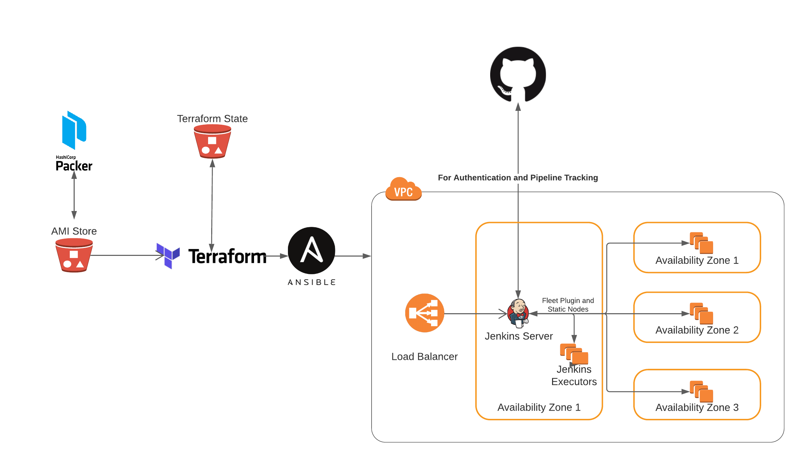

# Managed Jenkins Infrastructure for TVM

- Feature Name: `managed_jenkins_infra`
- Start Date: 2022-01-03
- RFC PR: [apache/tvm-rfcs#0000](https://github.com/apache/tvm-rfcs/pull/0049)
- GitHub Issue: [apache/tvm#0000](https://github.com/apache/tvm/issues/0000)
- Pre-RFC: https://discuss.tvm.apache.org/t/pre-rfc-managed-jenkins-infrastructure-for-tvm/11692

Authored-by: [Andrew Reusch](https://github.com/areusch)(@areusch)

Authored-by: [Noah Kontur](https://github.com/konturn)(@konturn)

See also: PoC of the Infrastructure-as-Code repos:
- Ansible and Jenkins config: https://github.com/octoml/tvm-ci
- Terraform: https://github.com/octoml/tvm-ci-terraform
- Packer: https://github.com/octoml/tvm-ci-packer

## Background and Motivations

The Apache TVM project relies on Jenkins for Continuous Integration services. At present, Jenkins is maintained by a small set of folks, many of whom are core committers or who serve on the PMC. As the project grows and the maintenance burden increases, we find that it could be beneficial to the project as well as the current Jenkins maintainers to adopt a more modern, Infrastructure-as-Code approach to maintaining the fleet of machines and the web services responsible for the TVM CI.

### Architectural Overview

At a high level, the proposed architecture layout is similar to what currently exists for TVM CI; namely, a leader VM in AWS will run the Jenkins GUI and assign pipeline jobs to agent VM's. As before, the Jenkins service on the leader VM will run via docker, and the leader will assign jobs to the agents via SSH authentication. While there will certainly be some architectural difference between this setup and the old one—agents will likely be deployed in autoscaling groups, and they will likely utilize a shared cache mechanism for builds via EFS or S3—the primary differences involve how provisioning/configuration is done:

1. Packer will be used to provision baseline images for all the agent and head node VM's. These images will be stored in AWS' AMI store, and will be updated periodically when necessary.
2. Terraform will be used to manage the infrastructural components of Jenkins CI such as the head node, agent autoscaling groups, and the load balancer handling SSL termination to the Jenkins leader VM. This way, infrastructural changes can be versioned and vetted in a publicly-available repository.
3. Ansible will be used to configure the Jenkins head node, and will thus handle items like Jenkins Job configuration (e.g. how often nightly builds run) and authentication methods. As with Terraform, the Ansible code will be made publicly-available.

It will likely be the case that the Terraform and Ansible code will reside in different repositories, as they will likely utilize different deploy paradigms. The former will likely leverage [Atlantis pull request automation](https://www.runatlantis.io/), which essentially allows contributors to run and review terraform plans by issuing comments on a PR. On the other hand, the ansible playbooks used to configure Jenkins will be run using Github Actions. If it is desirable to reduce complexity, we could use the same deploy tool for both.

### Theory of Operation

Under normal conditions, the system operates as follows:

1. The Jenkins master node is configured with a Pipeline Multibranch project. The project source tree is set to the official Apache TVM GitHub repository.
2. A GitHub [webhook](https://docs.github.com/en/developers/webhooks-and-events/webhooks/about-webhooks) notifies the Jenkins master when any branch or PR is updated in the Apache TVM repository.
3. The Jenkins master schedules a build for each notification it receives.
4. When it is time to start the build (the Jenkins [quiet period](https://www.jenkins.io/blog/2010/08/11/quiet-period-feature/) expires), Jenkins notifies GitHub and executes the `Jenkinsfile` to be used for the build.
    - NOTE: for PR builds, the `Jenkinsfile` used is always the one checked-in to the target merge branch (i.e. `main` for all practical purposes here). This is due to convention from the [Multibranch Pipeline plugin](https://github.com/jenkinsci/workflow-multibranch-plugin).
5. The TVM `Jenkinsfile` specifies a multi-stage build, each stage containing a set of parallel jobs which run on specific types of machines (machine types are identified from a `label` which is specified on [`node`](https://www.jenkins.io/doc/book/pipeline/syntax/#agent-parameters) lines in `Jenkinsfile`). These machine labels are also present in the TVM Jenkins master configuration. Currently, TVM CI supports these labels with these meanings:
    - `CPU` - an x86_64 machine with no specific GPU requirement which can execute `ci-lint`, `ci-cpu`, `ci-wasm`, `ci-qemu`, and `ci-i386` containers
    - `GPU` - an x86_64 machine with a specific GPU which can execute `ci-gpu` containers
    - `GPUBUILD` - an x86_64 machine with CUDA and other GPU libraries present (such that `ci-gpu` can execute), but not necessarily with the GPU used in TVM CI unit tests. Used to build TVM and unit tests which can be run on `GPU` nodes.
    - `ARM` - an AArch64 machine which can run `ci-arm` containers.
    - `TensorCore` - an alias for `GPU` (historically this specified a machine with a more powerful GPU)
    - `doc` - a machine which serves the last-built docs from `main`
6. Jenkins finds an **executor** machine for each job. Executors are machines running in AWS or other public clouds (e.g. public machine types in Azure, GCP, etc) which are running the Jenkins agent. Jenkins dispatches the job to the executor and awaits the results.
7. When a job in any stage fails, the build is aborted. Otherwise, the build proceeds through all stages.
8. When the build is completed, Jenkins notifies GitHub of the result, and the PR or `main` branch is updated.

### Autoscaler

Jenkins executor nodes can be classified into two groups:

1. **Static nodes** are long-lived instances managed by Terraform. The Jenkins master is configured to connect to static nodes at startup and expects them to continue to stay alive for the life of the Jenkins master process.
2. **Autoscaled nodes** are cloud instances that are created by the Jenkins master in response to PR workload. As the build queue grows longer, Jenkins can choose to create additional executors to alleviate developer wait time. Autoscaled nodes persist for an adjustable period of time after they become idle.

At launch time, we intend to use only static nodes. However, autoscaled nodes have been tested internally and we will begin to use those sometime in Q1 2022. Autoscaled nodes present a debugging challenge, as flaky tests or non-repeatable errors will need to be diagnosed before the autoscaled node is decommissioned automatically by the Jenkins master.

### Infrastructure-as-Code Repository

The production TVM CI instance will be managed using an open source Infrastructure-as-Code repository living in GitHub. All configuration except credentials will be stored in this repository. TVM Committers will be granted write access to this repository. Any changes to this repository will require review from those individuals with write access who are actively involved in the day-to-day operations of TVM CI.

## Maintenance Tasks

This section describes the various maintenance tasks that may need to occur with a Managed Jenkins fleet and roughly outlines the strategy and playbook for accomplishing them. The actual playbooks will be maintained and updated in the Infrastructure-as-Code repository which automates this system.

### Updating the Jenkins software

As mentioned in the Architectural Overview above, the Jenkins service on the head node runs via docker, and the image is deployed via Ansible. Updating the Jenkins service is therefore as easy as updating the version tag on the Jenkins image and letting the Ansible pipeline deploy the new image onto the leader node. Since doing this involves restarting Jenkins, it causes running jobs to fail; to prevent disruption, worker nodes will be drained of jobs prior to deployment. This will all be done in a pre-defined maintenance window (e.g., Sunday night) as to avoid large queue times during the draining process.

### Changing the set of static nodes

As of now, technical limitations in the way the static nodes are deployed prevents configuration changes without recreating the nodes. Luckily, these changes can be applied by rolling updates; namely, the nodes can be drained and updated one at a time to avoid noticeable CI degradation. To elaborate, the update process entails making a change to the set of static nodes in Terraform and then draining and applying the changes on each node one by one.

### Making a configuration change to Jenkins

As with updating the Jenkins software, any configuration changes can be made by running and deploying the configuration changes through Ansible. As of now, most global configuration changes require a reboot of the Jenkins node, and so will likely be done during the same maintenance window mentioned above. The code will likely be retooled in the future so that these changes can be made without having to redeploy the docker image.

### Adding a new job

Jenkins Jobs are also managed through Ansible, and updates to job configuration/adding new jobs does not require Jenkins to be restarted.

## Launch Validation

### Validating the CI

This section describes how we have validated the new CI to ensure we aren't changing the test results by switching platforms. This validation process is vastly simplified by the fact that we have already been managing the executors using Terraform for 6 months. Here, validation means determining that the proposed Jenkins system produces test results which are similar enough to the one currently running in production.

There are many reasons why the two systems could differ:

1. Executor node misconfiguration
2. Jenkins master misconfiguration
3. Flaky TVM tests
4. Differences in the test environments (e.g. choosing a different target revision when merging a PR for test purposes)

We consider disagreements in test results caused by the first two reasons to be blocking, and the others to not block a launch of this system. TVM's CI testing is not always 100% reproducible due to test flakiness, and the benefit of launching this system outweighs the cost of achieving an exact match between a staging system and TVM's present production CI system.

We therefore adopt a log analysis strategy for validation like so:

1. A Python script scans the Jenkins workspace of the production Jenkins instance and a staging instance which matches the configuration proposed here. A list of pairs of build numbers, each pair associating two builds (one from production Jenkins and one from staging) which operated on the same PR or TVM revision.
2. Each build pair is considered one-by-one. The Jenkins pipeline XML is examined to determine the build result and any failing stages in TVM CI. A report is produced detailing differences between the outcome of all `sh` statements in the `Jenkinsfile`.
3. The differing entries in the report are analyzed manually and categorized into one of the above categories. Those reports which fall into a blocking launch category must be justified to avoid blocking launch (e.g. transient config change, development of staging instance, etc).

### Launch Process

TVM CI is less heavily used over weekends, so the launch process will take place on a weekend. When the launch commences, Jenkins will be configured to stop scanning PRs and we will wait for builds to complete. Once completed, the following steps will take place:

1. The production cluster will be created using the IaC pipeline
2. [`ci.tlcpack.ai`](http://ci.tlcpack.ai) will be updated to point to the new Jenkins master
3. We will smoke test several PRs to ensure the CI has basic functionality

We will not initially enable autoscaling. After a few weeks of successful operation, we will begin adding autoscaler nodes to the fleet.

## Ownership

We propose that the Infrastructure-as-Code repository for this system be open-sourced and that maintenance of the repositories be under the same project governance and PMC; IaC operations will therefore (after the project enters production) be launched from GitHub Actions inside new git repositories dedicated to operating the CI. It is the intent of the authors of this RFC to eventually host these repositories in the `apache` GitHub Organization. However, for the **initial** launch, we will create the following repositories:

* `tlcpack/ci-packer` - Contains Packer build scripts for the AMI base images used by the executors.
* `tlcpack/ci-terraform` - Contains Terraform infrastructure-as-code which documents how cloud services are configured.
* `tlcpack/ci-ansible` - Contains Ansible infrastructure-as-code which documents how the software on each node is configured.

These repositories will be operated in the same way as `apache/tvm`. For example, the set of users who can write to these repositories are the TVM committers, and all files will include the ASF header. Cloud credentials will be provided to these IaC repositories as GitHub Secrets (e.g. stored privately, accessible to TVM committers) to enable maintenance access to the fleet of nodes.

These IaC repositories will be placed under the `tlcpack` organization during the initial launch whie we experiment with maintaining the system and come to a full understanding of what's needed from GitHub. After the new CI has been in production for some time (e.g. in Q2 2022), we will assess these needs and determine whether it's feasible to move it into a repository underneath the `apache` organization. Most likely, it will be possible to do this and we will form a request to the Apache infrastructure team at this time. In the unlikely event that this would adversely interfere with operations, the PMC will establish a set of rules for operating out of the `tlcpack` organization.

This RFC doesn't intend to remove any documentation on how unit tests are run from the TVM repository--the project expects that sufficient documentation should exist in `apache/tvm` to run unit tests and that the IaC here serves, for now, to reflect that documentation into automated test infrastructure.

## Alternatives

### GitHub Actions

We considered using GitHub Actions to drive the TVM CI instead of Jenkins. While GitHub Actions has several attractive properties (for two, a modern configuration language and management of the "Jenkins master" equivalent), there are a couple of compelling reasons to build our own infrastructure including the Jenkins master:

1. **Maintenance of dedicated executor fleet**. TVM's build is sensitive to the type of hardware used to execute the CI. Using GitHub Actions only alleviates us of the burden of running the Jenkins master. We would still need to run our own fleet of executors with the GitHub agent.
2. **Write access to CI configuration**. GitHub Actions is configured from within the `tvm` repository. While there are many benefits to this, operationally write access to the `tvm` repository is a slow process that is currently granted based on historical contribution to TVM. This process isn't particularly impedance-matched to the needs of a DevOps team, where access checks are routine but low-overhead and the group with write permissions should be controlled but easy to change. And, it's likely that many of the maintenance tasks involved with running TVM executors require the involvement of the current group of TVM Committers—indeed, no TVM committer is on the OctoML Infrastructure team today.
3. **Private TVM CI instances**. While TVM CI will always remain open and public, there are multiple companies which both contribute to TVM and desire to run their own CI instance internally. Sticking to an open-source CI system avoids any vendor-specific pitfalls (e.g. anyone *could* run Jenkins internally and reference our configuration).
4. **Supporting non-cloud TVM Targets**. TVM CI does not currently test against targets not available in a public cloud. We have no plans to include such targets in any CI process which may contribute a binding vote on a PR's; however, as TVM expands to target mobile and edge (e.g. iOS, Android, and microTVM-related targets), there are some good reasons to consider allowing vendors the capability to notify when a PR would break their specific build. Adding this functionality to GitHub Actions could further complicate the permissions issue contemplated above.

## Future Questions

1. With an open IaC repository, it should be possible to share sponsorship of the Jenkins executor nodes with others in the TVM community. The exact process for this, however, has yet to be defined.
2. How can we add support for testing hardware not available from cloud providers? What additional infrastructure might this require?
3. We may need to change the TVM committer promotion process to accomodate oncall staff or document an additional process by which those staff can be granted write access to the IaC repos without having committer status. We will take this up after the system has been live for a period of time.
