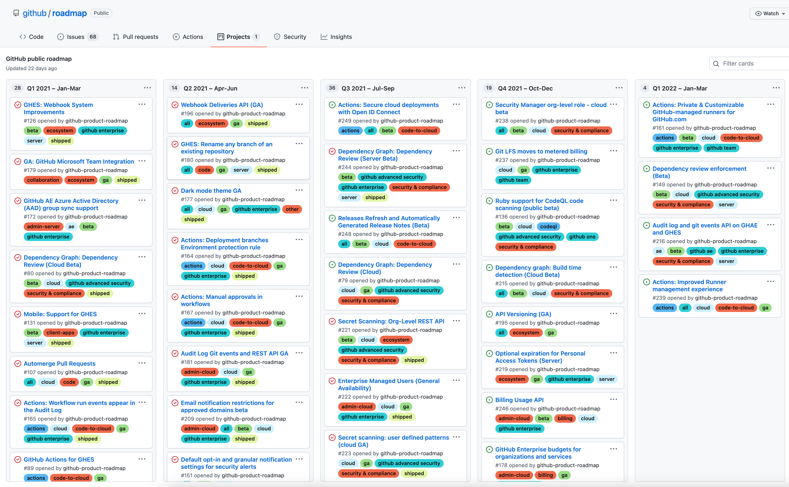

- Feature Name: roadmaps
- Start Date: 2022-01-07
- RFC PR: [apache/tvm-rfcs#0050](https://github.com/apache/tvm-rfcs/pull/0050)
- GitHub Issue: [apache/tvm#0000](https://github.com/apache/tvm/issues/0000)
- pre-RFC: https://discuss.tvm.apache.org/t/pre-rfc-tvm-roadmap/11171
- pre-RFC: https://discuss.tvm.apache.org/t/pre-rfc-roadmap-rfcs/11711
- Co-Authors: Denise Kutnick ([**@denise-k**](https://github.com/denise-k)), Andrew Reusch 
  ([**@areusch**](https://github.com/areusch))

NOTE(areusch): This RFC is a combination of the two above pre-RFCs, and limited copy-editing has
been done to preserve the flow of the document.

## Summary

This RFC proposes to add product roadmaps to TVM.

Roadmaps should be seen as a way of unifying the planning process of TVM, all the way from ideas to
PR merges. The roadmaps discussed in this RFC are intentionally designed to integrate with TVM’s
existing planning tools (e.g. GitHub tracking issues, RFCs), while adding an additional space for
sharing and collaboration earlier in the R&D process.

This proposal includes two categories of roadmaps:

- **TVM Global Roadmap**: This roadmap aims to provide a holistic view of all components within TVM,
  focusing on features which broadly affect the entire project or add significant functionality.
- **TVM Component Roadmaps**: These roadmaps aim to provide a more detailed view of a subsection of
  TVM: including vertical efforts involving TVM's intermediate representations (such as Relay or
  TIR) and the horizontal efforts which span across TVM's full stack (such as Automation or
  Documentation). Details about each of the components in TVM will be discussed later in this
  RFC.

## Motivations

- Integrate TVM’s technical vision and task tracking mechanisms together
- Provide everyone with visibility into all of TVM’s projects
- Enable individuals and organizations that contribute to TVM to influence the vision of TVM via
  roadmaps
- Encourage individuals and organizations that contribute to TVM to share the details of their
  longer-term efforts
- Ensure a openly-governed, equitable process towards creating new roadmaps for TVM

## Guide-Level Explanation

This guide-level explanation will describe the basic structure of the roadmap, without focusing
heavily on the intended contents.

### Tooling

The roadmap utilizes GitHub Projects as the underlying tooling mechanism. This maximizes reuse of
existing content tracked in GitHub, and is very user-friendly for existing GitHub users.

This RFC proposes to place the TVM roadmaps directly in the `apache/tvm` repository, since the
roadmap is intended to be a community-focused project, and having the roadmaps directly in TVM would
help to maximize visibility to the TVM community.

### Sample Roadmap

Above is a sample roadmap for **TVM CI and Testing**, with annotations to show several important
features within the roadmap:

1. **Background & Motivations** **Column:** This section is located on the left-most part of the
   roadmap, and is intended to define a few key focus areas of the project and their overall success
   criteria. In the **TVM CI and Testing** roadmap, this section contains definitions of Coverage,
   Ease of Use, Runtime, Stability, and Reporting.
2. **Quarterly Planning Columns**: Following **Background & Motivations**, a roadmap has 4 quarterly
   planning columns (one column per upcoming quarter through the next year). Each Quarterly planning
   column has these cards:
    - **Themes & Goals:** The **Themes & Goals** are listed in the top-most card of each column of
    the roadmap, and are intended to show how the focus areas of the project are addressed that
    quarter.
        - Themes are chosen from those defined in the **Background & Motivations** section (such as
        Stability or Runtime).
        - Goals describe how the **Roadmap Items** listed in each column contribute to the success
        criteria listed in **Background & Motivations**.

        For example, in Q3 of 2021 (the last 3 months of development in TVM), two of the major focus
        areas in **TVM CI and Testing** were Stability and Runtime.

    - **Roadmap Items:** Each column of development contains roadmap items which contribute to each
    of the **Themes & Goals** described above. These items are meant to unify feature development
    within each project, whether it is coming from an RFC, GitHub task tracking, or directly from
    within the roadmap. Items on the roadmap generally have feature ownership at least partially
    identified at a minimum.
3. **Backlog Column**: Items on the roadmap which don't have an owner or a proposed development
   timeline fall into the **Backlog Items** column. This is also the default location where new
   roadmap issues are placed.

## Roadmap Process

This section proposes the **Roadmap-RFC** process, which aims to encapsulate the processes discussed
in the Overview section. The **Roadmap-RFC** is used to create, modify, or delete roadmaps. Details
on the process are listed below.

### Template of a Roadmap's Contextual Information

The following fields provide some contextual information for each roadmap.

- **Roadmap Name:** Name of the roadmap
- **Roadmap Maintainers**: These community members are primarily responsible for adding, modifying,
  and removing roadmap items. **Any community member can be listed as a maintainer of a roadmap,
  regardless of contributor status within the Apache organization.**
    - Note: If a Roadmap-RFC's proposed maintainer does not have TVM Committer or PMC status within
    the Apache organization, they will receive an invitation for a Triage role in Apache TVM as soon
    as their Roadmap-RFC is accepted. This will allow them to maintain and triage roadmaps while
    maintaining the Apache community contribution process.
- **Roadmap Summary/Description:** A brief description of the roadmap

### Establishing Scope and Themes for a new Roadmap

For each roadmap, a set of **scope** and **themes** should also be defined, in order for TVM's
community members to quickly learn about a roadmap's key focus areas.

**Establishing Scope**

- How are the tasks tracked in this roadmap grouped together? How can we think about this grouping
  distinct from those made in other roadmaps? It's okay for there to be overlap with other roadmaps,
  but the scope defined here should motivate a separate roadmap.
- Is the proposed roadmap intended to represent a perpetually ongoing set of efforts, or is there an
  end goal which will close/finalize the roadmap?
- Does the proposed roadmap have any scope overlaps with any existing roadmaps? If so, please list
  them.

**Establishing Themes**

- List 4-6 proposed "themes" of the roadmap, intended to convey the purpose of the roadmap and the
  types of tasks that should be added.
    - Some examples of themes are `programmability`, `portability`, and `performance`.
    - Themes are intended to group items within a roadmap. This helps us to understand the scope of
    the roadmap.
- For each theme, include a set of definitions specific to the proposed roadmap.
    - What does this theme mean in the context of this roadmap?
    - Are there multiple definitions for this theme? For example, `performance` could be interpreted
    as tuning times, runtime latency, or a number of other definitions.
- For each theme, include a set of success criteria specific to the proposed roadmap.
    - What types of metrics would be relevant to this roadmap?

### Adding Items to a Roadmap

A roadmap's maintainers are the primary folks responsible for adding, modifying, and removing items
for a roadmap. This isn't a hard and fast rule—for example, it may be expedient for other community
members to triage new roadmap items into a roadmap's backlog. However, the maintainers should be
considered the "owners" of a roadmap, and generally no rigid process is defined around modifying the
items in a roadmap.

Roadmaps are defined using [GitHub
Projects](https://docs.github.com/en/issues/trying-out-the-new-projects-experience/about-projects)
and can include GitHub Issues, Pull Requests, and simple note cards. Maintainers should strive to
place mainly **GitHub Issues** in roadmaps to make it possible for the community to learn more about
ongoing work and reduce triage burden.

Each item on a roadmap is intended to track one of these community processes:

- **pre-RFCs** serve as a way to begin discussions on planned work at the earliest stage of
  maturity. **pre-RFCs** are typically posted in the [TVM Discuss
  forums](http://discuss.tvm.apache.org) in order to solicit TVM Community feedback. For an example
  of a **pre-RFC**, see the screenshot of [**@areusch**](https://github.com/areusch)'s proposal to 
  [Convert RST Docs to Markdown](https://discuss.tvm.apache.org/t/docs-discuss-convert-restructuredtext-docs-to-markdown/10264).

    **pre-RFCs** can be tracked on a Roadmap by preemptively creating a GitHub Task-tracking Issue
    in [tvm-rfcs](https://github.com/apache/tvm-rfcs).
    

- **RFCs** serve as a way to share feature proposals with the TVM Community. The
  [tvm-rfcs](https://github.com/apache/tvm-rfcs) repo is used for the creation and acceptance of
  **RFCs**. For some examples of **RFCs**, see the screenshot of open pull requests in
  [tvm-rfcs](https://github.com/apache/tvm-rfcs) below.

    Open **RFCs** can be directly linked into any roadmap. Once an **RFC** is accepted, please use
    the **GitHub Task-Tracking** process to track **RFC** Execution.
    

- **GitHub Task-Tracking Issues** are used in [tvm](https://github.com/apache/tvm) to share the
  progress of midsize features and/or accepted RFCs over time. 
  - For an example of a  **GitHub Task-Tracking Issue**, see the screenshot of [**@AndrewZhaoLuo**](https://github.com/AndrewZhaoLuo)'s 
    RFC to *Add Mixed-Precision Support to TVM* below.

    These task-tracking issues can be directly linked into any roadmap.
    

  - For an example of a midsize feature which could be categorized as a **GitHub Task-Tracking Issue**,
    see the screenshot of [**@FranckQC**](https://github.com/FranckQC)'s *Implementation of Common Subexpression Elimination for TIR*
    below.

    These features will need a *separate GitHub Issue* created and linked to the applicable pull
    requests, so that they can be properly linked into GitHub Projects.
    

- **Bugfixes** are actionable GitHub Issues not necessarily connected to a Task-Tracking
  Issue. Generally, they require only 1 PR and the work is clearly specified in the issue. For an
  example of a **bugfix** GitHub Issue, see the screenshot of a flaky CI test report below.

    You can directly link **bugfixes** in a roadmap by adding their corresponding GitHub Issues as a
    card. Generally, it’s the maintainer’s responsibility to combine related **bugfixes** in order
    to keep the roadmap concise. For example, if you have 10 flaky tests in CI, it might make sense
    to have a global tracking issue for flaky CI tests which points to each individual bug.
     

## Reference-Level Explanation

### Design Considerations

There were several key considerations made while designing this roadmap, centering around the
overall themes of quality content, usability, and maintainability. Below are some of these
considerations:

1. **Make it as easy as possible for contributors without domain-level expertise to quickly gain
   basic context and understanding of a project**
2. **Encourage consistent and high-quality roadmap content**
    - Background Information
        - There should be a roadmap for all of TVM, and detailed, focused roadmaps for components of
        TVM
        - Each roadmap should contain themes which encapsulate key focus areas of the roadmap
        - Each roadmap should contain items which describe either features or milestones
            - Each item should have clearly defined motivations, end goals, deliverables, and scope
            - Smaller tasks (e.g. fixing flaky tests) may be combined into a larger milestone
            - Larger features (e.g. AutoTIR) may be split into smaller milestones
    - Schedule & Prioritization
        - Priority of any given feature should be determined by consensus, then displayed
        prominently
        - Dependencies and blockers should be easily traceable
        - Delivery schedule should be estimated based on prioritization, dependencies, and blockers,
        and it should be updated as confidence increases
    - Ownership
        - Subject-matter experts (e.g. feature authors, contributors with subject-matter expertise)
        should be listed for each feature
        - Task-level ownership should be listed for each feature
        - Tasks with help needed should be discoverable to new users
3. **Leverage existing task tracking mechanisms**
    - Easier maintenance for everyday contributors
    - Show updated progress towards feature completion
4. **Encourage sharing and collaboration in the early stages of planning**
    - Roadmap describes what changes are desired
    - RFC describes how changes will be implemented

### Proposed Set of Roadmaps

Below is the initial set of roadmaps proposed in this RFC.

|Roadmap Name|Scope|
| --- | --- |
|TVM Global Roadmap|All of TVM's efforts|
|TVM Automation Roadmap|Automated performance improvements across the entire TVM stack|
|TVM Community Roadmap|Community efforts across all of TVM, including Developer Tooling, Documentation, Events, Videos, and Tutorials|
|TVM Continuous Integration & Testing Roadmap|CI and testing across all of TVM|
|TVM Core Compiler Roadmap|Major compiler features and/or refactors with impacts across key APIs and/or multiple IRs in the TVM stack|
|TVM Frontend & Interface Roadmap|Major user-facing pieces of TVM, such as importers, TVMC, and user facing APIs|
|TVM Graph Computation & High-Level Optimizations Roadmap|All things Relay related
|TVM Scheduler & Low-Level Optimizations Roadmap|All things TIR related|
|TVM Hardware Roadmap|All things hardware backend related|
|microTVM roadmap|All things microTVM related|

## Challenges

There are a few challenges to having publicly available roadmaps, but overall, we believe that the
benefits of having roadmaps for TVM vastly outweigh the negatives.

- **Changes to the roadmap**: Items on the roadmap are subject to change as plans and community
  consensus changes. It is inevitable that projects get delayed or rescoped with time, and this will
  impact the roadmaps. However, the true value of roadmapping is to empower contributors to share
  their ideas, changes included, with the community.
- **Contents of the roadmap**: TVM has a broad and diverse contributor base who may take different
  approaches to authoring and reading the contents of the roadmap. In order to ensure uniformity and
  high-quality contents within the roadmap, community roadmap guidelines will be created and
  upstreamed.
- **Organization of the roadmap**: Since the proposed roadmaps would live directly in `apache/tvm`
  via GitHub Projects, roadmap items would be created directly in `apache/tvm` as GitHub
  issues. Currently, GitHub issue usage is very limited in `apache/tvm` in order to ensure easier
  triage and timely closure of issues. Having the TVM roadmaps live in `apache/tvm` would increase
  the overall count of GitHub issues in the repository, but the roadmap items could be labeled with
  a `tvm:roadmap` tag so that they can be properly triaged and filtered.

## Rationale & Alternatives

There are several alternatives to this roadmap proposal; however, each of the alternatives has
drawbacks of its own.

- **Do nothing:** Don’t create a publicly viewable roadmap. However, the community would miss out on
  the numerous benefits of having a roadmap.
- **Create a separate repository for roadmap:** Having a separate roadmap repository
  (e.g. `apache/tvm-roadmap`) might reduce the number of roadmap issues filed directly to
  `apache/tvm`, but it would increase the complexity and fragmentation of the roadmap significantly,
  since this roadmap repository would have to link to RFC tracking issues in `apache/tvm` anyways.
- **Use a separate tool for the roadmap:** Using a separate tool for the roadmap may provide more
  functionality than GitHub projects. However, this would require much more effort to create and
  maintain.

## Prior Art

This RFC is inspired by the previous work done to improve the tracking mechanisms of TVM. This
includes but is not limited to the existing RFC process, release process, and technical visions of
TVM.

It is also inspired by the [public GitHub roadmap](https://github.com/github/roadmap), which is an
excellent example of usage for GitHub Projects.

## Upstreaming Timeline

This is a prospective upstreaming timeline for the TVM roadmap.

|Milestone Name|Deliverables|
| --- | --- |
|TVM Roadmap M1A: Taking the Plunge|<li>All roadmap projects defined <li>Initial prototype roadmap (TVM CI & Testing) upstreamed   <li>Skeleton roadmap documentation upstreamed   <li>Scope of M1B and M1C clearly defined|
|TVM Roadmap M1B: Building Momentum|<li> At least 3 additional roadmaps upstreamed   <li> Additional roadmap process documentation upstreamed|
|TVM Roadmap M1C: Ready for Prime Time|<li> All initial roadmaps (described in M1A RFC) upstreamed   <li> All RFC opens from M1A and M1B addressed  <li> Publicize roadmap in documentation and TVM forums|

## Unresolved Questions

Questions about the design and contents of the TVM Roadmap will be progressively resolved through
the upstreaming timeline shown above. Any unresolved questions at the end of TVM Roadmap Milestone 1
will be created as roadmap items in the TVM Community Roadmap.

## Future Possibilities

- Create [GitHub issue templates](https://github.com/apache/tvm/tree/main/.github/ISSUE_TEMPLATE)
  for roadmap items (similar to the existing GitHub issue templates for docs, CI, etc).
- Use [the new GitHub issues/projects (closed beta)](https://github.com/features/issues) to improve
  roadmap functionality.

## Special Thanks
Thanks so much for copyediting, [**@electriclilies**](https://github.com/electriclilies)! :hugs:
