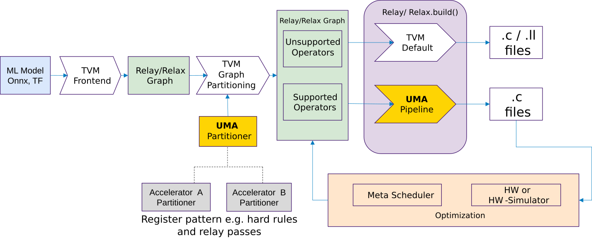

# UMA: Universal Modular Accelerator Interface

    Feature Name: Universal Modular Accelerator Interface (UMA)
    Start Date: 2022 February
	Authors: 
	  Paul Palomero Bernardo @paulpb, Christoph Gerum @cgerum - University of Tübingen
      Michael J. Klaiber @mjklaiber, Ingo Feldner - Bosch Research
      Philipp van Kempen @philippvk, Rafael Stahl @r.stahl, Daniel Müller-Gritschneder - Technical University of Munich
	  Johannes Partzsch - TU Dresden
	  Andrew Stevens - Infineon Technologies
    RFC PR: https://github.com/apache/tvm-rfcs/pull/60
    GitHub Tracking Issue: https://github.com/apache/tvm/issues/11260

## Summary


The goal of **UMA (Universal Modular Accelerator Interface)** is to create a unified infrastructure for easily integrating external accelerators into TVM. 
UMA provides file structures, Python interface classes and an API for accelerator integration. These interfaces and API are accessible from Python and are part of the components *UMA Partitioner*, *UMA Lower* and *UMA Codgen*. 
The features and proposals of *Target registered compiler flow customization* [TVM-RFC0011] and [TVM-RFC0010] are considered, with the difference that UMA tries to provide a more general interface for integrating new accelerators and one specific implementation of the hooks described in [TVM-RFC0011]. 


<br clear="left"/>

<sub><sup> Image Source:  https://www.flickr.com/photos/luvi/234261205 under CC BY-NC-ND 2.0</sup></sub>


##  Goal and Motivation

A number of accelerators have already been integrated into TVM, e.g. VTA, ARM EthosU. 
These are similar in both the structure of their build flow and the operations that they can offload.
Nonetheless, due to incremental independent development, the TVM interfaces and processing steps used are quite different with little commonality.  A consistent, unified, infrastructure would simplify accelerator integration making it accessible to smaller, hardware-focused, development teams.

The **goal** of UMA is to establish two API layers with a different target groups of users:

**Porcelain Layer**: UMA
  - Straight-forward, *Python-only* and stable API wrapper of plumbing layer
  - Easy and clearly-defined template for integration of accelerators
  - Short learning period for hardware/software engineers new to TVM

**Plumbing Layer**: 
  - Collage-like API [COLLAGE-RFC](https://github.com/mbs-octoml/mbs-tvm-rfcs/blob/mbs-rfcs-collage/rfcs/xxxx-collage.md) + other TVM APIs
  - Powerful API to core-compiler + other TVM features
  - Target audience is experienced TVM users/developers
  - C++ and Python APIs


## Focus

UMA's primary objective is to enable straight-forward TVM integration of loosely-coupled processor/microcontroller controlled accelerators.  That is, accelerators capable of executing complete tensor operations or operation-graphs without host processor intervention.
Secondary objectives are:

* Support for closely-coupled accelerators (those offload parts of  CPU computation for significant elements of tensor operations)
* Compatibility with both run-time or ahead-of-time compilation
* Support for heterogeneous execution utilizing accelerators optimized for specific operations or data types

Accelerator support or optimization functions **outside** the scope of UMA are:

* Parallel execution on multi-accelerator architectures (to be handled by executor/run-time and customized layer splitting)
* Real-time execution (to be handled by executor/run-time)
* High-level support for parameter conversion like quantization or sparsity exploitation (to be realized via model pre-processing or in accelerator backends)

## Guide-level explanation 


### Flow description 


The figure below describes the UMA interface from a top level. An *Accelerator Partitioner* which is a specialization of the *UMA Partitioner* takes the Relay graph and matches for supported and unsupported operators. Unsupported operators are processed with the default TVM flow. Supported operator are processed with **UMA Pipeline**.
In the following the tasks and the functionality of each block in the figure below is described:



UMA Partitioner: 
* Register relay passes
* Register patterns - supported sub-graph operations
* Order: pre-partitioning passes, Graph partitioning, post-partitioning passes
* API level:
    * UMA Partitioner creates a wrapper API to TVM core-compiler APIs

The figure below described the *UMA Pipeline*. The blocks are described below:


UMA Pipelining:
* Consists of UMALower and UMACodgen, which implement the target hook Relay-to-TIR and TIR-to-Runtime (proposed in [TVM-RFC0010])
* UMALower
  * Input: Partitioned composite functions
  * Custom primitives can be registered
  * Lowering from Relay to S-TIR, using TOPI or custom primitives 
  * Interface for registering accelerator-specific passes
  * Execution of UMA passes on S-TIR and NS-TIR
  * Output:  NS-TIR(including tir.extern calls)
* UMACodegen
  * Input: NS-TIR(including tir.extern calls)
  * Defaults to standard TVM codegen
  * Intend is to provide a Python interface to insert/emit target code
  * Output: Target .c files

The intention is to use TensorIR with MetaScheduler for optimization and Relax (a possible succesor of Relay [video link](https://www.youtube.com/watch?v=xVbkjJDMexo)) in later versions.


Abbreviations:
S-TIR: Schedulable TIR
NS-TIR: Non-Schedulable TIR

### Adding a New Custom Accelerator

A custom accelerator is added by inheriting the `UMABackend`. New elements (e.g., passes) are added using a registration machanism. Below example shows a backend that makes use of all available registration functions.
```python
"""UMA backend for the UltraTrail accelerator"""

class UltraTrailBackend(UMABackend):
    def __init__(self):
        super(UltraTrailBackend, self).__init__()
	
	# Target configuration
        self._register_target_attr("dimension", default=8)

        # Relay to Relay function registration
        self._register_pattern("conv1d_relu", conv1d_relu_pattern())

        self._register_relay_pass(PassPhase.POST_PARTITIONING, ConfigGenerator())
        self._register_relay_pass(PassPhase.POST_PARTITIONING, BufferScopeAnnotator())

        # Relay to TIR function registration
        self._register_operator_strategy("nn.conv1d", custom_conv1d_strategy)

        self._register_tir_pass(PassPhase.TIR_PHASE_0, CodegenGenerateExternCalls())

        # TIR to runtime function registration
        self._register_codegen(format="c", includes=gen_includes, replace_call_extern=None)

    @property
    def target_name(self):
        return "ultra_trail"
```

### Using a Custom Backend

A new custom backend is created by implementing the `UMABackend` as shown in the [previous section](#adding-a-new-custom-accelerator). To use the backend it simply needs to be registered using `backend.register()`. Once a `UMABackend` is registered, it hooks into the usual `relay.build` process to create the code for the target accelerator.
```
# Load model
mod, params = relay.frontend.from_pytorch(scripted_model, [("input_data", input_shape)])

# Register a UMA backend
ut_backend = UltraTrailBackend()
ut_backend.register()
mod = ut_backend.partition(mod)

# Relay build (AOT C target)
TARGET = tvm.target.Target("c")
RUNTIME = tvm.relay.backend.Runtime("crt")
EXECUTOR = tvm.relay.backend.Executor("aot", {"unpacked-api": True})

with tvm.transform.PassContext(
    opt_level=3, config={"tir.disable_vectorize": True}, disabled_pass=["AlterOpLayout"]
):
    module = relay.build(mod, target=TARGET, runtime=RUNTIME, executor=EXECUTOR, params=params)
```

## Reference-level explanation 

### File and class structure and Snippets as example for integration

UMA provides a fully python-based API. The API is structured as shown below. The base class `UMABackend` functions as the core API. It uses the API points described in the [flow description](#flow-description) to register elements for the different stages. 
```
.
├── backend.py
├── api
│   ├── codegen.py
│   ├── lower.py
│   ├── partitioner.py
│   └── utils.py
├── accelerator_A
│   ├── backend.py
│   ├── codegen.py
│   ├── passes.py
│   ├── patterns.py
│   └── strategies.py
└── accelerator_B
    └── ...
```

### Pass Phases

UMA allows users to register passes in different stages of the compilation pipeline called pass phases. They are motivated by the existing [TIR pass phases](https://tvm.apache.org/docs/how_to/extend_tvm/low_level_custom_pass.html?highlight=phase#glue-to-lowering) and provide new users with some orientation as to where they should put their custom passes in the entire compilation process. To be more expressive, pass phases are named enums of type `PassPhase`, e.g., `PassPhase.PRE_PARTITIONING`, `PassPhase.POST_PARTITIONING`. This makes them easier to extend and more intuitive to use than an int-based representation.

Passes are divided into relay and TIR passes and can be registered as such (`_register_relay_pass`, `_register_tir_pass`). Each pass gets registered for a specific pass phase and the order of registration defines the order of exection within the same phase.

Future versions of UMA could also provide a finer interface for where to register a pass by providing the passes dependencies, e.g., `_register_relay_pass(MyPass, before=PassA, after=(PassB, PassC))`. However, this would first require pass dependencies to be implemented in the TVM core since UMA only tries to wrap around existing TVM APIs. 

### UMA Target Hooks

UMA uses target hooks (RFC [#0010](https://github.com/apache/tvm-rfcs/blob/main/rfcs/0010-target-registered-compiler-flow-customisation.md)) to perform the lowering of the partitioned, accelerator specific functions from relay to TIR and TIR to runtime. To register the hooks from the python side, a global function `RegisterTarget` is registered on the C++ side and used during backend registration. To allow customization of the target, it is possible to pass target-specific attribute options which are registered in the UMABackend.

```cpp   
TVM_REGISTER_GLOBAL("relay.backend.contrib.uma.RegisterTarget")
    .set_body_typed([](String target_name, Map<String, ObjectRef> attr_options){
        auto target_kind = ::tvm::TargetKindRegEntry::RegisterOrGet(target_name)
        .set_name()
        .set_device_type(kDLCPU)
        .add_attr_option<Array<String>>("keys")
        .add_attr_option<String>("tag")
        .add_attr_option<String>("device")
        .add_attr_option<String>("model")
        .add_attr_option<Array<String>>("libs")
        .add_attr_option<Target>("host")
        .add_attr_option<Integer>("from_device")
        .set_attr<FTVMRelayToTIR>("RelayToTIR", relay::contrib::uma::RelayToTIR(target_name))
        .set_attr<FTVMTIRToRuntime>("TIRToRuntime", relay::contrib::uma::TIRToRuntime);

        for (auto &attr_option : attr_options) {
          try {
            target_kind.add_attr_option<String>(attr_option.first, Downcast<String>(attr_option.second));
            continue;
          } catch (...) {}
          try {
            target_kind.add_attr_option<Bool>(attr_option.first, Downcast<Bool>(attr_option.second));
            continue;
          } catch (...) {}
          try {
            target_kind.add_attr_option<Integer>(attr_option.first, Downcast<Integer>(attr_option.second));
            continue;
          } catch (...) {
            LOG(FATAL) << "Attribute option of type " << attr_option.second->GetTypeKey() 
                       << " can not be added. Only String, Integer, or Bool are supported.";
          }
        }
    });
```

Future versions of UMA could support further customization of the target. One option that has been discussed is the possibility to also allow registration of target preprocessors (e.g., `.add_attrs_preprocessor(Preprocessor)`). A motivation for it in described in this [RFC](https://github.com/apache/tvm-rfcs/blob/1901b7361891fc7235b3bb8e80c89130cfe2c91d/rfcs/0070-target-preprocessing.md).

### UMABackend References

UMA should function as an easy to use API, that also helps new users gain orientation in the codebase. To this end, all API functions are typed and documented with examples of their use and required input.

#### `_register_target_attr`
```python
_register_target_attr(self, name: str, default: Optional[Union[str, int, bool]] = "") -> None
```

|Parameter|Description|
|---------|-----------|
|name|The name of the target attribute.|
|default|A default value for the attribute. If none is provided, the attribute will be treated as a string.|

Example usage:
```python
self._register_target_attr("attrA", default=0)
self._register_target_attr("attrB", default=False)
```

#### `_register_relay_pass`
```python
_register_relay_pass(self, phase: PassPhase, relay_pass: tvm.transform.Pass) -> None
```

|Parameter|Description|
|---------|-----------|
|phase|The phase at which the pass is registered.|
|relay_pass|The relay pass to be registered.|

Example usage:
```python
self._register_relay_pass(PassPhase.RELAY_PASS_PHASE, MyPassA)

# Where a relay pass can look like this:
@tvm.ir.transform.module_pass(opt_level=0)
class MyPassA:
    def transform_module(self, mod, ctx):
        # My pass functionality...
        return mod
```

#### `_register_pattern`
```python
_register_pattern(self, name: str, pattern: tvm.relay.dataflow_pattern.DFPattern,) -> None
```

|Parameter|Description|
|---------|-----------|
|name|The name of the pattern.|
|pattern|The dataflow pattern.|

Example usage:
```python
self._register_pattern("conv1d", conv1d_pattern)

# Where a dataflow pattern can look like this:
conv1d_pattern = is_op("nn.conv1d")(wildcard(), wildcard())
optional_bias = lambda x: is_op("nn.bias_add")(x, wildcard())
optional_relu = lambda x: is_op("nn.relu")(x)
conv1d_pattern = conv1d_pattern.optional(optional_bias).optional(optional_relu)
```

#### `_register_operator_strategy`
```python
_register_operator_strategy(self, op: str, strategy: Callable[[tvm.ir.Attrs, tvm.ir.Array, tvm.ir.TensorType, tvm.target.Target], tvm.relay.op.op.OpStrategy], plevel: Optional[int] = 11) -> None
```

|Parameter|Description|
|---------|-----------|
|op|The name of the operator for which this strategy will be registered.|
|strategy|The strategy function.|
|plevel|The priority level of the strategy. Higher plevel equals higher priorization. The TVM default for topi strategies is 10 so by default new UMA strategies are always used.|

Example usage:
```python
self._register_operator_strategy("nn.conv1d", custom_conv1d_strategy)

# Where a strategy function can look like this:
@relay.op.strategy.override_native_generic_func("custom_conv1d_strategy")
def custom_conv1d_strategy(attrs, inputs, out_type, target):
    strategy = _op.OpStrategy()
    strategy.add_implementation(
        wrap_compute_conv1d(custom_conv1d_compute),
        wrap_topi_schedule(custom_conv1d_schedule),
        name="custom_conv1d.generic",
    return strategy
```

#### `_register_tir_pass`
```python
_register_tir_pass(self, phase: PassPhase, tir_pass: tvm.tir.transform.PrimFuncPass) -> None
```

|Parameter|Description|
|---------|-----------|
|phase|The phase at which the pass is registered.|
|tir_pass|The relay pass to be registered.|

Example usage:
```python
self._register_tir_pass(PassPhase.TIR_PASS_PHASE, MyPassA)

# Where a TIR pass can look like this:
@tvm.tir.transform.prim_func_pass(opt_level=0)
class MyPassA:
    def transform_function(self, func, mod, ctx):
        # My pass functionality...
        return func
```

#### `_register_codegen`
```python
_register_codegen(self, fmt: str = "c", **kwargs) -> None
```

|Parameter|Description|
|---------|-----------|
|fmt|The codegen format. For now, only C-codegen is supported by UMA.|
|**kwargs|Keyword arguments for the chosen codegen.|

Example usage:
```python
self._register_codegen(fmt="c", includes=gen_includes, replace_call_extern=gen_replace_call_extern)

# The C-codegen provides two hooks which allows the user to insert code through the python API.
#     - `includes` hooks into the include stream and allows insertion of custom includes.
#     - `replace_call_extern` hooks into the expression visitor and allows the user to insert custom code for a given extern call.
# 
# The code generation functions can look like this:

def gen_includes() -> str:
    includes = "#include <my_custom_header.h>\n"
    return includes

def gen_replace_call_extern(args: tvm.ir.container.Array) -> str:
    return "my_custom_api_function({}, {}, {})".format(*args)
```

#### Configuration

The `UMABackend` can be further configured through parameters during initialization. However, the amount of configurability should be kept to a minimum, since UMA tries to streamline and simplify the compilation pipeline.
```python
class UltraTrailBackend(UMABackend):
    def __init__(self):
        super(UltraTrailBackend, self).__init__(merge_compiler_regions=False)
```

Below is a list of currently planned configuration parameters for the initial version of UMA proposed in this RFC.
|Parameter|Type|Description|
|---------|----|-----------|
|merge_compiler_regions|bool (default: True)|Enables/disables the `MergeCompilerRegions` pass during partitioning.|
