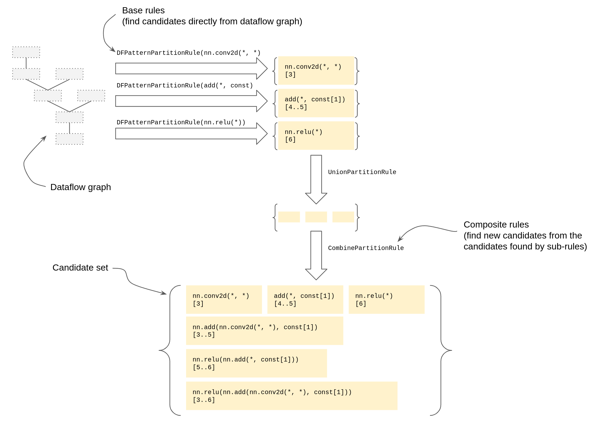

```
Feature Name: Collage [Draft 0.81]
Start Date: Mar 2022
Authors: Mark Shields (mbs@octoml.ai)
RFC PR: https://github.com/apache/tvm-rfcs/pull/62

History:
- v0.7: First draft.
- v0.8: Rework to emphasise 'partitioning' (quite early in pipeline) instead of 'fusion' (quite late in pipeline). 
```

# Summary

This design doc (with accompanying
['v2' prototype implementation](https://github.com/mbs-octoml/mbs-tvm/tree/mbs-collage-sketch))
shows how to bring tuning to TVM's BYOC partitioning passes. The tuning search explores the choice of sub-graphs (aka '
partitions') and toolchains (aka 'backends') so as to minimize the expected model inference latency. Both 'graph
style' (eg TensorRT) and 'library style' (eg DNNL) BYOC integrations are supported. We call the result an 'optimal
partitioning'. This new tuning layer complements the tuning traditionally done by TVM and other toolchains during
lowering. It can also complement any global tuning, for example to explore the choice of layout convention or device
assignment.

The approach is based on the [preprint](https://arxiv.org/pdf/2111.00655.pdf):

> *Collage: Automated Integration of Deep Learning Backends*  
> Byungsoo Jeon, Sunghyun Park, Peiyuan Liao, Sheng Xu, Tianqi Chen, Zhihao Jia

(See Appendix A for a comparison of this proposal and the paper's implementation. See Appendix D for TODO items in the '
v2' prototype.)

When Collage is enabled it subsumes the existing `MergeComposite`/`AnnotateTarget`/`MergeCompilerRegions`/
`PartitionGraph` passes embedded within each `partition_for_<toolchain>` function with a single new
`CollagePartitioner` pass. The pass is guided by the list of available `Target`s and three existing sources:

1. The `"TOpPattern"` attributes provided for every Relay operator and used by TVM's built-in `FuseOps`.
2. The BYOC `"target.<toolchain>"` operator predicates provided for some operator/toolchain pairs by
   'operator-based' BYOC integrations.
   TODO(mbs): Consider removing predicate based BYOC integrations once TensorRT has been transitioned to be
   predicate based.
3. The BYOC operator pattern/predicates (usually) registered in the pattern table by 'pattern-based' BYOC integrations.

The pass is run as early in the compilation flow as possible (see Appendix C).

Only some boilerplate aspects of existing BYOC integrations need to be adjusted to support Collage (patterns must
be registered in the standard pattern table, 'preamble' passes need to be split out as per Appendix C, and any
mandatory post lowering helpers must be folded into the custom lowering function. We'll make sure these changes are
part of or coordinated with the UMA project). However Collage may require more robustness from the BYOC integrations,
see Appendix F.

Note however that we are **not** proposing to deprecate the existing `partition_for_<toolchain>` operations (or their
UMA equivalent). This is mostly because Collage is inherently a tuning-based system which is not practical for users who
need a stand-alone compiler. But it is also because of challenges with establishing a common pass ordering which will
work for both TVM and all BYOC toolchains (see Appendix C for more details).

# Motivation

This tuning approach contrasts with TVM's existing "greedy" and "manual" approaches to partitioning:

- Greedy: Currently only the largest possible supported sub-graphs are used for partitions, irrespective of their
  execution time. With Collage many more candidate sub-graphs are explored, and it is possible for two smaller
  sub-graphs to yield better overall latency than one large sub-graph if they mix toolchains.
- Manual: Currently the TVM user must commit to a BYOC toolchain and invoke the corresponding
  `partition_for_<toolchain>` function before the main TVM compilation flow begins. With Collage the choice of toolchain
  can be automated based on measured latency. Collage will also explore mixing and matching between multiple BYOC
  toolchains as well as TVM's native backend.


Collage offers three advantages:

- **Latency**: Overall model latency may be reduced compared to TVM native, TVM with a single
  `partition_for_<toolchain>` call, or a non-TVM stand-alone compiler such as TensorRT.
- **Automation**: The choice of which BYOC toolchains to enable can be automated.
- **Economy and modularity of implementation**: Four standalone passes using two separate mechanisms for expressing
  partitioning rules/algorithms can be replaced with one, which itself is built from compositional primitives. (The
  machinery is also reusable for the very similar problem of choosing TVM fusion kernels, which we'll tackle in the
  future).

See Appendix H for some frequently asked questions.

# Success Metrics

1. Collage offers at least a 10% latency improvement for a selection of standard ONNX models and NVIDIA hardware using
   targets which include the CuDNN and CuBlas libraries, the CUTLASS library (with tuning, via BYOC), the TensorRT
   compiler (via BYOC), and (obviously!) TVM native.
2. Collage does not require new per-target or per-model patterns or rules to be implemented independently of the BYOC
   integrations.
3. Collage with a `Target` list enabling just one BYOC toolchain is never worse than using the the existing
   `partition_for_<toolchain>` function directly. (Since partitioning for multiple toolchains in sequence should never
   improve the result for any single toolchain we consider just the single BYOC case.)


# Project Milestones

- [Done] M0: Port paper prototype to recent TVM main and validate paper results.
- [Done] M1: Internal design doc.
- [Done] M2: Use 'v2' prototype to test design doc, and rework ready for TVM community.
- [In progress] M3: RFC
- [2022Q1] M4: Re-validate results on 'v2' prototype for larger models (eg GPT2) and more NVIDIA targets.
- [2022Q2] M5: Implementation in TVM main, including 'sub-projects' listed below.
- [OctoML internal] M6: Estimator integrated into OctoML platform, validation against OctoML test suite.
- [OctoML internal] M7: Productionization for OctoML.

# Check-in plan

Though the 'v2' prototype is in a personal branch we'd like to transition to main ASAP and rely on directory/namespace
separation, maintaining backwards compat, and a new `PassConfig` flag to isolate all Collage changes from the rest of
TVM. A rough PR progression is:

- TensorRT and CUTLASS BYOC changes are backwards compat. The existing `partition_for_<toolchain>` functions remain. The
  CUTLASS-specific tuning and codegen functions will either continue to be supported or we'll work with users to account
  for them being folded into the function-at-a-time `relay.ext.cutlass` codegen function.
- The `DFPattern` and friends changes are all mostly just for improving the robustness of the
  `IndexedGraph<T>` class and can go into main independently.
- Some basic `Expr` improvements can go into main independently.
- The design allows for multiple `Target`s for the same `DLDeviceType`. That requires the various
  `build` interfaces which currently accept `Union[Target,Dict]` to also accept a list of `Target`s, and can be
  backwards compat.
- The new Collage code can go in bottom-up as we develop unit tests:
    - Support utils, including `NameSupply`, `IndexSet`, `PriorityQueue`, `Cost`, `CostEstimator`.
    - The core `SubGraph` datatype.
    - `CandidatePartition`.
    - The `PartitionRule` class hierarchy, as a series of PRs, ending with `PartitionSpec`.
    - `GatherPartitionSpecs` helper for bridging the existing BYOC world with the Collage `PartitionRule` world.
    - The `CollagePartitioner` driver pass itself.

# Guide-level explanation

Collage allows the choice and partitioning for BYOC toolchains to be determined automatically
so as to minimize overall (expected) model execution latency.

To compile with Collage it's necessary to set a `PassContext` flag, and include
'Collage aware' `Targets` in the build's `target` argument.


For example, assume `mod` is bound to [MNIST](https://github.com/onnx/models/tree/main/vision/classification/mnist):

```
def @main(%x: Tensor[(1, 1, 28, 28), float32]) -> Tensor[(1, 10), float32] {
  %0 = nn.pad(%x, 0f, pad_width=[[0, 0], [0, 0], [2, 2], [2, 2]]);
  %1 = nn.conv2d(%0, meta[relay.Constant][0] /*Tensor[(8, 1, 5, 5), float32]*/,
                 padding=[0, 0, 0, 0], channels=8, kernel_size=[5, 5]);
  %2 = add(%1, meta[relay.Constant][1] /*Tensor[(8, 1, 1), float32]*/);
  %3 = nn.relu(%2);
  %4 = nn.max_pool2d(%3, pool_size=[2, 2], strides=[2, 2], padding=[0, 0, 0, 0]);
  %5 = nn.pad(%4, 0f, pad_width=[[0, 0], [0, 0], [2, 2], [2, 2]]);
  %6 = nn.conv2d(%5, meta[relay.Constant][2] /*Tensor[(16, 8, 5, 5), float32]*/,
                 padding=[0, 0, 0, 0], channels=16, kernel_size=[5, 5]);
  %7 = add(%6, meta[relay.Constant][3] /*Tensor[(16, 1, 1), float32]*/);
  %8 = nn.relu(%7);
  %9 = nn.max_pool2d(%8, pool_size=[3, 3], strides=[3, 3], padding=[0, 0, 0, 0]);
  %10 = reshape(%9, newshape=[1, 256]);
  %11 = nn.dense(%10, meta[relay.Constant][4] /*Tensor[(10, 256), float32]*/, units=None, out_dtype="float32");
  add(%11, meta[relay.Constant][5] /*Tensor[(1, 10), float32]*/)
}
```

We can compile this with Collage enabled for a variety of NVIDIA toolchains/libraries with
the following fragment:

```
with tvm.transform.PassContext(config={"relay.fallback_device_type": 2, "relay.collage.enable_collage": True}):
    host_target = tvm.target.Target("llvm")
    generic_target = tvm.target.Target("cuda", host_target)
    cutlass_target = tvm.target.Target("cuda -compiler=cutlass", host_target)
    tensorrt_target = tvm.target.Target("cuda -compiler=tensorrt", host_target)
    cudnn_target = tvm.target.Target("cuda -compiler=cudnn", host_target)
    cublas_target = tvm.target.Target("cuda -compiler=cublas", host_target)
    targets = [generic_target, cutlass_target, tensorrt_target, cudnn_target, cublas_target]
    exe = tvm.relay.vm.compile(mod, target=targets)
```

(Note that `cudnn` and `cublas` are not yet supported in the 'v2' prototype, see Appendix B.)

After the `CollagePartitioner` pass, the intermediate `"main"` global function could resemble the following
(though we've modified this "optimal" partitioning by hand for illustration so don't take it as representative of actual
performance):

```
def @main(%x: Tensor[(1, 1, 28, 28), float32]) -> Tensor[(1, 10), float32] {
  # Operators left behind in the function body are intended for TVM.
  # The usual Relay passes may rewrite them, then FuseOps will push them
  # into "Primitive" functions (without any "Compiler" attribute) ready
  # for TVM lowering. 
  %4 = nn.pad(%x, 0f, pad_width=[[0, 0], [0, 0], [2, 2], [2, 2]]);
  # This conv2d will be offloaded to cudnn. However the main TVM compilation
  # flow is responsible for emitting the call.
  %6 = fn (%FunctionVar_5: Tensor[(1, 1, 32, 32), float32],
           Composite="cudnn.conv2d") -> Tensor[(1, 8, 28, 28), float32] {
    nn.conv2d(%FunctionVar_5, meta[relay.Constant][0] /*Tensor[(8, 1, 5, 5), float32]*/,
              padding=[0, 0, 0, 0], channels=8, kernel_size=[5, 5])
  };
  # Back to vanilla TVM.
  %7 = %6(%4);
  %3 = add(%7, meta[relay.Constant][1] /*Tensor[(8, 1, 1), float32]*/);
  %9 = nn.relu(%3);
  %11 = nn.max_pool2d(%9, pool_size=[2, 2], strides=[2, 2], padding=[0, 0, 0, 0]);
  %13 = nn.pad(%11, 0f, pad_width=[[0, 0], [0, 0], [2, 2], [2, 2]]);
  # Use TensorRT. The "Primitive" function deleniates the partition.
  %14 = fn (%FunctionVar_03: Tensor[(1, 8, 18, 18), float32],
            %FunctionVar_11: Tensor[(16, 1, 1), float32],
            Primitive=1,
            Compiler="tensorrt",
            global_symbol="collage_nn_conv2d_add_nn_relu_1") -> Tensor[(1, 16, 14, 14), float32] {
    %1 = nn.conv2d(%FunctionVar_03, meta[relay.Constant][2] /*Tensor[(16, 8, 5, 5), float32]*/,
                   padding=[0, 0, 0, 0], channels=16, kernel_size=[5, 5]);
    %2 = add(%1, %FunctionVar_11);
    nn.relu(%2)
  };
  %15 = %14(%13, meta[relay.Constant][3] /*Tensor[(16, 1, 1), float32]*/);
  # Back to vanilla TVM.
  %17 = nn.max_pool2d(%15, pool_size=[3, 3], strides=[3, 3], padding=[0, 0, 0, 0]);
  %19 = reshape(%17, newshape=[1, 256]);
  # Use CUTLASS. Note the double function nesting: the outer "Primitive" function
  # deleniates the partition and the inner "Composite" function maps the original
  # Relay operators to a tag to be used during compilation/build/lowering with the
  # CUTLASS BYOC integration.
  %20 = fn (%FunctionVar_0: Tensor[(1, 256), float32],
            %FunctionVar_1: Tensor[(10, 256), float32],
            %FunctionVar_2: Tensor[(1, 10), float32],
            Primitive=1,
            Compiler="cutlass",
            global_symbol="collage_cutlass_dense_bias_nn_dense_add") -> Tensor[(1, 10), float32] {
    %1 = fn (%FunctionVar_01: Tensor[(1, 256), float32],
             %FunctionVar_11: Tensor[(10, 256), float32],
             %FunctionVar_21: Tensor[(1, 10), float32],
             Composite="cutlass.dense_bias") -> Tensor[(1, 10), float32] {
      %0 = nn.dense(%FunctionVar_01, %FunctionVar_11, units=None, out_dtype="float32");
      add(%0, %FunctionVar_21)
    };
    %1(%FunctionVar_0, %FunctionVar_1, %FunctionVar_2)
  };
  %20(%19, meta[relay.Constant][4] /*Tensor[(10, 256), float32]*/,
      meta[relay.Constant][5] /*Tensor[(1, 10), float32]*/)
}
```

The remainder of the compilation will respect the partitioning found by Collage without
any further user involvement.

# Reference-level explanation

The implementation is mostly under `src/relay/collage/...` (namespace `tvm::relay::collage`), with just a few Python
helper functions under `python/tvm/relay/collage`.

If the `relay.collage.enable_collage` `PassConfig` attribute is true then a new `CollagePartitioner` pass is inserted
before all other Relay passes. The result of the pass is:

- All Relay sub-graphs in all global functions which are to be handed off to a BYOC toolchain are replaced by calls to
  an inline `"Primitive"` function with `"Compiler"` and `"global_symbol"` attributes.
- Relay operators, or groups of operators, which are to be translated to particular library or BYOC-supplied function
  are replaced by calls to an inline `"Composite"` function. (This encoding is supported for both BYOC and external
  libraries.)

TODO(mbs): We need to also support
[RFC10](https://github.com/apache/tvm-rfcs/blob/main/rfcs/0010-target-registered-compiler-flow-customisation.md) style BYOC extensions in the partitioning encoding.

Note that no `"Primitive"` functions denoting TVM kernels are produced -- the existing `FuseOps` pass is still required.

The `CollagePartitioner` pass has four phases:

- **Phase 1**: The available `Target`s are scanned to build a list of rules describing how to find possible partitions (
  see `PartitionSpec` and `PartitionRule` below). Depending on the `Target` the rules may incorporate entries from the
  BYOC pattern table. (The remaining phases execute on each global function separately.)
- **Phase 2**: A dataflow graph is constructed for the global function (which is just an `IndexedGraph<Expr>`). The
  available rules from phase 1 are evaluated on the dataflow graph to yield a (possibly overlapping) set of candidate
  partitions for each target (see `CandidatePartition` below). Each candidate efficiently describes a sub-graph of the
  global function's body without the need to construct any new expressions (see `SubGraph` below).
- **Phase 3**: A least cost path is found in the following (implicit and lazily constructed) search graph:
  - Search Node: Each node represents the set of 'covered' dataflow nodes which have been assigned to a
    candidate partition on every path to the node from the starting node.
  - Starting node: The search node with empty 'covered' set.
  - Ending node: The search node with every dataflow node in the 'covered' set.
  - Search Edge X->Y: A candidate partition P does not overlap X's 'covered' nodes. Y's 'covered' nodes are
    those of X union P. To avoid an unnecessary search space explosion the candidate must also include the
    next yet-to-be-covered dataflow node in X.
  - Edge cost: The estimated latency of the candidate partition, plus a partition transition penalty. Note
    that though we need to be able to extract the candidate's sub-graph in order to build a function
    representing the candidate to measure with, we do not yet need to partition the overall function body
    expression.

  Other search algorithms are certainly possible, eg the paper uses an evolutionary search to refine the partitioning
  found by the dynamic-programming search. We can easily abstract away the search interface to support multiple
  implementations in the future.
- **Phase 4**: The function body is partitioned according to the candidate kernels on the shortest path. This phase
  can be run independently of the first three so that additional inspection or optimization may be applied to
  the intmediate optimal partitioning.

In the following we introduce the new datatypes, then expand on the phases.

### Util Datatypes

- `PostDfsIndex`: The integer index of a Relay sub-expression in a post-dfs traversal of the overall Relay expression.
  If index i is less than index j then we know the sub-expression for j cannot influence the value of the sub-expression
  for i.
- `DataflowGraph`: As alias for the existing `IndexedGraph<Expr>` from the `DFPatternMatcher` suite (which in turn is a
  reworked copy of the `IndexedGraph` private to `fuse_ops.cc`). It is used throughout to manage the three-way bijection
  from Relay `ExprNode`s to `PostDfsIndex`s to
  `DataflowGraph::Node`s. Each `DataflowGraph::Node` describes the sub-expression's dataflow inputs, outputs, dominator
  and inverse-dominators.
- `IndexSet`:  A bit vector indexed by `PostDfsIndex`s. These are used as a compact representation for an arbitrary set
  of dataflow nodes in a dataflow graph.
- `Cost`: A `double` representing a candidate partition (or kernel) 'cost', which currently is just mean execution
  latency in seconds. Collage only cares that costs are additive and a total order, so in the future we could support
  cost functions which balance execution time against high memory watermark or other measures. Costs may be `Unknown`
  (ie NaN) to signal some other heuristic should be used to compare kernel costs. Costs may be `Invalid` (ie +inf)
  to signal the toolchain could not compile and run a candidate kernel.

### SubGraph

A `SubGraph` is an `IndexSet` of the `PostDfsIndex`s of all dataflow nodes 'inside' an arbitrary sub-graph of the
overall dataflow graph. This and `PartitionRule` below are the core Collage datatypes. The following illustrates
the dataflow graph, indexes and one sub-graph for 'mini' MNIST (MNIST with the second layer removed):


Sub-graphs can be used to represent partitions/kernels/composite functions without having to pay the cost of
constructing or rewriting any expressions. We also allow 'extracting' a function to use for measuring a
partition/kernel's latency independently from 'rewriting' the overall Relay expression since only a tiny subset of
candidate partitions will end up being needed after Collage has completed its search.

We expect O(thousands) of sub-graphs to be in flight while processing a given model, so are mindful of space overhead.

A sub-graph classifies every dataflow node of the overall expression as either 'inside' or
'outside' the sub-graph. Obviously not all such divisions make sense, for example it is not valid for an inside node to
feed into another inside node via outside nodes. We provide an
`IsValid` method to check for validity, and `SubGraphConfig` to control which validity rules apply (such as maximum
depth).

We generally work with the `DataflowGraph` representation of the overall Relay expression rather than the expression
itself. We use the post-dfs visit index to uniquely refer to expression nodes.

As well as 'inside' and 'outside' we have four other flavors of dataflow nodes, all uniquely determined from the '
inside' nodes:

- 'entry' nodes are those inside with at least one dataflow input outside.
- 'exit' nodes are those inside with at least one dataflow output outside, or which are considered 'external' in the
  underlying dataflow graph (eg because they represent the result of the overall function).
- 'input' nodes are those outside with at least one dataflow output inside.
- 'output' nodes are those outside with at least one dataflow input inside.

Index sets for these are cached with the sub-graph for performance.

It is valid to have multiple entry nodes (we can bind a parameter for each). It may be valid to have multiple exit
nodes (we can build a tuple of all such). It may be valid to have exit nodes which also contribute to other inside
nodes (ie represent a 'tap' on an intermediate result).

Sub-graphs are closed under:

- Disjoint union.
- Wrapping by a function with given attributes. This can be used to encode "Composite" functions, or to represent a
  candidate kernel within a "Primitive" function. (By combining 'wrapping' with
  'union' we can encode, eg, 'this sub-graph should be placed inside a primitive function which itself may have calls to
  composite functions).
- Substitution, which allows a sub-graph w.r.t. one dataflow graph to be transformed to match some other (typically
  smaller) dataflow graph.

Note that the Relay `PatternPartitoner` goes directly from `Expr` to partitioned `Expr` without stopping at any
intermediate representation. It may be worth 'promoting' `SubGraph` out of Collage and into the standard `DFPattern`
suite, we leave that to future work.

### CandidatePartition

A `CandidatePartition` pairs a `SubGraph` with a `Target`. All Collage search and measurement is in terms of candidate
partitions.

### PartitionRule

A `PartitionRule` describes how to find a set of `CandidatePartitions`s for a `DataflowGraph`. This and `SubGraph`
above are the core Collage datatypes. All partition rules implement the method:

```
virtual std::vector<CandidatePartition> AllCandidates(const DataflowGraph& dataflow_graph,
                                                      const PartitionSpec& spec) const;
```

The candidates are allowed to overlap, and ultimately it is the job of the Collage searcher to find a selection of
candidates which cover the whole Relay expression without overlap. There may be many thousands of candidates in flight
during the Collage search.

We currently have three distinct flavors of partitions:

- For pattern-based BYOC integrations, individual `DFPattern`s are used to select the `"Composite"` functions to
  offload, and those are grouped into a `"Primitive"` Relay function with a `"Compiler"` attribute.
- For operator-based BYOC integrations, per-operator predicates indicate operators to offload, and again those are
  grouped into a `"Primitive"` Relay function with a `"Compiler"` attribute.
  TODO(mbs): Consider removing predicate based BYOC integrations once TensorRT has been transitioned to be
  predicate based.
- For TVM, obviously all of Relay can go into a single partition, however for search efficiency the partitions should
  roughly mimic the Relay `FuseOps`. That pass uses the `"TOpPattern"` (of type `OPPatternKind`) attribute on all Relay
  operators, and rules for when operators of one kind can be folded into another (typically by moving scalar ops from
  elementwise operators into the output position of an earlier operator). This is implemented as a
  stand-alone analysis which encodes its result using `"Primitive"` functions.

Two new flavors are also showing up:

- For easy external library integration we would like to borrow the `DFPattern`-with-composite-functions approach from
  pattern-based BYOC integrations. But we'd like to leave those composite functions outside of any `"Primitive"`
  function so that the library calls could end up within larger TVM kernels.
- `FuseOps` is generally considered too inflexible, and we've sought a more flexible way to express target-dependent
  fusion rules.

So in the same way `DFPattern`s provide a small library of 'base' and 'combinator' pattern rules supporting a wide
variety of examples, we seek the same economy and flexibility from `PartitionRule`s. 

An obvious question is whether all partition rules should be expressed with `DFPattern`s, possibly by extending
the `DFPattern` library itself. Indeed, though it does not appear to be used in prod, the `DominatorPattern` is
an attempt to use `DFPattern`s to subsume the existing `FuseOps` machinery. We actually went down this path but
decided to back out:
- We'd need a new pattern combinator to associate predicates with sub-patterns.
- Since we are interested in searching over possibly overlapping candidate partitions we'd need the `DFPattern`
  machinery to all enumeration over all matching sub-expressions. That would require a rewrite of the
  `DFPatternMatcher`.
- Some of the more subtle fusion rules are difficult to express as patterns.
- `DFPattern`s are widely used outside of just partitioning, so any change would need to ensure no efficiency
  or cognitive overhead for those common cases.

That pushed us to the present design, which builds on `DFPatterns`, but introduces new 'base' and 'combinator'
partition rules which can be combined to match the desired partition flavors:
- The 'base' rules produce candidates from the dataflow graph directly. Eg we have a base rule to produce
  all sub-graphs matching a given `DFPattern`.
- The 'combinator' rules combine the candidates found by one or more sub-rules into a new set of
  candidates. The sub-rule(s) can be 'base' or 'candidate' rules. We call the candidates produced by
  a sub-rule 'sub-candidates'. Eg we have a combinator rule which wraps all sub-candidates in a
  `"Composite"` function (when the overall expression is rewritten).

The following illustrates some base and combinator patterns on the earlier mini MNIST dataflow graph:



The base rules are:

- `DFPatternPartitionRule`: Given a `DFPattern` and expression predicate, produces a candidate for every sub-graph
  matched by the pattern and predicate. Unlike the `PatternRewriter`, candidates are free to overlap. Mainly used
  to bring BYOC patterns into the Collage framework.
- `OpPredicatePartitionRule`: Given an attribute name, produces a candidate for every call to a primitive Relay
  operator where the operator i) has predicate bound to that attribute which ii) returns true given the
  call sub-expression. Generally this will result in a singleton sub-graph containing only the call, but it may also
  pull in constant arguments to the call should they be required. Used to bring BYOC operator predicates into the
  Collage framework.
  TODO(mbs): Consider removing predicate based BYOC integrations once TensorRT has been transitioned to be
  predicate based.
- `OpCallByKindPartitionRule`: Uses the `"TOpPattern"` attribute provided for every Relay operator to produce a
  candidate for every call to a 'fusable Relay operator'. Used to select the operators which `FuseOps` will consider
  parts of kernels.

The combinator rules are:

- `CompositePartitionRule`: Indicates all sub-candidates matched by the sub-rule should be wrapped by a `"Composite"`
  function. The `"Composite"` name is taken from the rule name. Used to indicate Relay operators (or groups of Relay
  operators) should be mapped to target-specific operators, both for BYOC and TVM external library integrations.
- `PrimitivePartitionRule`: Indicates all sub-candidates matched by the sub-rule should be wrapped by a `"Primitive"`
  function, possibly with an additional `"Compiler"` attribute. Used to delineate a partition (or kernel).
- `UnionPartitionRule`: Simply unions all the sub-candidates from all sub-rules together. Used to combine
  individual `DFPatternPartitionRules`.
- `CombinePartitionRule`: Given a sub-rule and a list of 'combiner' rules (see below), finds all possible ways of
  combining the sub-candidates to yield even larger candidates. Note that the sub-candidates may also be directly
  included in the results. The 'combiner' rules allow combining by `OpPatternKinds`, combining the arguments to
  tuples which themselves are arguments to Relay operator calls, and so on. This rule is intended to mimic the
  existing TVM `FuseOps` pass, though: i) all candidates are found rather than just the largest, ii) the starting
  set of candidates can be provided by any other rule, and iii) we rely on `SubGraph` validity checking to weed out
  infeasible candidates.
- `OnlyValidPartitionRule`: Given a `SubGraphConfig`, ignores candidates with 'invalid' sub-graphs. Used to limit the
  maximum candidate depth, the number of independent outputs, and whether intermediate 'taps' are allowed.
- `HostPartitionRule`: Produces candidates for all Relay expressions which could be
  'left behind' for execution by the host (eg on the VM). This rule lets us move special case handling out of the
  core search algorithm and into a simple rule.

Here are some typical ways to combine `PartitionRules` for different partition flavors. (These combinations
may be generated during phase 1 by inspection of the `Target` and BYOC registration -- see 'Phase 1' below.)

- Classic operator-predicate based BYOC with
  `AnnotateTarget`/`MergeCompilerRegions`/`PartitionGraph` passes (eg see `tensorrt.py`):
  ```
  PrimitivePartitionRule
    OnlyValidPartitionRule
      CombinePartitionRule (with a join-anything combiner rule)
        OpPredicatePartitionRule
  ```
  TODO(mbs): Consider removing predicate based BYOC integrations once TensorRT has been transitioned to be
  predicate based.

- Classic pattern-based BYOC with `MergeComposite`/`AnnotateTarget`/`PartitionGraph` passes
  (eg see `cutlass.py`)`:
  ```
  PrimitivePartitionRule
    OnlyValidPartitionRule
      CombinePartitionRule (with join-anything combiner rule)
        UnionPartitionRule
          CompositePartitionRule(label1)
            DFPatternPartitionRule(pattern1)
                      :
          CompositePartitionRule(labeln)
            DFPatternPartitionRule(patternn)
  ```

  The `CompositePartitionRule`/`DFPatternPartitionRule` combination is repeated for each entry in the pattern table for
  the BYOC toolchain name, eg:
  ```
  CompositePartitionRule(
    rule_name="cutlass.conv2d_bias_residual_multiply_relu"
    sub_rule=DFPatternPartitionRule(
      pattern=CallPatternNode(Op(nn.relu), 
                              [AltPattern(CallPatternNode(Op(multiply), 
                                                          [CallPatternNode(AltPattern(Op(add) | Op(nn.bias_add)),
                                                                           [CallPatternNode(Op(nn.conv2d), [*, *]), *]),
                                                           *]) |
                                          CallPatternNode(Op(multiply),
                                                          [*, 
                                                           CallPatternNode(AltPattern(Op(add) | Op(nn.bias_add)),
                                                                           [CallPatternNode(Op(nn.conv2d), [*, *]), *])
                                                          ]))
                              ])))
  ```

- "Consider this library implementation for these sub-expressions", using `DFPatterns` to pick out which Relay operators
  are supported (a new scheme):
  ```
  OnlyValidPartitionRule
    CombinePartitionRule (with default TVM combiner rules)
      UnionPartitionRule
        OpCallByKindPartitionRule
        CompositePartitionRule(lable1)
          DFPatternPartitionRule(pattern1)
                     :
        CompositePartitionRule(lablen)
          DFPatternPartitionRule(patternn)
  ```

- Classic TVM `FuseOps`:
  ```
  PrimitivePartitionRule
    OnlyValidPartitionRule
      CombinePartitionRule (with default TVM combiner rules)
        OpCallByKindPartitionRule
  ```

- "Just fuse what I tell you to fuse", using `DFPatterns` to directly select candidates (a new scheme):
  ```
  PrimitivePartitionRule
    OnlyValidPartitionRule
      UnionPartitionRule
        DFPatternPartitionRule(pattern1)
                     :
        DFPatternPartitionRule(patternn)
  ```

### PartitionSpec

A `PartitionSpec` pairs a a `PartitionRule` with one or more `Target`s.

### Phase 1

We build on the existing TVM support for heterogeneous devices and targets. The available `Targets` are extracted from
the compilation configuration (eg using the existing `CompilationConfig` helper class). Each target is inspected to
decide on how to construct a `PartitionRule`, which will guide Collage in the selection of candidate kernels to explore
for that target. (See Appendix G for the requirements which motivated this part of the design.)

- If the `Target` has a `"partition_rule"` attribute, use that directly. This would allow users to directly control
  partitioning/fusion for the target's they care about.
- If the `Target` has a `"compiler"` attribute (eg `"cutlass"`), and the global pattern table has an entry for that
  attribute value, assume the `Target` denotes a pattern-based BYOC integration to explore. The `PartitionRule`
  will import all the BYOC patterns and predicates automatically.
- As above, but if global pattern has no matching entry, assume the `Target` denotes a predicate-based BYOC integration
  to explore (eg `"tensorrt"`). The `PartitonRule` will look for and evaluate predicates with the
  `"target.<compiler>"` attribute on all Relay operators.
- Otherwise, assume the `Target` denotes a TVM-native target. The `PartitionRule` mimics `FuseOps`, but now generalized
  to explore multiple candidates so as to leave room for possible BYOC candidates.

Note that to make this approach work we need to allow for multiple `Target`s with the same `DLDeviceKind`. For the VM
simply switching the `target` argument from dictionary to list and removing some redundant Python preprocessing code was
all that was required to support this.

The user can use `on_device` annotations to constrain sub-graphs to particular devices. When Collage is considering
candidate partitions, it should be sure to choose a candidate `Target` which 'refines' the `Target` for every
sub-expression discovered by the `PlanDevicesPass`. Given targets T and U we say 'T refines U' if T has a
'"compiler"' and/or '"partition_rule"' attributes, U has no such attributes, and T and U otherwise agree on all other
fields.

### Phase 2

Most of the hard work for this phase is carried by the `AllCandidates` implementations of the `PartitionRule`s. The main
driver simply needs to index all the found `CandidatePartitions` by their minimum 'inside' `PostDfsIndex`
for rapid retrieval during the shortest path search.

### Phase 3

We find it most natural to use Dijkstra to find the optimal partitioning. A `SearchState` is a node in the search
graph, and contains:

- An `IndexSet` of the dataflow nodes already 'covered' by candidates on every path to this state. This is the
  identifying key for the state.
- The predecessor `SearchState` in the best path to this state.
- The `Cost` of the best path to this state. This is the order for the Dijkstra priority queue.
- The `CandidatePartition` for the transition from the best predecessor to this state.

The starting state has no covered nodes. The final state has all nodes covered. The following is an example search
graph fragment for the mini MNIST example: 


When expanding a state we could choose any `CandidatePartition` collected from phase 2 provided it doesn't overlap with
the state's covered set. However, a search path applying candidates C then D is equivalent to one applying D then C, so
we only consider candidates which intersect the next yet-to-be-covered dataflow node. For each such candidate we use
the `CostEstimator` (with it's assumed cache) to get the candidate's cost, build the successor state, and 'relax' the
successor state in the usual way. (See Appendix E for more details on `CostEstimator`.)

The `HostPartitionRule` is used to allow some dataflow nodes to be 'left behind' for execution by the host.

The result at this stage is an `Array<CandidatePartition>`, which can be materialized and restored using the standard
TVM object graph machinery if desired. An example least-cost path for the mini MNIST example could be the following:


### Phase 4

The overall Relay expression is partitioned over all the `CandidatePartition`s on the lowest cost path 'in parallel'.
Since all the candidates are expressed using `SubGraph`s w.r.t. the original dataflow graph, we must be careful not to
invalidate yet-to-be-partitioned candidates as we go. Working backwards in dataflow order avoids this problem.

# Drawbacks

- **Some BYOC boilerplate changes required**: TVM's current BYOC integration API only requires the 'lowering/codegen'
  function to be registered to a well-known global function name. Everything else is up to the BYOC author.
    - Collage requires pattern-based BYOC integrations to register their patterns in the global pattern table. Some BYOC
      integrations use the table but many do not, but it's an easy fix.
    - Collage requires the BYOC lowering function to yield a valid `runtime::Module` without requiring any additional
      BYOC-specific passes to be run. Some BYOC integrations require the user to run separate passes to tune and/or
      compile the partitioned, those need to be moved into the lowering function itself.
    - Collage requires the BYOC integration to either correctly test for which operators are supported in the
      pattern/operator predicate, or gracefully propagate failure rather than CHECK-fail if an unsupported operator is
      included in a candidate kernel. Thus a BYOC integration will need to be 'robustified' to become 'Collage
      compatible'.

  Overall we've tried to make as few changes as possible. Collage will happily follow along with any improvements to the
  BYOC integration API (eg via the UMA project).

- **Non-compositional BYOC toolchains**: BYOC partitioning functions often run global passes to get the Relay graph into
  a state better aligned with the toolchain on the assumption they are the exclusive partitioning pass. Most obvious is
  the choice of layout, and if two BYOC integrations have a different choice of layout then there's currently no way for
  them to be used concurrently. All of those passes must either be i) pushed up to global configuration (which could be
  explored by a search layer outside of TVM), ii) pushed into the BYOC lowering/codegen function (to prepare the
  sub-graph for further compilation) or iii) moved into the standard Relay optimization passes run before
  `CollagePartitioner`.

- **Higher tuning cost**: Obviously Collage needs to estimate the latency of partitions. For TVM this can trigger
  turning of schedules for novel kernels, which can require O(thousands) of trials and take O(hours), so we'll be very
  dependent on cached tuning logs to amortize this cost between models for the same target.

- **Task extraction vs Tuning**: Traditionally TVM has had three phases: i) Task extraction (find the fused sub-graphs
  to tune), ii) Tuning (find a good schedule for those sub-graphs), and iii) Compilation (re-compile the model, now
  retrieving schedules for all the anticipated sub-graphs from the cache.) However the Collage 'v2' prototype collapses
  all these phases. This lets us lazily explore the implied search graph (nodes = partially rewritten models, edges =
  selected of sub-graph and toolchain as a candidate partition, cost = estimated sum of partition costs plus transition
  penalties), and thus only pay the cost of measuring (and tuning) candidates which could possibly influence the final
  partitioning.

- **No non-local optimization**: Though Collage can explore the choice of sub-graph and toolchain, it cannot explore any
  choices which require the arguments and/or result of the sub-graph to be rewritten, or the overall `IRModule` to be
  changed. Thus Collage **cannot** be used to search over:
    - Choice of layout for arguments/results (may require insertion of layout transforms),
    - Choice of memory scope for arguments/results (may require insertion of device copies),
    - Choice of device on which to host the kernel (ditto),
    - Choice of quantization scheme,

  To support this efficiently we'd need to abandon the simple-minded but fast `SubGraph` representation we describe here
  in favor of something like an EGraph representation, which seems like a very large change for TVM.

- **Dependency management**: Currently BYOC integrations tend to assume they are the only non-TVM toolchain in use. So
  it's possible two toolchains introduce runtime dependencies which can't be satisfied. Collage has no notion of
  dependencies or incompatibilities and may attemt to mix candidate kernels we can't support in prod. It's also possible
  for two BYOC integrations to have incompatible runtimes.

- **Additive cost assumption**: Collage as per this design assumes the cost of running candidate partitions is additive,
  plus a small transition penalty. However cache effects can dominate measured latency, particularly for
  'lightweight' kernels. Thus there may be a **additive error** in the final result:

  > additive_error = measured_latency(collage_partitioning) - sum_{partition} (estimated_latency(partition) + penalty)

  The evolutionary search explored by the paper can help here since it uses measured end-to-end model latency as its
  cost function, but we're deferring that to future work.

- **Limited search space**: Naively exploring all sub-graphs is O(n!), so we need to constrain the search. The easiest
  approach is just to limit candidates to sub-graphs of just a few operators. This can mean significantly faster
  candidates are not explored, yielding a partitioning with high **optimality loss**:

  > optimality_loss = measured_latency(collage_partitioning) - measured_latency(true_optimal_partitioning)

  Though the 'true' optimal partitioning may be infeasible to find, the user may easily discover a high
  **apparent loss**, eg by comparing the Collage result with a traditional BYOC partitioning result:

  > apparent_loss = measured_latency(collage_partitioning) - measured_latency(users_own_partitioning)

- **Fragile toolchains**: Some BYOC toolchains are intended to be stand-alone compilers in their own right, and have
  been tuned against common models and include global flags to guide optimizations such as reducing precision. However
  Collage will only feed these toolchains smaller sub-graphs, thus making the limited search space problem more severe.

- **High variance in lightweight kernels**: Small kernels can have high variance, thus the choice of which toolchain to
  use can be arbitrary. We probably want to i) validate our variance estimator is accurate, ii) choose a percentile
  slightly above 50% for the estimated candidate kernel latency, and iii) fall back to hard-coded priorities when the
  measured variance is too high.

- **Explainability**: It's easy to show the user the final partitioning and estimated times for each kernel, but harder
  to show why that partitioning won out over all others during search.

- **Does not subsume `partition_for_<toolchain>`**: We don't have any plan to deprecate the existing patterns of each
  BYOC integration supplying a `partiion_for_<toolchain>` function. If the user has a specific toolchain in mind then
  making the partition explicit enjoys both faster compilation and can incorporate global optimization passes which
  Collage cannot currently account for (eg enforcing a particular layout).

# Prior art

- The [Cascading Scheduler](https://github.com/apache/tvm-rfcs/blob/main/rfcs/0037-arm-ethosu-cascading-scheduler.md)
  combines i) dynamic-programming to find an optimal grouping of TE sub-expressions, ii) an analytic model of cost to
  guide the search, and iii) cascading scheduling of the TE sub-expressions so as to reduce memory high-watermark. By
  contrast Collage i) also uses dynamic-programming, but to find an optimal grouping of Relay sub-expressions, ii)
  uses (very much slower!) measurement to guide the search and iii) has no influence over how either TVM or BYOC
  toolchains actually lower the sub-graphs given to them.
- The [Universal modular Accelerator Interface](https://github.com/apache/tvm-rfcs/pull/60) proposal adds a layer on top
  of the existing and separate TVM BYOC, operator strategy, operator scheduling, target-specific passes and
  target-specific code generation extension points. Collage currently relies only on the global pattern registry and
  global `relay.ext.<toolchain>` function to integrate with BYOC integrations, but this is easy to rework should UMA
  change the source of truth.

# Appendix A: Differences between the paper's implementation and this proposal

The results of the paper were derived in a [branch](https://github.com/cmu-catalyst/collage) from
[TVM](https://github.com/apache/tvm) at `461d06eb5cfc7954f1983779acd05c47cea269f1`. We ported/rebased that code onto
main, and refer to it as the
['v1' prototype implementation](https://github.com/mbs-octoml/mbs-tvm/tree/mbs-collage-port).

The 'v1' prototype has nine main parts:

1. A new
   [backend](https://github.com/mbs-octoml/mbs-tvm/blob/52d8780e879a9115b8a93e505bcd3a6c2646c61f/include/tvm/ir/expr.h#L208)
   field on every Relay `Expr` to capture the pattern name and backend name chosen during search. Downstream compilation
   must be forced to respect that choice.
2. An
   [intercept](https://github.com/mbs-octoml/mbs-tvm/blob/52d8780e879a9115b8a93e505bcd3a6c2646c61f/src/relay/transforms/fuse_ops.cc#L1392)
   in `fuse_ops.cc` which redirects to the main Collage fuser/searcher before TVM’s fusion rules kick in.
3. The main fuser/searcher
   [implementation](https://github.com/mbs-octoml/mbs-tvm/blob/52d8780e879a9115b8a93e505bcd3a6c2646c61f/python/collage/optimizer/comp_graph_optimizer.py#L221)
   (for the simpler DP algorithm). This implementation:
4. Uses both Relay `Pattern` s and its own path-based fusion algorithm to find candidate sub-graphs.
5. Uses the DP algorithm to find the best assignment of fused sub-graphs and backends to cover the whole Relay graph.
6. Applies the resulting assignment to the `IRModule` using the new `backend` field on every expression.
7. An evolutionary search algorithm may optionally run after the above, and will attempt to replace ‘op’ kernels
   (which use a library) with ‘graph’ kernels (arbtrary sub-graph), but only if there’s a unique graph backend enabled.
8. An intercept
   ([here](https://github.com/mbs-octoml/mbs-tvm/blob/52d8780e879a9115b8a93e505bcd3a6c2646c61f/src/relay/transforms/fuse_ops.cc#L1402)
   and
   [here](https://github.com/mbs-octoml/mbs-tvm/blob/52d8780e879a9115b8a93e505bcd3a6c2646c61f/python/collage/optimizer/_optimizer.py#L48))
   in `fuse_ops.cc` to actually effect the fusion for BYOC backends depending on the new `backend` field.
9. An intercept
   ([here](https://github.com/mbs-octoml/mbs-tvm/blob/52d8780e879a9115b8a93e505bcd3a6c2646c61f/src/relay/backend/te_compiler_cache.cc#L284)
   and
   [here](https://github.com/mbs-octoml/mbs-tvm/blob/52d8780e879a9115b8a93e505bcd3a6c2646c61f/python/collage/backend/collage_strategies.py#L18))
   in `te_compiler.cc` to take over the selection of `OpStrategy` based on the `backend` field.

Note that the 'v1' prototype only supports `IRModules` with a single `"main"` whose body is in the ‘pure dataflow’ Relay
subset. Ie only calls, tuples, tuple projections, function variables and constants are supported.

In comparison to the 'v1' prototype, this design:

1. Shifts the search to occur at the very start of the compilation flow rather than just before `FuseOps` so that
   Collage sees the same input model as would an existing `partition_for_<toolchain>` BYOC function. This change allows
   us to use the existing BYOC patterns/predicates to guide the selection of candidate partitions instead of requiring
   new patterns to be added to support the combination of models and BYOC toolchains. It also ensures the existing BYOC
   lowering functions see partitions before any TVM-lowering specific passes have been applied, such as
   `qnn::transform::Legalize` and `transform::CombineParallelConv2D`.
2. Builds on the existing support for heterogeneous `Target`s to represent the menu of available toolchains to use
   during search. In particular, we want to allow users to blend `on_device` annotations (to express preferences for
   which devices should execute which sub-graphs) with Collage (to find the best partitions respecting those device
   preferences).
3. Uses the existing convention for `"Primitive"`, `"Composite"` and `"Compiler"` attributes on Relay `Function`s to
   encode partitioning choices.
4. Does not treat library integrations (eg for `CuDnn`) differently from toolchain integrations (eg for `TensorRT`). See
   Appendix B for a sketch of the issues.
5. Supports all of Relay.
6. Is implemented almost entirely in C++.

However:

6. We have only re-implemented the 'op-level' dynamic-programming based search strategy from the paper. Though the paper
   reports encouraging results with the 'graph-level' evolutionary-search strategy we leave that to future work.

# Appendix B: Easier Library Integration

TVM has two very different ways to make external library implementations available for use as (or in) kernels:
The pattern-based BYOC approach and the TVM `te.extern` approach.

The pattern-based approach allows library implementations to match with more than one Relay operator, such as for biased
convolution with an activation function. For example, for
[DNNL](https://oneapi-src.github.io/oneDNN/v1.3/index.html) the global pattern table is extended
in `python/tvm/relay/op/contrib/dnnl.py`, and the pattern labels encode the intended corresponding DNNL functions. The
user is responsible for partitioning using the usual `MergeComposite`/`AnnotateTarget`/`PartitionGraph`
sequence (surprisingly there's no `partition_for_dnnl` convenience function). The `relay.ext.dnnl` BYOC function
in `src/relay/backend/contrib/dnnl/codegen.cc` looks for calls to `"Composite"` functions in the overall `"Primitive"`
function, and dispatches based on the `"Composite"` label. C code is emitted to target the DNNL library, and the
standard C compiler helper is invoked to produce a `runtime::Module`.

Note that it is not possible for a TVM-generated kernel to call a library function integrated this way. In effect every
library function must go into a library-specific kernel (though kernels may group calls to multiple library function).

The `te.extern` approach only allows library implementations which are 1:1 with Relay operators. However the library may
be used as part of a larger TVM-generated kernel, and the usual TVM tuning machinery may choose to use the library based
on overall kernel performance measured during TVM tuning. For example, `batch_matmul` can be implemented using
[CuBLAS](https://developer.nvidia.com/cublas) via the strategy `batch_matmul` in `python/tvm/contrib/cublas.py`, which
is made available to the operator's `OpStrategy` using `batch_matmul_stategy_cuda` in
`python/tvm/relay/op/strategy/cuda.py` when `cublas` appears in the `Target`s `libs` attribute. That strategy simply
calls the `PackedFunc` registered as `tvm.contrib.cublas.batch_matmul` and implemented in
`src/runtime/contrib/cublas/cublas.cc` as part of the TVM runtime.

The `te.extern` approach also supports integrating 'micro-kernels' which may be invoked as part of the TVM schedule for
some larger Relay operator.

Collage as presented can work with either approach. For the pattern-based BYOC approach Collage doesn't need to know
what's going on under the BYOC integration hood, it only needs to see a `Target` with the appropriate
`compiler` attribute. For the `te.extern` approach Collage similarly doesn't need to know that the TVM partition may
result in a kernel who's schedule includes a call to the linked library provided the `Target` has the appropriate
`libs` attribute.

However, we'd to make library integration with Collage as seamless as possible since we expect it to be the common case.
The requirements are roughly:

- Support library functions which match sub-graphs as well as single Relay operators.
- Allow library calls from within TVM-generated kernels.
- Avoid the boilerplate needed for full BYOC integrations, but retain the familiar BYOC pattern-based mechanism.
- Express the choice of external library in the same way we express other partitioning choices.

One possibility is:

- Like the `te.extern` approach, libraries can be made available to the TVM runtime via registered `PackedFunc`s.
- Like the pattern-based BYOC approach, labelled patterns can be supplied which indicate how Relay operators could be
  mapped to registered `PackedFunc`s.
- Like the BYOC custom lowering approach, a distinguished compiler name controls when the library is available and
  causes lowering to go via a different path.
- But unlike the BYOC custom lowering approach, the rewrite to an external library call is made available in TE or TIR
  form so that it can be incorporated into larger TVM kernels.

We'll follow up on this separately, but mention it here since it motivates why we've tried to handle "Composite"
patterns fairly generally.

# Appendix C: When to run Collage?

There's a few cross-cutting issues when it comes to when Collage should run in the compilation flow:

- The current TVM convention is for BYOC integrations to supply a `partition_for_<toolchain>` function which can be
  called by the user on the original input model, ie before **any** Relay passes are run.
- Many `partition_for_<toolchain>` functions run their own 'preamble' passes before the standard
  `MergeComposite`/`AnnotateTarget`/`MergeCompilerRegions`/`PartitionGraph` passes. The preamble passes are sometimes
  just generic Relay passes such as `FoldConstant`. But some partitioning functions impose specific global rewrites,
  such as for layout. All the BYOC op patterns and op predicates are thus written expecting the Relay model in 'vanilla'
  form with only those preamble passes applied.
- There's no reason to expect the preamble passes are compositional in any sensible way between different BYOC
  integrations.
- Some BYOC integrations also supply additional passes which are expected to be run after partitioning and lowering, for
  example to finish tuning or compilation.
- The standard Relay pass prefix includes many passes which are either target dependent (for example to
  'legalize' quantized version of ops depending on the intended target), or which prepare the model for Relay fusion and
  subsequent lowering. These passes are all run before `FuseOps`. Those passes are not universally applicable to all
  BYOC integrations, and BYOC patterns are not guaranteed to be invariant over them.
- Relay's default `FuseOps` is currently hard-coded to greedily find the largest possible kernels using fixed
  `OpPatternKind` based rules. Those rules are intended to predict exactly what TVM's scheduling can support. There's
  interest in bringing customization (eg limiting fusion patterns to directly match hardware supported primitives,
  supporting custom 'horizontal' and 'vertical' fusion) and search (to reduce the strong coupling of fusion with
  lowering) to `FuseOps`, which all looks very similar to customization and search Collage brings to partitioning.
- Finally(!), Collage should obviously explore candidate partitions which both TVM and the BYOC toolchains can do well
  on. That encourages large partitions with fusion opportunities. But a naive search over all O(n!) possibilities is
  also obviously not feasible. This means Collage should limit its search to candidates which more or less correspond to
  the kernels each backend would choose using their own fusion rules. This in turn requires Collage's partitioning rules
  to roughly match the backend fusion rules.

This puts us in a bit of a pickle since there's no obvious single point in the compilation flow for Collage:

1. We could run before any Relay passes at all, just as `partition_for_<toolchain>` functions are run today. However
   there's no opportunity to apply any BYOC preamble passes which may be needed before patterns are used.
2. We could run just after the BYOC preamble passes. However that's prematurely committing to a particular BYOC
   integration, and there's no way to detect when two BYOC integrations have incompatible preambles.
3. We could run instead of `FuseOps` to collapse partitioning with fusion. However, by that stage too many TVM-specific
   optimizations have been applied for the BYOC integrations to work.

Our compromise is to i) run Collage at the very beginning of compilation (ie option 1), ii) require the user manually
apply global passes which may assist particular BYOC integrations (such as to choose a particularly favorable layout),
and iii) leave `FuseOps` unchanged. (Note the first draft of the RFC instead chose option 3.)

In more detail, here's a taxonomy of pass instances and how we can handle them in Collage:

- **BYOC global** (eg `ConvertLayout`): These passes are currently run in the preamble of some of the
  `partition_for_<toolchain>` functions to apply a global rewrite to improve efficiency for the intended target.
    - Under Collage, these passes should be made available as a new `optimize_for_<toolchain>` function. The user
      (or some top-level search outside of TVM) can apply this function in the same way they currently apply
      `partition_for_<toolchain>`.
    - Ideally this would also be a well-known UMA extension point.
- **BYOC partitioning** (`MergeComposite`/`AnnotateTarget`/`MergeCompilerRegions`/`PartitionGraph` or a subset thereof):
  These passes are currently run after the premable of the `partition_for_<toolchain>` function to effect the desired
  partitioning and composite function labelling.
    - Under Collage, these passes are subsumed by `CollagePartitioner`.
    - They will also be called automatically by the UMA 'partitioner'.
- **BYOC lowering** (eg `Function->runtime::Module` function registered as `relay.ext.<toolchain>`). These passes invoke
  the BYOC-specific compilation toolchain.
    - Under Collage, the standard `TELower` pass will continue to invoke these functions depending on partitioning
      annotations. Collage will also need to support the other per-target compilation overrides.
- **BYOC post-lowering** (eg `tune_cutlass_kernels`): These follow-on passes are supplied by some BYOC integrations to
  further prepare the `runtime::Module` after lowering.
    - Under Collage, these passes need to be folded back into the generic BYOC lowering extension point.
- **Safe global** (eg `FoldConstant`): These passes are run within the standard Relay pass prefix, but may also be
  included in the BYOC preamble. However the pass is universally applicable to all BYOC and TVM toolchains.
    - Under Collage this 'safe' prefix of passes can be run before `CollagePartitioner`. If any BYOC predicates/patterns
      are not invariant to these safe passes then we'll need to generalize them. Note that currently this pass set is
      empty.
- **Target specific** (eg `qnn::transform::Legalize`): These passes are also within the standard Relay pass prefix. They
  apply per-operator or other rewrites which may be target-dependent. Clearly the target must already be known.
  Technically they should be run after `PlanDevices` to support heterogeneous execution this is not currently the case
  (and a few are disabled in the heterogeneous case).
    - Under Collage these passes are run after `PlanDevices` (which may use `on_device` annotations to enforce some
      target constraints) and `CollagePartitioner` (which will choose targets for all partitions subject to any existing
      constraints). But they are only run on non-BYOC partitions, ie on everything other than `"Primitive"`
      functions with a `"Compiler"` attribute.
- **Lowering specific** (eg `CanonicalizeOps`): These passes apply optimizations preparing for `FuseOps` and subsequent
  TVM lowering. They are also within the standard Relay pass prefix.
    - Under Collage, same as for the target specific passes above.

# Appendix D: TODO items in the 'v2' prototype before proceeding

- Implement the penalty for transitioning execution between partitions.
- Bring in `cudnn` and `cublas` to support measurement (ideally as Appendix B, but probably as heavyweight BYOC
  integration pending better support).
- Support RFC10-style integrations in the partitioning rules / sub-graph realization.
- Implement TVM-tuning during Collage search.
- Cross-check measurements against some of the 'v1' models.
- Bring up on `GPT2` and other 'larger' models.
- Measure additive error.
- Measure apparent loss with `partition_for_tensorrt`.
- Explore `float16` performance mixing `CUTLASS` and `TensorRT`.
- Find model+target combination that shows compelling speedup from mixing w.r.t. all other options, including stand
  alone `TensorRT`.
- If needed, implement 'lookahead' from the current search state to find the 'next' dataflow node(s) which have
  candidates crossing multiple `PartitionSpec`s. That defines a sub-graph. There's no need to search over all possible
  candidates within that sub-graph since almost certainly the maximal candidates will be best. Somehow prune the
  candidates to implement that.
- If needed, build indexes in `CombinePartitionRule` to avoid O(n^2) iteration over candidates.
- Reconcile with the 'RFC10' style BYOC extension methods -- we should support them all but for simplicity have just
  focussed on the traditional "Compiler" annotation.

# Appendix E: Robust candidate kernel latency measurement

Collage requires an implementation of a `CostEstimator`:

```
class CostEstimator {
 public:
  /*!
   * \brief Returns the estimated cost (possibly after many many minutes of training time) of
   * running "main" in mod using target, which represents a possible partitioning of some overall
   * Relay expression.
   */
  virtual Cost Estimate(const IRModule& mod, const Target& target) const;
}
```

The 'v2' prototype has implemented this with an in-memory cache and a small Python driver which defers to
TVM's `tvm.runtime.vm.VirtualMachine`s `benchmark` helper. The following needs to be designed and implemented:

- The recent MetaSchedule work has provided `BuilderInput` (`include/tvm/meta_schedule/builder.h`),
  `RunnerInput` (`include/tvm/meta_schedule/runner.h`) and `Database` (`include/tvm/meta_schedule/database.h`)
  interfaces. The latter is for `TuningRecord`s of `Workload`s. It looks like these interfaces can support the
  measurement of Collage `CandidatePartitions`s with no or minor changes.
- Collage converts measured 50th %ile latencies to costs in seconds. We may need to consider taking a slightly higher
  %ile to be more robust against variance on small kernels. We need to validate the estimated variance reflects true
  variance.
- For TVM-native targets, we would like the `Estimate` call to perform any TVM tuning required for a novel candidate
  kernel.
- Collage needs an estimate of the cost of transitioning between partitions (or kernels). Ideally that estimate would be
  based on measurement rather than hard coded.

# Appendix F: Robust BYOC integrations for targets of interest

Overall any BYOC toolchain which could be supported by Collage needs to be brought to a high standard:

- It should support the latest toolchain/library versions.
- It should support as much of Relay (both operators and dtypes) as feasible. In particular, Collage will only find
  interesting mixes when BYOC toolchains have overlapping operator and dtype support.
- It should correctly report which operators/patterns are supported.
- It should have good unit test coverage in CI.
- Dependencies should be documented and installation scripted (hopefully this is an easy consequence of the above).
- The translation scheme should give the BYOC toolchain the best chance to do well. In particular, if Collage reports
  toolchain X 'is better' than toolchain Y for a candidate sub-graph we want to have confidence that's not just because
  toolchain Y has been hobbled by a poor translation, API misuse, or other 'holding it wrong' issue.
- Where feasible, using `partition_for_<toolchain>` (ie using TVM but not Collage) should not be worse than using the
  toolchain directly (ie not using TVM at all).

Our current focus is on TensorRT, CUTLASS, CuDnn and CuBlas.

# Appendix G: Visualization

A [netron](https://netron.app/) style visualization for Relay which clearly shows the partitioning and cost for all the
kernels would be very valuable. The paper prototype produces such a visualization but we've lost that functionality in
the transition to 'v2'.

# Appendix H: FAQ

- **Are you deprecating `FuseOps`?** No. `FuseOps` will be run along with all the other Relay passes on the TVM
  partitions (ie all Relay expressions not partitioned onto a BYOC backend).
- **Are you deprecating the BYOC `partition_for_<toolchain>` functions?** No. Collage does not yet have a way to handle
  any global passes invoked before partitioning in those functions. Those functions are still the best approach for
  users who cannot tolerate long search/tuning times.
- **Can I use Collage for optimizing layout? Device placement? Quantization strategy?** No. Collage only explores
  partitionings, and cannot currently explore rewrites. Though Collage could allow sub-graphs to be rewritten as part of
  a partitioning choice (eg to insert `device_copy` nodes on inputs and outputs), there's little utility to doing so
  since Collage won't be able to measure the effect of those rewrites on the overall model latency after further
  downstream passes (eg to collapse unnecessary `device_copy` nodes). These sorts of global optimization problems can be
  tackled by additional analysis passes before `CollagePartitioner`.
- **Won't this increase tuning time?** Yes. Collage will explore significantly more candidate partitions, and for the
  TVM backend the resulting kernels will themselves require schedule tuning.
- **Does this clash with the UMA proposal?** No. Though Collage takes over partitioning, it can still greatly benefit
  from the UMA proposal to better organize all the BYOC extension points. Any changes made by the UMA project should be
  easy to account for in Collage.
- **Why replace the existing `MergeComposite`/`AnnotateTarget`/`MergeCompilerRegions`/
  `PartitionGraph` passes?** Those passes don't allow us to represent the search space over all partitionings.
- **Why not just build on `DFPattern`s instead of introducing the PartitionRule family?** We actually started in that
  direction but found the complexity overwhelming. We believe it's best to keep `DFPattern`s focussed on the simple and
  common case of deterministically matching specific sub-expressions.
- **Why should partitioning have anything to do with fusion?** For efficiency Collage should only explore candidate
  partitions which roughly match kernel boundaries. This means Collage's partitioning rules need to roughly predict the
  fusion rules of each backend, TVM included.

# Appendix G: Representing Collage 'backends'

The paper introduced an explicit representation for 'backends'. In this design we've chosen to merge this notion back
into the existing `Target` machinery:

- All the backends we know of are dependent on a family of `Target`s. For example, `TensorRT` obviously only applies to
  CUDA targets, `DNNL` only applies to CPU targets, and so on.
- So it seems most natural to just extend `TargetKind`s with the ability to specify a particular BYOC toolchain, and
  allow the user to supply as many `Target`s as needed to cover all the BYOC toolchains they'd like to include in the
  Collage search.
- There's then two subtleties which are easy to handle:
    - A `Target` which is specific about it's BYOC toolchain should be considered a refinement of the same `Target`
      without any such detail.
    - The user may supply multiple `Target`s for the same `DLDeviceType`. There's a few places in device planning where
      the `DLDeviceType` to `Target` mapping needs to choose the least-refined `Target`.
