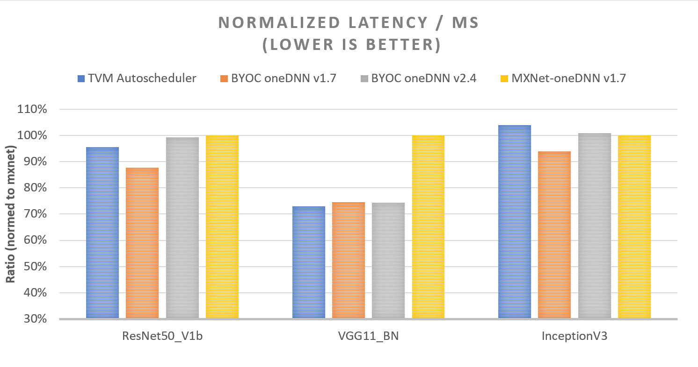

- Feature Name: oneDNN Integration via BYOC
- Start Date: 2021-11-29
- RFC PR: [apache/tvm-rfcs#0069](https://github.com/apache/tvm-rfcs/pull/0069)
- GitHub PR: [PR#9671](https://github.com/apache/tvm/pull/9671/commits), [PR#9797](https://github.com/apache/tvm/pull/9797/commits), [PR#9995](https://github.com/apache/tvm/pull/9995/commits), [PR#9996](https://github.com/apache/tvm/pull/9996/commits), [PR#10112](https://github.com/apache/tvm/pull/10112/commits), [PR#10266](https://github.com/apache/tvm/pull/10266/commits), [PR#10421](https://github.com/apache/tvm/pull/10421/commits), [PR#10835](https://github.com/apache/tvm/pull/10835/commits), [PR#10836](https://github.com/apache/tvm/pull/10837/commits)

# Summary
[summary]: #summary

This RFC proposes to integrate DNNL into TVM via BYOC framework. The drawback of the current "Bring DNNL to TVM via DNNL JSON codegen/runtime" is analysed and has been enhanced. Performance benefits are observed by comparing with either MXNet-oneDNN or TVM-autoscheduler on several popular workloads.

# Motivation
[motivation]: #motivation

TVM has shown its good performance on many CV models. One of the major advantages is the maximizing throughput which benefits from the small overhead. However, tuning is needed for each new shape, and it usually takes long time.

oneDNN is an open-source cross-platform performance library of basic building blocks for deep learning applications. The library is optimized for Intel(R) Architecture Processors, Intel(R) Processor Graphics and Xe Architecture graphics. Given a new shape and the env config, oneDNN is able to infer the optimal data format immediately. In order to take the advantage of small overhead of TVM, and achieve the best performance on CPU in a short time, we propose to integrate oneDNN into TVM via BYOC framework. 

Currently, the BYOC homepage provides a simple example of integrating DNNL(naming to oneDNN nowadays) into TVM, but the performance is far away from both TVM autoscheduler and MXNet-oneDNN due to the following main reasons:
- Non-optimal layout was used in dnnl ops. 
- Insufficient subgraph partitioning.
- Unnecessary overhead due to memory copy from tensor to dnnl memory buffer or vice versa.

# Guide-level explanation

We have already solved the above issues and observed the performance benefits by comparing with either MXNet-oneDNN or TVM-autoscheduler on several popular workloads like ResNet50_v1b,  InceptionV3, VGG11_bn in several scenarios including latency (Figure 1, single instance with 28 cores and bs=1), throughput (Figure 2, single instance with 28 core and bs=32) and real-time (Figure 3, 7 instances with 4core per each and bs=1) mode.

## *Note
[Note]: ##Note

Hardware config
- Intel(R) Xeon(R) Platinum 8280L CPU @ 2.70GHz

Compilation config
- g++ 7
- 'llvm -mcpu=cascadelake -model=platinum-8280'
- TVM commitID: 19b23b9
- MXNet version: V1.8.0
- OneDNN version: V1.7 / V2.4

Runtime config
- 20 warm-up and 100 batches

 

# Reference-level explanation
This proposal aims to provide a new approach to integrate oneDNN into TVM via DNNL JSON codegen/runtime by applying the following adjustments to tackle the aforementioned issues: 
- Register a new “alter_op_layout” function for dnnl to get the optimal layouts for dnnl ops with a new layout auto-query function in Relay.
- Add a `simplifyConsecuitiveAdd` pattern in `simplify_expr` pass. So that, `FoldConstant` pass able to fuse pattern `conv-add-add-relu` (comes from `conv-bias_add-bn-relu`) into `conv-add-relu`.
- Add a new pattern “Conv-Add-Sum-ReLu” for the fusion.
- Remove the unnecessary memory copy in “dnnl_json_runtime.cc” with pointer assignment only.

We have enhanced and updated the support. Currently, the following ops/post-op fusion/datatype are enhanced/added, as well as some CV models are verified with the new oneDNN backend, we’re going to cover more ops/datatypes and models (denoted with *) in the next step. 

## Ops
- nn.conv2d
- depthwise conv
- nn.conv3d
- nn.dense
- nn.relu
- nn.max_pool2d
- nn.avg_pool2d
- matrix multiplication *
- nn.conv1d *

## Post-Op Fusions
- conv2d_bias_sum_relu
- conv2d_bias_relu
- conv2d_bias
- dense_bias_relu
- dense_bias
- Eltwise Post-op
- Depthwise *
- Binary *
- PReLu *

## Datatype
- Float32
- BF16
- INT8 *

## Verified Models (from gluoncv)
- ResNet 18, 32, 50, 101, 152
- VGG 11, 13, 16, 19; VGG_BN 11, 13, 16, 19
- InceptionV3
- Mobilenet *
- Bert *

# Drawbacks
[drawbacks]: #drawbacks

Currently, only test on `Intel` CPU.

# Rationale and alternatives
[rationale-and-alternatives]: #rationale-and-alternatives

There are two ways to integrate oneDNN into TVM, "JSON Codegen" and "C Source Codegen". This RFC is developped with "JSON Codegen".

# Prior art
[prior-art]: #prior-art

This RFC aims to enhance the existing ["Bring DNNL to TVM via DNNL JSON codegen/runtime"](https://tvm.apache.org/2020/07/15/how-to-bring-your-own-codegen-to-tvm) to take advantages of both TVM and oneDNN.

The issues related to poor performance of the existing BYOC with DNNL have been listed in [Motivation]. They have been solved in this RFC.

# Unresolved questions

# Future possibilities
[future-possibilities]: #future-possibilities

More ops, post-op fusions, datatypes and more workloads are to be supported in the next step.
