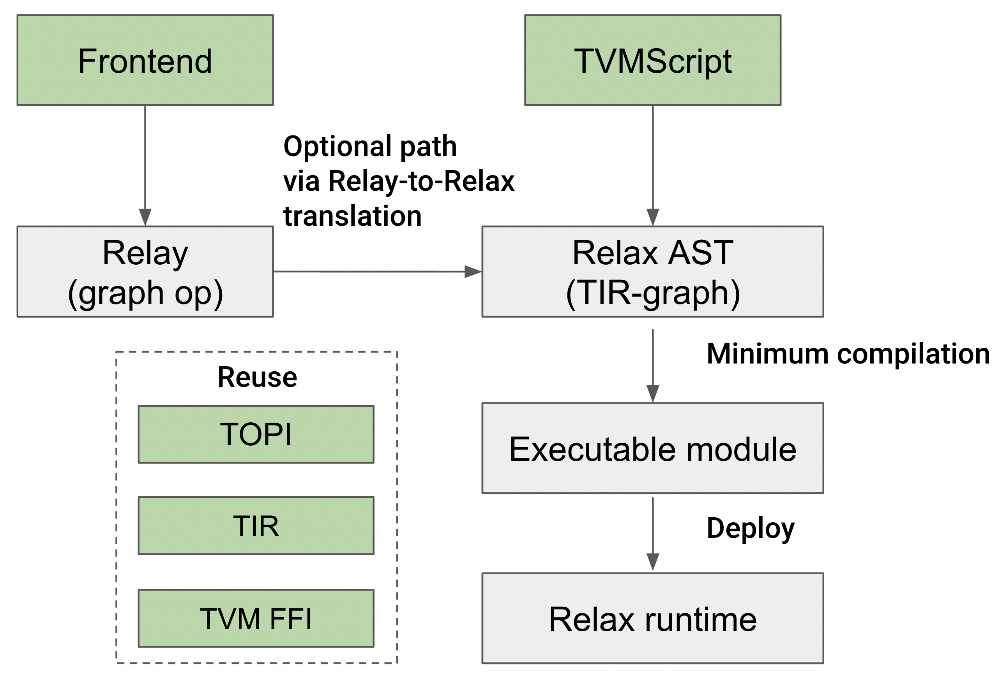
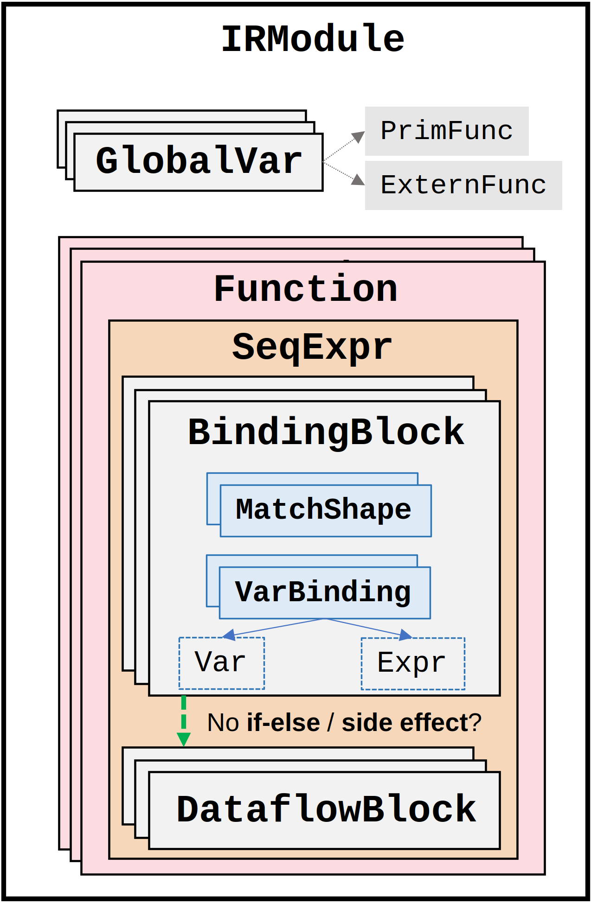
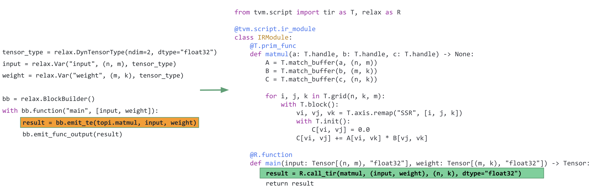

- Feature Name: Relax Upstreaming
- Start Date: 2022-08-17
- RFC PR: [apache/tvm-rfcs#0089](https://github.com/apache/tvm-rfcs/pull/0089)
- GitHub Issue: [apache/tvm#0000](https://github.com/apache/tvm/issues/0000)
- Co-Authors: [@denise-k](https://github.com/denise-k), [@jwfromm](https://github.com/jwfromm)

# 1. **Summary**

This RFC proposes to upstream the core foundation of Relax (Relay Next). Relax is a new graph-level IR that enables new capabilities to address the [critical needs](https://discuss.tvm.apache.org/t/establish-tvm-unity-connection-a-technical-strategy/13344) identified by the TVM community over the years of using and developing deep learning compilers.

# 2. **Motivation and goals**

Relax is an effort within [TVM Unity](https://tvm.apache.org/2021/12/15/tvm-unity) that aims to evolve the graph-level IR to maximize **expressibility, performance, and portability** across today and tomorrow’s workloads. Relax has three key goals motivated by the TVM community’s needs, and lessons the community has learned in ML acceleration through years of using and developing TVM:

- Build a unified interface to transcends the boundaries of TVM’s abstractions between graph-level IR, tensor programs (TensorIR), and runtime libraries (PackedFunc);
- Enable and optimize dynamic shape workloads;
- Support “computational graph” style optimizations with advanced dataflow semantics.

For more details on the design goals of Relax, please check out the [discuss forum post](https://discuss.tvm.apache.org/t/relax-co-designing-high-level-abstraction-towards-tvm-unity/12496).

The main focus of this upstreaming RFC is to upstream the **core foundation** of Relax as an **optional** compilation flow in TVM with two principles:

- **Minimize disruption:** This upstreaming should provide a **non-default** path to enable new capabilities for users/developers who are interested in what Relax brings, so it will not break the current default Relay flow.
- **Minimize complexity:** This upstreaming should reuse existing TVM/Relay infrastructure as much as possible (for example IRModule, runtime Module, TOPI library, etc.) to avoid duplicated effort and code.

Note:
- Acceptance of this RFC doesn't mean there is an agreement to eventually deprecate Relay and replace it with Relax. It only permits bringing the development that's currently occurring on the Relax fork into the TVM repo. This will improve the accessibility of that important work for community stakeholders who rely on it, as well as bring Relax under TVM project governance.
- If at a later stage it's found that individual features from Relax are desired in the Relay compiler (e.g. dynamic shapes, TVMScript support), design discussions and RFCs must take place to determine the best way to implement those features. Acceptance of this RFC gives no preference to Relax as the solution, and so evolving Relay would remain firmly on the table in those discussions.

This initial upstreaming will open the path for TVM Unity, and incrementally bring Relax into the community.

# 3. **Guide-level explanation**

This section introduces the three major design points of Relax, which map directly to the three key goals of Relax in the last section. At the beginning of this section, we first introduce what user-facing interfaces will look like after this RFC lands.

(Most of the code examples in this RFC are written in [TVMScript](https://github.com/apache/tvm-rfcs/pull/74/files#diff-6965a40ad8df7618ae68e11c88f924542a506c74a931cc3011ae9f99989b5f51R21-R27), which enables users to write and print TVM programs containing both Relax and TIR functions with Python syntax.)

## User-facing interface

After this upstreaming lands, users are able to write a Relax program in TVMScript or translate a model directly from Relay. Relax provides a simple API to compile the IRModule to VM executable, and run it on Relax VM.

```python
import tvm.script
from tvm.script import relax as R, tir as T

# Relax IRModule written in TVMScript
@tvm.script.ir_module
class MyIRModule:
    # This is a TIR PrimFunc which calls the TIR intrinsic T.exp
    @T.prim_func
    def tir_exp_func(x: T.handle, y: T.handle): ## <= D0
        n = T.var("int64")
        X = T.match_buffer(x, (n,), "float32")
        Y = T.match_buffer(y, (n,), "float32")
        for i in T.serial(n):
            Y[i] = T.exp(X[i], dtype="float32")

    # This is a Relax function which contains a dataflow block
    # representing a computational graph, as well as a call to an
    # opaque packed function which performs an in-place update to the
    # data in variable gv0.
    # We mark the corresponding design points (D0, D1, D2) that map to
    # the following sections throughout the relax function bellow.
    @R.function
    def relax_func(x: R.Tensor[(n, k), "float32"], w: R.Tensor[_, "float32"]):
    # n, k above are implicitly defined within the function signature
    # so we will be able to refer to n, k within all of relax_func
        with R.dataflow(): ## <= D2
            lv0 = R.match_shape(w, (k, m)) ## <= D1
            lv1: R.Tensor[(n, m), "float32"] = R.dot(x, lv0)
            lv2: R.Tensor[(n * m,), "float32"] = R.flatten(lv1) ## <= D1
            lv3: R.Shape = (n * m,)  ## <= D1
            gv0 = R.call_tir(tir_exp_func, [lv2], lv3, dtype="float32") ## <= D0
            R.outputs(gv0)

        R.call_packed("custom_inplace_update", gv0) ## <= D0, D2
        return gv0

# Print IRModule with syntax highlighting
MyIRModule.show()

# Build the Relax IRModule
target = tvm.target.Target("llvm")
exec = relax.vm.build(MyIRModule, target)

# Dump the VM executable instructions as text
print(ex.as_text())

# Run the function on Relax VM runtime
vm = relax.VirtualMachine(exec, tvm.cpu())
shape = (2, 3)
data = tvm.nd.array(np.random.rand(*shape).astype(np.float32))
res = vm["relax_func"](data)
```

## D0: ****Unified abstractions and optimizations across layers****

The first key design point is to allow the high-level graph IR to be able to directly interact and call into lower-level TensorIR and PackedFunc (TVM FFI).

The TensorIR PrimFunc and many external libraries adopt a **destination-passing-style** (DPS) calling convention that both input and output are passed to the function as arguments, and the outputs are mutated directly inside the function:

```python
def low_level_func(input0, input1, ..., output):
    # implementations
```

The main idea of DPS is that input and output are explicitly allocated outside and passed to the low-level primitive function. This style is commonly used in low-level library designs (for example TensorRT), so that higher-level frameworks (for example, the compiler) can handle memory allocation.

### ****call_tir****

In Relax, we introduce `call_tir` to bridge graph-level IR and TIR. `call_tir` is an intrinsic that calls a TIR PrimFunc (that follows DPS) and returns the output. The semantics of `call_tir` can be demonstrated by the code below.

```python
def call_tir(tir_primfunc: GlobalVar, 
             inputs: Tuple[Expr], 
             output_shape: Shape, 
             output_dtype: DataType) -> Expr:
    """Example code to demonstrate the semantics of call_tir"""
    out_tensor = alloc_tensor(output_shape, output_dtype)
    low_level_func(*inputs, out_tensor)
    return out_tensor
```

`call_tir` takes in tir_primfunc (a GlobalVar that maps to a TIR PrimFunc in the IRModule), a tuple of inputs, output tensor shape and datatype.  Notably, when the compiler lowers `call_tir`, it is not required to individually allocate each output tensor. The compiler can choose to create a memory plan of the intermediate tensors and tie things together for effective reuse.

`call_tir` is implemented as a special relax operator to minimize the impact on the IR changes (instead of a standalone IR node). From the AST point of view, it becomes:

```python
Call(
    op=Op::Get("relax.call_tir"),   
    tir_primfunc,
    inputs,
    output_shape,
    output_dtype
)
```

### ****call_packed****

In Relax, we introduce `call_packed` to bridge graph-level IR and PackedFunc. It indicates a call to a **non-DPS packed function** that is registered in the environment via TVM FFI. 

From the AST’s point of view, we do not need to introduce an additional call node, instead, we introduce an `ExternFunc` construct that represents a PackedFunc that we can call into (the PackedFunc may or may not return a value):

```python
Call(op=ExternFunc("my_packed_func"), *args)
```

`R.call_packed("my_packed_func", gv0)` in TVMScript (as shown in the User-facing interface section) only served as a syntax sugar to represent the above AST node. 

### ****call_dps_packed****

To be able to call into a DPS packed function (many low-level library (e.g. TensorRT) functions are designed in this way), and hence the compiler is able to directly handle the output memory, we introduce a `call_dps_packed` intrinsic, which corresponds to the following AST:

```python
Call(
    op=Op::Get("relax.call_dps_packed"),   
    ExternFunc("my_packed_func"),
    inputs,
    output_shape,
    output_dtype
)
```

Suppose `custom_packed_func` is a user-defined packed function in DPS:

```python
R.call_dps_packed("custom_packed_func", (input0, input1), output_shape=(3, 4), output_dtype="float32")
```

corresponds to the following AST:

```python
Call(
    op=Op::Get("relax.call_dps_packed"),
    ExternFunc("custom_packed_func"),
    (input0, input1),
    output_shape=(3, 4), 
    output_dtype="float32"
)
```

The following program in TVMScript shows that with `call_tir`, `call_packed`, and `call_dps_packed`, we can directly embed and call the TIR and PackedFunc functions in the high-level Relax IR program.

```python
from tvm.script import relax as R

# User-defined packed functions
# Non-DPS PackedFunc with return
@tvm.register_func("custom_add")
def add_packed(a, b):
    ret = a.numpy() + b.numpy()
    return tvm.nd.array(ret)

# Non-DPS PackedFunc without return
@tvm.register_func("custom_print")
def print_packed(a):
    print(a)

# DPS PackedFunc
@tvm.register_func("custom_tile")
def tile_packed(a, b):
    b[:] = tvm.nd.array(np.tile(a.numpy(), (1, 2)))

@tvm.script.ir_module
class MyIRModule:
    # define a PrimFunc to do matrix multiply
    # note TIR PrimFunc is in DPS, here z is the output
    @T.prim_func
    def tir_matmul(x: T.handle, y: T.handle, z: T.handle) -> None:
        m = T.var("int32")
        n = T.var("int32")
        k = T.var("int32")
        A = T.match_buffer(x, (m, n))
        B = T.match_buffer(y, (n, k))
        C = T.match_buffer(z, (m, k))

        for (i0, j0, k0) in T.grid(m, n, k):
            with T.block():
                i, j, k = T.axis.remap("SSR", [i0, j0, k0])
                with T.init():
                    C[i, j] = 0.0
                C[i, j] += A[i, k] * B[j, k]

    @R.function
    def relax_func(x: R.Tensor[(m, n), "float32"], y: R.Tensor[(n, k), "float32"]):
        with R.dataflow():
            # call_tir calls into a PrimFunc, and returns the matrix multiplication result
            gv0 = R.call_tir(tir_matmul, (x, y), (m, k), dtype="float32")
            R.outputs(gv0)

        # call into a PackedFunc to print the value of gv0
        R.call_packed("custom_print", gv0)

        # call the registered "custom_add" non-DPS PackedFunc and return the result
        gv1 = R.call_packed("custom_add", gv0, gv0)

        # call the registered "custom_tile" DPS PackedFunc and return the result
        gv2 = R.call_dps_packed("custom_tile", (gv1), (m, k * 2), dtype="float32")
        return gv2
```

This cross-level interaction unlocks many interesting things that were not possible before, including, but not limited to:

- Incrementally lower different parts of a program using different strategies, instead of lowering the entire program to TIR directly from Relay as today.
- Allow for more customized optimizations, such as whole program optimizations, cascading, and other post-schedule optimizations.
- Enable automation (MetaSchedule) to analyze call_tir nodes and the callee TIR programs, perform optimizations and rewrites to one or more call_tir nodes, thus feeding decisions such as layout rewrite directly to the high-level IR.
- By turning subgraphs into calls to PackedFunc (via call_dps_packed), BYOC becomes an IRModule ⇒ IRModule transformation as a natural part of compilation.
- Provide a flexible way to incorporate TensorIR and existing libraries such as cuDNN.

Through this unified interface, ML researchers, system engineers, and hardware vendors can collaborate better, since we can incrementally optimize and translate specific parts of the whole program in Relax.

## D1: ****Shape deduction as first-class computation****

Shape deduction is essential to compiling dynamic workloads. Under a dynamic shape setting, the destination-passing call style adopted by call_tir and call_dps_packed requires that the shapes of the output tensors are computed. We can solve this challenge by invoking a function to compute the shape before calling the operator function. However, there are also cases where the shape itself is data-dependent (e.g. `unique` operation used to select the unique elements of a tensor). Finally, since most dynamic shape workloads still contain a lot of (partially) static shapes, ideally we want to take benefit of this static shape information for optimization.

In Relax, a shape constraint of a tensor is represented by two fields of the `relax.Expr`(`RelayExpr`).

- `checked_type_: Type`, stores the generic rank and dtype constraints.
- `shape_: Expr`, stores ways to compute shape of the expression at runtime. It’s `nullptr` when the expression’s `checked_type_` is not `DynTensorType`(meaning the expression is not a Tensor). Otherwise, this `shape_` field takes one of the 3 possible types outlined below.

**checked_type_**

`Expr→checked_type_` stores the compile time deduced type of an expression. We introduce a new type `DynTensorType` to represent the type of a Relax tensor Expr, which contains the following two fields:

```python
class DynTensorType(Type): 
    ndim: int # ndim=-1 means unknown rank
    dtype: DataType # dtype=DataType::Void() means unknown dtype
```

**shape_**

`DynTensorType` does not contain shape information. Instead, the shape of a Tensor is stored in an **optional** `shape_` field in an Expr.

For an `Expr x`, `x.shape_` can contain the following values:

- V0: `ShapeExpr` (see Section 4.1 for its definition), which contains an `Array<PrimExpr>`. Static shapes are always represented in this form by encoding each dimension as `IntImm`. Symbolic shapes can also be represented (see section 4.1 for more).
- V1: Generic `Expr`, which is expected to, at runtime, result in something of type `Shape`. The `Expr` can call into opaque (shape) functions, or shape deduction intrinsics.
- V2: `RuntimeDepShape` (see Section 4.1 for its definition), a special `Expr` to indicate that shape is unknown at compile time and cannot be determined at runtime without producing the attached Tensor (see Safety Net section for its handling).

The following program covers typical scenarios in shape deduction (marked in comments). Importantly, shape is now part of the computation along with Tensor values. This reflects the fact that the computation of shapes can happen at runtime.

```python
from tvm.script import relax as R

@R.function
def shape_example(x: R.Tensor[(n, 2, 2), "float32"]):
    with R.dataflow():
        # V0: symbolic and static shape deduction
        lv0: R.Tensor[(n, 4), "float32"] = R.reshape(x, (n, 4))
        lv1: R.Tensor[(n * 4,), "float32"] = R.flatten(lv0)
        lv2: R.Shape = (n * 4,)

        # V1: external opaque shape function
        lv3: R.Shape = R.call_packed("myshape_func", lv2)
        lv4 = R.call_tir("custom_func", (lv1,), lv3, dtype="float32")

        # V2: runtime dependent case: _ is used to represent RuntimeDepShape
        lv5: R.Tensor[_, "float32"] = R.unique(lv4)

        # re-match shape
        lv6: R.Tensor[(m,), "float32"] = R.match_shape(lv5, (m,))
        lv7: R.Shape = R.match_shape(lv3, (m,))

        gv0: R.Tensor[(m,), "float32"] = R.exp(lv6)
        R.outputs(gv0)

    return gv0
```

While the text format type annotation `lv0: R.Tensor[(n, 4), "float32"]` shows the shape of each value, this is only syntactic sugar. From the IR’s point of view, the `shape_` field `(n, 4)` is not included in the type signature of `lv0`. The type signature of `lv0` is `DynTensor(rank=2, dtype="float32")`, and the shape is a special value field that is attached to each `Expr`. We made this explicit choice to simplify the type inference so that we do not need to get into the [dependent typing](https://en.wikipedia.org/wiki/Dependent_type) land where type depends on value (shape in our case) which requires heavier machinery to handle. 

**match_shape**

After a data-dependent computation (like `unique`) or external calls, we may need to be able to recover/refine the shape information to enable more optimizations. The `match_shape` construct is used to perform such refinements.

`var: Var = match_shape(value: Expr, pattern: List[PrimExpr])`

The match_shape construct takes a **value** and a **pattern** (a list of `PrimExpr`, for example `(m, n)`), and returns a **var**. It has two overloaded semantics:

- When value is a Tensor, it matches `value.shape` to the pattern, populates the corresponding symbolic integer variable if it occurs in the pattern for the first time in the scope, and then returns a new Tensor that is the same as value but the shape field is updated to the pattern. In the V2 case in the above code snippet, `R.match_shape(lv5, (m,))` defines a symbolic TIR variable `m`, and matches tensor lv5’s shape with the pattern `(m,)`.
- When value is a Shape (for example `lv7: R.Shape = R.match_shape(lv3, (m,))` in the above code snippet), it directly matches the pattern, and returns a Shape. This is useful when we want to isolate out shape functions that do not correspond to any Tensor value.

**Safety Net (handle `RuntimeDepShape`)**

While fixed rank, dynamic symbolic shape relation covers most of the use cases. Inevitably we also need to be able to cover general cases that may not fall into the category:

- C0: Dynamic shape relations where output shape is data dependent on the input (e.g. `unique` operator).
- C1: Rank of a tensor is not known (can happen in rare cases of loops).
- C2: dtype of a tensor is not known.
- C3: Other cases, opaque runtime objects for low-level libraries(e.g. PRNG handle, cuDNN context).

As a result, it is important to have a "safety net" solution so that we cover the general cases.

Suppose we have a `unique` operation which we cannot deduce the return tensor’s shape at compile time:

`y: R.Tensor[_, _] = R.unique(x)`

During lowering, this call won't get translated into destination passing style, because it is impossible to obtain the shape information and pre-allocate the memory. Instead, they are directly translated to calls that allocate and return the result tensor.

- `R.unique` can be mapped to a runtime PackedFunc call that takes in an NDArray x and perform an unique operation.
    - We can even dispatch to common runtime libraries such as `torch.unique`, for exmaple the above `R.unique(x)` can be lowered to `call_packed(”torch.unique”, x)`.

These features are supported by Relax VM as PackedFunc calls that return TVM Object. We can bring the tensors from no shape computation land to the shape-aware land using match_shape. The no shape computation is by no means the most effective way to handle things. It is necessary for cases like data-dependent calculation and interfaces with external libs that have weaker shape information.

## D2: ****Dataflow block as a first-class construct****

Most machine learning models can be represented with a **pure**/**side-effect-free** computational graph. An operation is pure or side-effect free if: it only reads from its inputs and returns the result via its output, it will not change other parts of the program (such as incrementing a global counter).

A **dataflow graph** means every operation inside is **side-effect free** and there are no **control flows** (such as if-then-else). A **dataflow block** is a way for us to mark the dataflow graph regions of the program in Relax. Specifically, all the operations under the dataflow block are side-effect-free and do not contain control flows (control flow is an advanced semantic that most pass writers do not consider). Outside a dataflow block, operations can contain side effects (for example doing in-place weight update during model training) and control flow. The program below is an example program that contains two dataflow blocks.

```python
@R.function
def main(x: R.Tensor((1, 784), "float32"), 
         w: R.Tensor((128, 784), "float32"), 
         b: R.Tensor((128,), "float32")):

    with R.dataflow():
        # linear and relu are PrimFuncs in the same IRModule
        lv0 = R.call_tir(linear, (x, w, b), (1, 128), dtype="float32")
        gv0 = R.call_tir(relu, (lv0,), (1, 128), dtype="float32")
        R.output(gv0)

    R.call_packed("custom_inplace_update", gv0)
    gv1 = R.read_tensor_from_file("tensor.txt")

    with R.dataflow():
        out = R.call_tir(linear1, (gv0, gv1, b), (1, 128), dtype="float32")
        R.output(out)
    return out
```

A dataflow block can effectively be **viewed as a computational graph** embedded in the program.

Binding variables assigned in a dataflow block are by default local to the dataflow block, and these variables can be viewed as “internal nodes” of the computational graph. When those variables are needed outside the scope of that dataflow block (output nodes in the computational graph), they must be explicitly output using `R.output()`. In the example above, `lv0` is local to its dataflow block and can’t be referenced outside the block. `gv0` can be referenced directly via its name in the surrounding scope because it has been `R.output`.

In the above relax function, `R.read_tensor_from_file`, and `R.call_packed` all have side effects, so they reside outside of the dataflow block. Anything that is outside of a dataflow block may have side effects, so we cannot perform optimizations such as reordering these bindings according to topological order unless we do more careful analysis. 

We expect most of the optimizations are graph rewriting, which happens inside dataflow blocks, and most existing optimization passes in TVM could also be converted to the dataflow block level too. These optimizations can be done by ML engineers who are familiar with the computational graph concept. The ability to isolate and represent effectful components also provides opportunities for more advanced optimizations for the places that need them.

# 4. **Reference-level explanation**

To achieve the design points described in the last section, this RFC focuses on how to build a **end-to-end MVP** (Minimum Viable Product) which allows the users to construct an end-to-end model (represented by IRModule), transform/build the IRModule, and run the execution.

As shown in the diagram below, users can construct a Relax AST either by writing TVMScript or via Relay-to-Relax IR translator, and then compile the Relax AST via the Relax minimum compilation flow to generate an executable module, and run it on a runtime. Other components in the TVM stack such as TIR, TOPI, TVM FFI are **shared** between Relay and Relax. We need three major components to put together an end-to-end MVP as shown on the right side in the diagram: **Relax AST**, **Relax runtime**, and **Relax minimum compilation flow**. This section illustrates the underlying techniques for these three components.

<p align="center">
    
</p>

## 4.1 Relax AST

To support the key design points in the last section, Relax introduces the following constructs to the AST. In the meantime, we reuse `RelayExpr`, `Call`, `Constant`, `Tuple`, `If`, `Op`, `GlobalVar`, `TupleGetItem` in Relay.

```python
class Expr(BaseExpr):
    """This is RelayExpr, but we add a shape_ field."""
    checked_type_: Type
    shape_: ObjectRef

class ShapeExpr(Expr):
    """corresponds to a shape containing symbolic PrimExpr"""
    values: List[PrimExpr]

class RuntimeDepShape(Expr):
    """represents a runtime-dependent shape
    Sometimes shape of a tensor cannot be deduced statically either
    because the shape is truly data dependent such as output of
    `unique` operator or cannot be deduced due to limited shape
    inference capability.
    """
    pass

class Var(Expr):
    """a function/SeqExpr scope visible variable that can be bound to other Expr"""
    vid: Id
    type_annotation: Optional[Type]

class DataflowVar(Var):
    """a specific type of Var that only has dataflow scope visibility"""
    pass

class Binding(Node):
    """the base class of bindings"""
    pass

class VarBinding(Binding):
    """variable bindings, bind the value to the var"""
    var: Var
    value: Expr

class MatchShape(Binding):
    """A type of binding which represents to matching a shape
    Example: MatchShape(x, [m, n], var)
    means matching Tensor x's shape to symbolic variables (m, n),
    and returns a 2-D tensor with the same shape as tensor x (but with
    explicit shape field [m, n]) to the output *var*;
    """
    value: Expr
    pattern: List[PrimExpr]
    var: Var

class BindingBlock(Node):
    """base class of binding block, bindings inside can be impure (with side effect or control flow)"""
    bindings: List[Binding]

class DataflowBlock(BindingBlock):
    """dataflow block, bindings inside are pure (side-effect-free and no control flow)"""
    pass

class SeqExpr(Expr):
    """sequence of BindingBlocks, can serve as the body of a Function"""
    blocks: List[BindingBlock]
    body: Expr

class Function(BaseFunc):
    """represents a Relax function"""
    params: List[Var]
    body: Expr   
    ret_type: Type

class ExternFunc(BaseFunc):
    """extern function, which represents a PackedFunc, used in call_packed."""
    global_symbol: String
```

With Relax IR, the overall structure of a Relax function is as follows:


<p align="center">
    
</p>

- Relax has first-class function support. A `Function`'s body can be any `Expr`, and Relax has an explicit data structure to handle binding blocks —`SeqExpr`, which usually serves as a Function’s body.
- A `SeqExpr` contains a list (sequence) of `BindingBlock` and a `body` expression.
- `DataflowBlock` is a special kind of `BindingBlock` that is identical to a pure computational graph. The bindings inside `DataflowBlock` have no side effects and no control flow.
- A `BindingBlock` consists of a list of `Binding`.
- `Binding` can be either `VarBinding` or `MatchShape`.
- The scope of a `DataflowVar` is its `DataflowBlock`, a normal `Var` in a `DataflowBlock` escapes to the scope containing the block (which could be the function scope or some other scope like an *if* branch). Note that TIR variables (bound by `MatchShape`) have the same scoping rules as normal `Var`.
- A `SeqExpr` is evaluated as follows: Each binding block in its `BindingBlock` is evaluated, and then the `body` expression is evaluated—the result of evaluating the body is the result of evaluating the SeqExpr.

Let's take the following relax program as an example, `relax_func` contains a `SeqExpr`, the `SeqExpr` contains a `DataflowBlock` (with 2 `VarBinding`) and a `BindingBlock` with one `VarBinding`.

```python
from tvm.script import relax as R

@R.func
def relax_func(x: R.Tensor[(n, k), "float32"], w: R.Tensor[(k, m), "float32"]):
    # start a DataflowBlock
    with R.dataflow(): ## <= DataflowBlock
        lv0: R.Tensor[(n, m), "float32"] = R.dot(x, w) ## <= VarBinding, lv0 is a DataflowVar
        gv0: R.Tensor[(n * m,), "float32"] = R.flatten(lv0) ## <= VarBinding, gv0 is a Var that escapes to the outer scope
        R.outputs(gv0)

    # start a BindingBlock
    gv1 = R.call_packed("custom_inplace_update", gv0) ## <= side-effect binding
    return gv1
```

## 4.2 Relax runtime

For the ease of implementation and flexibility to support dynamic workloads, we build a flexible register-based VM runtime similiar to the Relay VM but with two distinctions:

- Minimal instruction set (including `Call`, `Ret`, `If`, `Goto`):
    - **Call** **Instruction** (packed function invocation) as the core instruction, since eventually TIR PrimFuncs are also compiled to PackedFuncs.
    - Builtin packed function library to bridge the IR and runtime (e.g., `shape_of(tensor)` is one of the builtin packed functions to be invoked with the **Call** **instruction** to get the shape of a tensor).
- Do shape calculations via "shape tensor" manipulation.
    - In Relax runtime, a "shape tensor" (a tvm NDArray) is used as a scratchpad for shape computations. Suppose Tensor A's shape is (m, n) at compile time, and in a later Relax program we want to compute (j, k) = (m+1, n+1). At runtime, A's shape will be fetched and stored in index 0 and index 1 of the shape tensor via calling the runtime builtin function `store_shape(A.shape, 0, 1)`. m+1 (j) and n+1 (k) will be computed by a TIR PrimFunc generated in a shape lowering pass, and stored at index 2 and 3 of the shape tensor. Please refer to the shape lowering pass in the next subsection for more details.

As future plan, we will consolidate Relay VM and Relax VM, and integrate Relax with the AOT executor (see Section 5).

## 4.3 Relax minimum compilation flow

In Relax, we need to ensure a unified and minimum build that maps an IRModule → runtime.Module. This minimum build is capable of building any valid IRModule no matter what transformations have been applied to the IRModule. This design decouples the optimization passes from the minimum build, which will enable flexible and customizable compilation pipelines without the need to hack into the core of the compiler, and allow the users to explore new space.

Relax compilation flow is designed with the following goals:

- Compile Relax program to a format that the Relax runtime can directly execute.
- A compilation pipeline that enables composable transformations:
    - Every transformation is a `IRModule` → `IRModule` transformation.
    - Users might run part of the program with third-party libraries such as cuDNN. We need to be capable to optimize the left part.

Let's take compiling the following simple Relax program as a running example.

```python
import tvm.script
from tvm.script import tir as T, relax as R

@tvm.script.ir_module
class MyIRModule:
    @T.prim_func
    def tirexp(a: ty.handle, b: ty.handle):
        n1, m1 = T.var("n1"), T.var("m1")
        X = T.match_buffer(x, (n1, m1))
        Y = T.match_buffer(y, (n1, m1))
        with T.block(n1, m1) as i, j:
            Y[i, j] = T.exp(X[i, j])
    
    @R.function
    def relax_function(x: R.Tensor[(n, m)]):
        with R.dataflow():
            lv0: R.Tensor[(n, m)] = R.call_tir(tirexp, (x,), (n, m), dtype="float32")
            gv0: R.Tensor[(m*n,)] = R.call_tir("flatten", (lv0,), (m*n,), dtype="float32")
            R.outputs(gv0)

        return gv0
```

There are two challenges to lowering a Relax program to Relax VM instructions:

- C0: Every `call_tir` needs to be lowered because Relax runtime only supports calling a packed function directly → We need to insert explicit memory allocation for each `call_tir`.
- C1: The symbolic shape variables `n` and `m` are not something that the runtime can represent (the Relax VM only supports `NDArray` and `ShapeTuple` runtime data structures) → We need to use the shape tensor in the runtime to do shape calculations.

### A**ddress C0: lower `call_tir` to explicit memory allocation form**

An explicit memory form program has the following properties:

- Explicitly allocate and kill storage and tensors
- Has side effect
- No shape annotation
- Core expression: `call(func_name, arg0, arg1, ...) -> optional<Expr>`, this maps to the `Call` instruction that runtime can directly execute.

We can introduce four builtin functions in the runtime:

- `relax.runtime.builtin.alloc_storage(size, device) -> storage`: Allocate a storage (a contiguous block of memory) that can be used to create tensors.
- `relax.runtime.builtin.alloc_tensor(storage, shape, offset, dtype) -> tensor`: Allocate a tensor in a storage.
- `relax.runtime.builtin.free_storage(storage)`: Free the allocated storage.
- `relax.runtime.builtin.free_tensor(tensor)`: Free the allocated tensor.

Program after call_tir lowering:

```python
@R.function
def relax_function(x):
    # the memory allocation has side effect, so it's now in a BindingBlock instead of a DataflowBlock
    n, m = R.match_shape(x.shape)
		
    storage0 = relax.runtime.builtin.alloc_storage(size=[n*m], device=cpu)
    tensor0 = relax.runtime.builtin.alloc_tensor(storage0, shape=[n, m], offset=0, "float32")
    R.call_packed("tirexp"), x, tensor0)
		
    storage1 = relax.runtime.builtin.alloc_storage(size=[n*m], device=cpu)
    tensor1 = relax.runtime.builtin.alloc_tensor(storage1, shape=[m*n,], offset=0, "float32")
    R.call_packed("flatten"), tensor0, tensor1)
		
    R.call_packed("free_tensor"), tensor0)
    R.call_packed("free_storage"), storage0)
    return tensor1
```

In a future RFC, we will design and implement a memory planner to be leveraged both by the Relax VM flow discussed here and the AOT flow to be defined in the future.

### A**ddress C1: do shape lowering via VM shape tensor manipulation**

We can introduce three builtin functions in the runtime:

- `relax.runtime.builtin.alloc_shape_tensor(size) -> shape_tensor`: Allocate an NDArray with a specific size to execute shape computation
    
    (We can use `alloc_tensor` to achieve the same goal)
    
- `relax.runtime.builtin.store_shape(shape, shape_tensor, idx0, ...)`: Store a shape into specific indices in the shape_tensor.
- `relax.runtime.builtin.load_shape(shape_tensor, idx0, ...) -> shape`: Construct a shape from the shape_tensor according to the indices.

Program after shape lowering:

```python
@R.function
def relax_function(x):
    shape_tensor = relax.call_packed("vm.builtin.alloc_shape_tensor", size=k) 
    relax.runtime.builtin.store_shape(x.shape, shape_tensor, 0, 1)
    sh = relax.runtime.builtin.load_shape(shape_tensor, 0, 1)
    # this product_shape function (to compute n*m) is generated as TIR primfunc when visiting ShapeExpr in the shape lowering pass
    shape_size = product_shape(sh) 
		
    storage0 = relax.runtime.builtin.alloc_storage(size=shape_size, device=cpu)
    gv0 = relax.runtime.builtin.alloc_tensor(storage0, sh, 0, "float32")
    R.call_packed("tirexp"), x, gv0)
		
    sh1 = R.call_packed("load_shape"), shape_tensor, 0, 1)
    storage1 = relax.runtime.builtin.alloc_storage(size=shape_size, device=cpu)
    gv1 = relax.runtime.builtin.alloc_tensor(storage1, sh1, 0, "float32")
    R.call_packed("flatten"), gv0, gv1)
		
    R.call_packed("free_tensor"), gv0)
    R.call_packed("free_storage"), storage0)
    return gv1
```

## 4.4 Relax-TE/TOPI integration

Relax brings support of directly embedding TIR functions through `call_tir`. However, it is still hard to manually construct TIR functions through TVMScript. In Relax, we can reuse libraries such as TOPI (pre-defined TE functions) for quick workload creation and operator lowering. 

The Relax-TE integration is very unique to Relax because the TE language in TVM is also based on symbolic shape. For exmaple, the following code uses `te.var` to create symbolic dimension variables whose values can be specified during execution:

 

```python
n = te.var(name='n')
A = te.placeholder((n,), name='a')
B = te.placeholder((n,), name='b')
C = te.compute(A.shape, lambda i: A[i] + B[i], name='c')
```

Since Relax also has symbolic shape as first class (D1 in Section 3), Relax can directly integrate with TE and TOPI library.



The above code snippets demonstrate how users can build an end-to-end workload by leveraging TOPI and TE.  The left side of the above diagram uses `relax.BlockBuilder` API to incrementally build the IRModule as shown in TVMScript on the right. 

The Relax BlockBuilder has a member function `emit_te` as highlighted in the program on the left. `emit_te` takes the following arguments:

- a TE function
- Relax variables that define the input tensors (for example the `input` and `weight` variables in this example)

`emit_te` then does the following:

- Creates `te.placeholder` for the input Relax variables (e.g. input and weight)
- Creates TE compute through the TE/TOPI function (`topi.matmul` in this case) using those `te.placeholder`.
- Calls into `te.create_prim_func` to create a TIR PrimFunc.
- Generates a call into the generated TIR PrimFunc via `call_tir`.

Bridging Relax and TIR is simple and clean given that Relax has symbolic shape as first class and the support for `call_tir` for cross-layer interactions.

**Relay → Relax translator**

To immediately boost the coverage of models and leverage existing relay optimizations, a Relay-to-Relax translator is implemented. The translator visits the Relay graph in post-order, lowers relay ops to their TOPI functions using `OpStrategy`, and uses `emit_te` to generate corresponding TIR PrimFuncs and a Relax `main` function that contains a sequence of `call_tir` that call into these generated TIR Primfuncs. 

## 4.5 PR list

We plan to split the upstreaming into the following manageable PRs for TVM community review:

- Relax IR
- Relax VM
- BlockBuilder
- ExprFunctor/ExprVisitor/ExprMutator/IRFunctor
- Relay → Relax translator
- Minimum build (4 passes)
- VM Codegen
- E2E model compilation + execution

# 5. **Future work**

This RFC only focuses on the foundation part of Relax. After it, we will incrementally incorporate the additional capabilities and features. Relax aims to achieve parity with the functionality provided by Relay: this means that workloads which are functional on Relay will also be functional on Relax, even though the infrastructure underneath may change.

Future plans that we will bring in future RFCs:

- AOT: AOT compilation has a wide range of benefits such as being more space efficient and is necessary for resource-constrained projects like uTVM. We are committed to continuously supporting the AOT compilation in Relax, and there is an ongoing effort to connect Relax to the current AOT executor.
- BYOC: We will try to reuse the existing translation spec. In Relax, BYOC can be formalized as a pass that call external packed functions.
- Automatic scheduling: We will try to reuse the underlying [MetaSchedule](https://github.com/apache/tvm-rfcs/blob/main/rfcs/0005-meta-schedule-autotensorir.md) infrastructure, and the automatic scheduling can be formalized as a pass in Relax.

We will migrate to use the new TVMScript parser/printer proposed in the following RFCs:

- Parser: https://github.com/apache/tvm-rfcs/pull/79
- Printer: https://github.com/apache/tvm-rfcs/pull/74

# 6. **Rationale and alternatives**
This proposal brings Relax as a separate dialect to the TVM ecosystem. We propose to do so because: Relax presents a set of closely chosen co-design choices to resolve pain points we observed so far in the TVM ecosystem, namely dynamic shape, side-effect handling, and cross-IR interaction. Additionally, the current Relax mainly focuses on graph-TIR-based cross-layer optimizations and complements the passes implemented in Relay.

Presenting optional modules and dialects to the ecosystem is an important way to welcome new improvements, land our technical commitment timely, continue to reinvent ourselves, and welcome new community members who have new use cases.  It also aligns with practices we see in other ML projects, such as MLIR dialects, PyTorch FX modules, etc.

As in these previous cases (MLIR dialects and TorchFX), there can be some amount of perceived duplications with existing modules. Nevertheless, there are usually technical reasons for a new module, both from design consistency, time to delivery, and separation of concerns from stable modules during improvements. Additionally, there is also a majority amount of support to help continue maintaining the new module. This new community effort would help us to welcome new members to the community, and enhance the overall development of TVM.

We acknowledge that the migration of default flow (that involves Relay) would benefit from more in-depth discussions on possible approaches. They are not part of this proposal and we welcome further discussions on this topic. We think however, that it is useful to provide such a context. This section provides a context on possible difficulties in evolving Relay to bring some of the features.

From the development point of view, we think that the technical reasonings, community needs, and technical support around the module being present is sufficient to justify the inclusion of the optional module. We agree that we need to do further in-depth discussions on default flow evolution, and would be more than happy to continue the discussion after this RFC.

To incrementally extend Relay to achieve the same goals as Relax, we need to consider several changes:

**C0: Add first-class dynamic shape support:**

In Relay, shape is part of its type system. Specifically, tensor shape is part of tensor type (`TensorType`), `Any` is used to represent a statically unknown dimension of tensor, and shape inference is part of type inference. For example, in the code snippet below, when applying a flatten operation on tensor `a` of shape `(Any, 224)`, the output tensor `b`’s shape is represented as `(Any, )`.

```python
a: Tensor[(Any, 224)]
b: Tensor[(Any, )] = relay.flatten(a)
```

To support first-class symbolic shape, `shape_` field needs to be introduced to expressions to define how shapes should be computed at run time, while the tensor type (`DynTensorType`) only stores the generic rank and dtype constraints. Separating shape from type system allows for greater flexibility for variable-shape tensors and makes it easier to implement new operators.

In Relax, the above program is represented as below:

```python
a: Tensor[(m, 224)]
b: Tensor[(m * 224, )] = relax.flatten(a)
```

With first-class symbolic shape, we know the shape relation between tensor `a` and tensor `b`, which allows for good optimization opportunities, for example, memory planning can reuse the memory between `a` and `b` since it is known at compile time these two tensors occupy the same amount of memory. In Relax, shape computation is part of the program, so we can do shape computations like `m * 224` at run time.

Supporting both shape mechanisms would mean all related passes need to be rewritten to be aware of these two shape mechanisms and only take benefits from one of them, which can be very confusing in the transition stage. Additionally, the two shape mechanisms are so different that users need to know which shape to look at, whether it’s the shape in type, or the `shape_` field. Directly refactoring the shape mechanism would mean an immediate jump to Relax, which is not incremental, and also infeasible in terms of engineering. See also the co-design section to see how shape in Relax interacts with other parts.

**C1: Add first-class support for interactions with TensorIR and TVM FFI:**

Relay focuses on graph-op level optimizations, while Relax focuses on interactions across layers (graph-TIR-runtime). Even though it’s possible to introduce intrinsics like `call_tir` into Relay, since currently all Relay passes do not consider the interactions between graph and TIR/runtime, related passes and BYOC flows need to be rewritten. 

For example, the fusion pass can be implemented in a modularized way in Relax: 

- An annotation pass to annotate op pattern kind (e.g., element-wise, injective, etc.) by analyzing each TIR PrimFunc in the IRModule. This requires manual labeling in Relay for each operator.
- A pass to make fusion decision based on some algorithm.
- An application pass to apply the fusion decision.

Note that we can have different decision passes with different algorithms, but only one decision application pass, and this allows TVM users to explore new fusion algorithms.

Relax can be viewed as a dialect on the graph-TIR-runtime abstraction, that is complementary to Relay. Relay focuses on high-level op transformations, while Relax passes focus on TIR-graph-runtime co-transformations that can enable new capabilities such as [customizable fusion](https://github.com/tqchen/tvm-rfcs/blob/main/rfcs/0091-establish-tvm-unity-connection.md#customize-fusion) and [generic layout rewrite](https://github.com/tqchen/tvm-rfcs/blob/main/rfcs/0091-establish-tvm-unity-connection.md#3-example-simplified-automatic-scheduling-integration), which is hard to achieve by simply migrating the current Relay passes.

**C2: Add first-class dataflow and side effect handling:**

Relay does not define semantics for side effects in operators, and most of Relay operators and passes were implemented without accommodating side effects. For example, the lack of in-place update semantics in Relay has prevented importing many PyTorch models used in practice. There have been many requests ([1](https://github.com/apache/tvm/pull/6049), [2](https://github.com/apache/tvm/pull/7513), [3](https://github.com/apache/tvm/pull/9375)) to add support for the `aten::copy_` op (which does in-place update on a tensor), but we have rejected all of them. To handle side effects, not only we need define semantics for them, but also need to rewrite related Relay passes, importers, and operators to respect the new assumptions that operators can have side effects.

From the three points discussed above, we can see that each time we introduce a component to Relay, it requires significant changes to the code base—not only adding the corresponding IR constructs but also rewriting all related passes based on the new assumptions. There are other assumptions and designs that we make in Relax, for example, we expect the majority of the Relax passes to operate on IR in [A-normal form](https://en.wikipedia.org/wiki/A-normal_form), to avoid the [stack overflow issue](https://discuss.tvm.apache.org/t/rfc-discuss-non-recursive-ast-visiting/2481) when visiting AST.

**Co-design**

Importantly, all these three components (C0, C1, C2) are coupled to each other. Co-designing them together is much more powerful than treating them as individual features. For example, `call_tir` (C1) signature has `output_shape` which can be represented by symbolic shape (C0), so bridging Relax and TIR is simple and clean given that TensorIR and TE natively support symbolic shape hence we can directly generate PrimFunc with `emit_te`. Also, `call_packed` (C1) provides the flexibility to call into third-party libraries and any opaque functions that may have side effects (C2), which dramatically simplifies the process to add new operators and customized compilation flow such as [BYOC](https://discuss.tvm.apache.org/t/establish-tvm-unity-connection-a-technical-strategy/13344#byoc-9). Introducing each component separately in an incremental way will make the whole design less cohesive.

**Summary**

In summary, the update would involve three things that are tightly coupled together:

- Change the shape mechanism.
- Build passes that are aware of symbolic shapes and TIR interaction. Notably, it’s not a migration, as most passes in Relay focus on the graph-op level.
- Handle dataflow and side effects.

Every step would require significant engineering effort, which is infeasible and non-incremental. On the other hand, Relax is complementary to Relay and can be viewed as a dialect on the graph-TIR-runtime abstraction, while Relay is stable and already used in many production cases. Introducing Relax as an optional module avoids introducing breaking changes to Relay. Additionally, most of the Relax passes work on the graph-TIR-runtime form, which allows us to incrementally build such passes.

# 7. **Acknowledgement**

We want to acknowledge all the Relax contributors (listed alphabetically by Github ID):

Core developers:

**[@ganler](https://github.com/ganler),[@hypercubestart](https://github.com/hypercubestart), [@Hzfengsy](https://github.com/Hzfengsy), [@jinhongyii](https://github.com/jinhongyii), [@junrushao1994](https://github.com/junrushao1994), [@LeshengJin](https://github.com/LeshengJin), [@MasterJH5574](https://github.com/MasterJH5574), [@psrivas2](https://github.com/psrivas2), [@slyubomirsky](https://github.com/slyubomirsky),[@sunggg](https://github.com/sunggg), [@tqchen](https://github.com/tqchen), [@yongwww](https://github.com/yongwww), [@YuchenJin](https://github.com/YuchenJin), [@ZihengJiang](https://github.com/ZihengJiang)**

Design/roadmap contributors:

**[@altanh](https://github.com/altanh), [@areusch](https://github.com/areusch), [@comaniac](https://github.com/comaniac), [@cyx-6](https://github.com/cyx-6), [@denise-k](https://github.com/denise-k), [@electriclilies](https://github.com/electriclilies), [@jroesch](https://github.com/jroesch), [@jwfromm](https://github.com/jwfromm), [@masahi](https://github.com/masahi), [@mbaret](https://github.com/mbaret), [mbs-octoml](https://github.com/mbs-octoml), [@mikepapadim](https://github.com/mikepapadim), [@tkonolige](https://github.com/tkonolige), [@VertexC](https://github.com/VertexC), [@vinx13](https://github.com/vinx13), [@yelite](https://github.com/yelite), [@yzhliu](https://github.com/yzhliu), [@zxybazh](https://github.com/zxybazh)**
