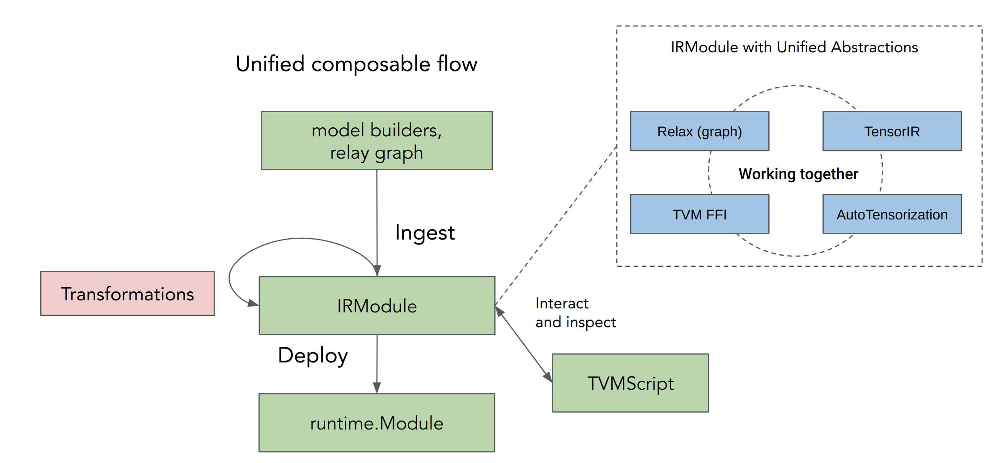
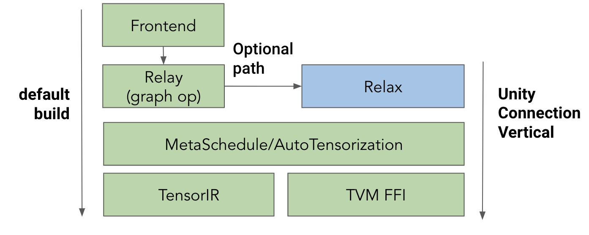
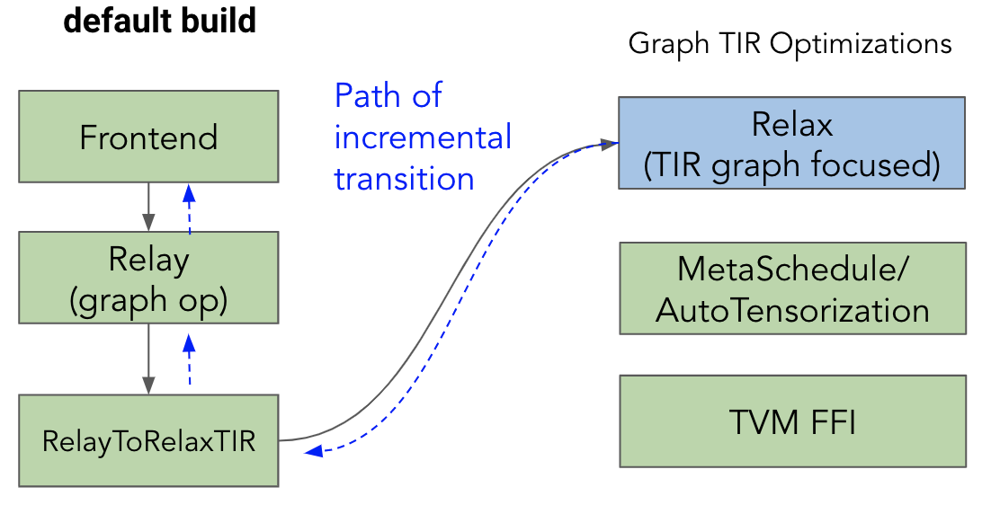

- Feature Name: Establish TVM Unity Connection — A Technical Strategy
- Start Date: Aug 24, 2022
- RFC PR: [apache/tvm-rfcs#0091](https://github.com/apache/tvm-rfcs/pull/91)
- GitHub Issue: None

Co-authored with @denise, @jwfromm

Also thanks to helpful inputs from @jknight @jroesch @areusch @yuchenj @junrushao1994 @psrivas2  @sunggg @slyubomirsky @yongwww @ziheng and many other members of the community.

# Summary

At the end of 2021, the TVM community outlined a plan for multiple significant improvements to the project under the banner of **TVM Unity**. Three of the four improvements are already a part of the TVM project (the FFI interface, TensorIR, and MetaSchedule) while Relax (the fourth) is reaching a state where it is time to talk about connecting them all together. **This RFC outlines a plan to connect all four components together for the first time in the TVM project to enable a cohesive (but optional) end-to-end flow in TVM.** We are calling this the “**TVM Unity Connection**” milestone. 

This RFC aims to clarify the direction of the TVM Unity effort by:

1. Reiterating TVM Unity goals and providing extra level of details on the TVM Unity’s unified composable flow.
2. Describing the TVM Unity Connection miestone
3. Demonstrating an example workflow made possible through this milestone
4. Considering possible future opportunities beyond the TVM Connection Milestone

We are excited to bring this new path forward in an incremental way so we can gather feedback from the community. We want to note that this proposal is also carefully designed to minimize disruption to the rest of the project and community.

To help explore and demonstrate the unity connection experience better, we also recommend checking out the [MLC course series](https://mlc.ai), which contains several examples of what is possible with TVM unity connection milestones and teaches the material from the basics.

### Relation to Upcoming Technical RFCs

This strategy RFC describes our process and desired outcomes in more detail as we work to connect the unity infrastructure together. We also outline the underlying goals as we establish the connection while minimizing disruption. It is broader than and supplementary to the upcoming technical RFCs about specific components including:

- **Relax upstreaming RFC** describes the technical details of Relax to enable a unified composable flow in unity connection.
- **tvm.compile**: Towards a unified, stable compilation flow for TVM Unity describes our long-term strategy to consolidate default build flows beyond the Unity Connection milestone
- **Bringing support for Relax to AOT** describes a plan to support Relax in the AOTExecutor build flow.
- Future RFCs for additional opportunities enabled by unity connection, such as memory planning, customized fusion, and flexibile library integration.

Our goal is to bring TVM Unity to the community incrementally with minimized disruption. This RFC is the first step. We will work together with the community on these future RFCs as we incrementally bring unity to  TVM.  

# 1. Unity motivation and goals

[TVM Unity](https://tvm.apache.org/2021/12/15/tvm-unity) describes a change in philosophy around the way developers interact with Tensor-based workloads through compilation frameworks. In order to support this new philosophy in TVM, four key components were needed (FFI, TensorIR, Meta-Schedule, and Relax). 

It is straightforward to understand the motivation for each of those pieces in reading their respective RFCs. However, it can be much harder to see how these pieces interact to bring additional benefits and resolve challenges we faced in our past experiences. And, it is helpful to set a concrete milestone to work towards based on an initial set of user workflows.

The main goals of TVM unity are:

- ****Unifying abstractions:**** TVM Unity will focus on letting AI applications fluidly cross the boundaries between operator graphs, tensor programs, and hardware primitives while supporting both static and dynamic shapes. In other words, rather than forcing a user to either describe things at the graph level (TF-Graph, ONNX) or at the loop level (CUDA, C++), unity enables a user to flexibly describe, transform, and compile ML computations with a single set of abstractions and interfaces.
- **Encourage interaction and collaboration:**  TVM unity brings first-class TVMScript and python API support, encouraging broader interaction among between ML engineers, ML scientists, and hardware providers through the interactive API.
- **First-class automation:** TVM Unity will expose all these cross-layer interactions for automated optimization and enable effective collaboration between domain experts and the automation system.

Besides the above three stated key elements, one common theme of TVM unity is to provide a unified and simplified approach to flexibly customize and enhance ML compilation. This desire comes from listening to users in the TVM compiler community who were struggling with the maintenance and cognitive burden arising from specializations and assumptions that became baked into the pipeline over time to support translations between different stages of compilation.

### Unified Composable Flow

Unity Connection aims to provide a way to simplify the overall flow, with the following principles (shown in the figure below):

- The compilation process and automated search center around the IRModule abstracts graph (relax), loop level (TensorIR), external (FFI), and search primitives (MetaSchedule with AutoTensorization) concepts with a single interface.
- Transformations are defined as functions take in one IRModule and produce a different IRModule. Transformations are designed to be flexible which avoids the need for special infrastructure built for particular features.
- TVMScript will serve as a centralized tool for inspecting and interacting with IRModules during the overall set of transformations.

 

This is made possible by IRModule’s unified abstractions which work together. We will include examples and have more discussions in the incoming sections.

### Unity connection alignment in the community

There is already a lot of excitement around TVM Unity and what it can enable because the TVM community is already benefiting from several exciting foundational pieces of TVM Unity that have already reached the TVM repository. The community collectively shipped **TensorIR** to make TVM more general and fix issues with inherited HalideIR. We then innovations from AutoTVM and AutoScheduler and evolved them towards **Meta-Schedule**. To enable better user interaction, we evolved introduced **TVMScript** to enable python-first user interactions.

The final component we are evolving is relax(relay next), which has been developed outside of the TVM main tree by academic and industry collaborators in order to minimize disruption. We think that Relax is now reaching a level of maturity where it would benefit a wider set of attention, use, and feedback from the rest of the community.

Simultaneously, bringing Relax as the final piece of TVM Unity into the upstream TVM repository can now enable an end-to-end optional flow that fully brings these pieces together and makes them accessible to even more members of the TVM community.

# 2. Unity Connection milestone

This RFC proposes the TVM Unity Connection Milestone as an initial step to connect the unity components together in an optional end-to-end flow in TVM.

This means that users will be able to try out the unity flow by constructing IRModules that contain interactions among graph, TIR, and FFI. They can then interactively transform them and build a runnable module. This process makes the overall compilation flow more customizable and accessible to different users and developers.

At TVMCon Dec 2021, we sketched a conceptual design of TVM unity. Today we realize it as a concretely runnable example and use them to summarize the unity connection capabilities:

```python
import tvm.script
from tvm.script import tir as T, relax as R

@tvm.script.ir_module
class MyIRModule:
    # Define a TIR based operation.
    @T.prim_func
    def tir_mm(X: T.Buffer[(n, d), "float32"],
               W: T.Buffer[(d, m), "float32"],
               Y: T.Buffer[(n, m), "float32"]):
        for i, j, k  in T.grid(n, m, d):
            with T.block("body"):
                vi, vj, vk = T.axis.remap("SSR", [i, j, k])
                with T.init():
                     Y[vi, vj] = 0
                # A2: can be mapped to HW primitives
               Y[vi, vj] += X[vi, vk] * W[vk, wj]

	@R.function
	def relax_func(x: R.Tensor[(n, d), "float32"], w: R.Tensor[(d, m), "float32"]):
        with R.dataflow()
            # A0: Interaction between "graph" and TIR
            lv0: R.Tensor[(n, m), "float32"] = R.call_tir((n, m), tir_mm, [x, w])
            lv1: R.Tensor[(n * m,), "float32"] = R.flatten(lv0)
            gv0: R.Tensor[lv2, "float32"] = R.exp(lv1)
            R.output(gv0)

        # A1: Interaction between "graph" and FFI
        R.call_packed("custom_inplace_update", gv0)
        return gv0f
```

Specifically, unity connection enables the following interactions (annotated in the code above):

- A0: Interaction between graph and Tensor Program (TensorIR)
- A1: Interaction between graph and FFI
- A2: Interaction between Tensor Program and Hardware primitive (through tensorization).

Enabling these interactions means:

- We can construct these interactions during model ingestion and use them as an interface for customization — e.g. directly call into both topi (TVM’s operator library) and TensorIR (flexible loop level syntax) in graph construction.
- We can inspect and transform IRModules that contain those elements to quickly bring in new optimizations.
- We can build optimization passes by transforming the IRModules and analyzing interactions between different types of abstractions(e.g. graph/TIR).

We have been experimenting with some of the efforts and confirmed that such flow is possible through combination of relax, TensorIR, FFI and AutoTensorization. While some of these capabilities were technically possible to do before TVM Unity, it would have required extensive modifications to TVM internals and increased project complexity. Additionally, many capabilities, such as interaction with symbolic shapes and direct calls into topi, require fundamentally thinking that leads to TVM unity.

Following best practices from other projects as they evolve, Relax will, as a new optional component, be isolated in its own namespace to minimize disruption to the current flow and design organic interfaces to interact with the rest of the unity components. Also, we do not plan to change the current default build pipeline (`tvm.build` and `relay.build`), in order to minimize disruption to existing users. 

To help stage the set of improvements while minimizing disruption of the current flow. We propose and introduce unity connection as an optional compilation flow of TVM, diagrammed as:

 

In the proposal, the “default build” (those that run through `tvmc` and `relay.build`) that TVM users know today will remain unchanged. TVM unity connection will be added as an optional vertical component. 

This is a change that is invisible to the current users who use the existing flow as the default build will continue to work as-is. In the meantime, we give our community members (many of whom are excited about TVM unity) abilities to leverage unity connection early as an optional vertical to enable use cases that may not be supported today (such as dynamic shapes, direct topi integration, and cross abstraction optimizations). 

# 3. Example: Simplified Automatic Scheduling Integration

Here we give one example of how unity connection can help simplify our current flow. Automatic scheduling refers to the ability to be able to take workload, run a search over a composed search space, and replace the optimized program by a new result.

Currently, we need to build a set of non-standard infrastructure (TECompiler) and hooks to be able to extract the tasks and replace the final code with an auto-scheduled version. The TECompiler designed a separate set of mechanisms outside of the normal pass infrastructure and served as a monolithic point between graph and TIR. As we started to add new capabilities (such as BYOC and auto-scheduling), we had to introduce new hooks to this layer, creating a place of growing complexity. 

Because unity connection enables TensorIR and graph in the same IRModule, we no longer need TECompiler and related patches that are less maintainable as we expand the capabilities of scheduling variants , instead, automatic scheduling can be achieved through two passes.

- TaskExtraction: take an IRModule, extract relevant tasks to be tuned, and tune them.
- ApplyHistoryBest: take an IRModule, and replace the original TensorIR function with the tuned version.

This approach allows us to organically interleave automatic scheduling with other transformations where this is helpful (e.g. fusion, layout-rewrites and BYOC), and also enables us to optionally skip automatic scheduling for some subgraphs if in cases where we want to lower to specific library functions. Such organic interleaving enables future optimization opportunities, such as bringing layout rewrites that are informed by automatic scheduling. We also encourage readers to check out this [MLC lecture](https://mlc.ai/chapter_auto_program_optimization/index.html) to see how auto-scheduling and the computational graph interact.

The unity approach also removes hacks needed for the automatic scheduler. Right now auto-scheduler needs to give feedback to the computational graph about possible layout rewrites on model weights. Because previously we only had high-level graph ops, we have to introduce [special attributes](https://github.com/apache/tvm/blob/main/include/tvm/relay/attrs/nn.h#L127) to each high-level operator to hint at the change. Such hacks make it hard to bring generic weight layout rewrite for a wide range of operators.  Unity connection simplifies the approach by expressing the layout transformations by rewriting `call_tir` in the main function. 

The following example shows how meta-schedule can signal future layout transformations naturally after applying the tuned decision. Meta-Schedule first introduces a layout transform on `B`, producing `Bphysical`:

```python
@tvm.script.ir_module
class MyMod:
	@T.func
	def matmul(A: T.Buffer((128, 128)),
               B: T.Buffer((128, 128)),
               C: T.Buffer((128, 128))):
         # better layout for B
         Bphysical = T.alloc(16, 128, 8)
         for i0, j, i1 in grid(16, 128, 8):
             with block("B-layout-convert"):	
                 Bphysical[i0, j, i1] = B[i0 * 8 + i1, j]

         for i, j, k in grid(128, 128, 128):
               with T.block("compute"):
                   with T.init():
                       C[i, j] =0
                   C[i, j] = C[i, j] + A[i, k] * Bphysical[k // 8, j, k % 8]

	@R.func
	def main(x: R.Tensor((128, 128))):
            w0 = R.const(shape=(128, 128))
            w1 = R.const(shape=(128, 128))
            lv0 = call_tir(mamul, [x, w0], (128, 128))
           lv1 = call_tir(mamul, [lv0, w1], (128, 128))
```

In the next transformation, it rewrites the program by lifting the weight layout conversion to the following form

```python
@tvm.script.ir_module
class MyMod:
    @T.func
    def pre_layout_convert(B: T.Buffer((16, 128, 8)),
                           Bphysical: T.Buffer((16, 128, 8))):
          for i0, j, i1 in grid(16, 128, 8):
               with block("B-layout-convert"):
                   Bphysical[i0, j, i1] = B[i0 * 8 + i1, j]

	@T.func
    def matmul_physical(A: T.Buffer((128, 128)),
                        Bphysical: T.Buffer((16, 128, 8)),
                        C: T.Buffer((128, 128))):
        for i, j, k in grid(128, 128, 128):
            with T.block("compute")
                with T.init():
                    C[i, j] =0
                C[i, j] = C[i, j] + A[i, k] * Bphysical[k // 8, j, k % 8]

    @R.func
    def main(x: R.Tensor((128, 128))):
        w0 = R.const(shape=(128, 128))
        w1 = R.const(shape=(128, 128))
        # can be constant folded 
        w0x = call_tir(pre_layout_convert, [x, w0], (16, 128, 8))
        lv0 = call_tir(mamul, [x, w0x], (128, 128))
        ...
```

On their own, small transformations such as the layout transformation shown here seem somewhat inconsequential. However, by expressing them in Relax + TIR, they can be composed to achieve considerable optimizations. For example, after applying layout transforms to the rest of the operators in the model, some neighboring layout transforms could be cancelled to arrive at an optimized program given the model and hardware constraints.

# 4. Future Opportunities after Unity Connection

The TVM Unity Connection Milestone demonstrates how TVM users can break down the complex problem of optimizing a Tensor program into small building blocks, each one conceptually accessible to users that typically perform those optimizations. TVM unity also brings additional opportunities further simplify the design and resolve some of our key pain points. This section briefly describes these opportunites, which are considered beyond the TVM Unity Connection Milestone.

Recall that TVM Unity Connection does not seek to replace the overall default flow exposed by `tvm.relay.build` and `tvm.build`. Instead, the unity connection milestone will initially expose most of the Unity features so that early adopters can try out the new techniques, give feedback, and continue to develop Unity.

As features stabilize, we plan to gradually introduce them to the default flow. To enable users to do this gracefully, a Relay→Relax converter is under development that will enable users to import programs into Relax.

Our goal is to bring TVM Unity to the community incrementally with minimized disruption. This RFC is the first step. TVM unity also opens the path to simplify and enhance a lot of tasks of interest. We now discuss these opportunities at the architectural level to provide high-level clarity to the overall Unity approach. We will open future RFCs to solidify these projects with more details and involve relevant community members in the process.

### BYOC

Right now BYOC is implemented as a hook in the TECompiler. Extending BYOC itself with new capabilities would amount to adding additional complexity to the hooks themselves. With the unified abstraction, we can simplify BYOC to an IRModule⇒IRModule transformation.

For a given `MyMod`, we want to run BYOC on `conv_relu` and replace it with an external compiler implemented version.

```python
@tvm.script.ir_module
class MyMod:
    @R.func
    def conv_relu(x: R.Tensor((1, 10, 32, 32)),
                  w: R.Tensor((10, 20, 3, 3))):
        with dataflow():
            lv0 = op.conv2d(x, w, padding=(1,1))
            gv0 = op.relu(lv0)
            R.output(gv0)
        return gv0
							
    @R.func
    def main(x: R.Tensor((1, 10, 32, 32))):
        w0 = R.const(shape=(10, 32, 3, 3))
        lv0: R.Tensor((1, 20, 32, 32))  = conv_relu(x, w)
        ...
```

The transformation takes the module, runs a code generator for `conv_relu` subgraph, agree on an external global symbol name to call into it (say `conv_relu_lib`)

```python
@tvm.script.ir_module
class MyModWithBYOCExtern:							
    @R.func
    def main(x: R.Tensor((1, 10, 32, 32))):
        w0 = R.const(shape=(10, 32, 3, 3))
        lv0 = R.call_dps_packed(R.extern("conv_relu_lib"), [x, w], (1, 20, 32, 32))
        ...
```

Here we change `conv_relu` to call into an external PackedFunc, where input/output are allocated on the original side and passed to the library function. Semantically, call tir expands to

```python
def call_dps_packed(func, inputs, out_shape):
    out = alloc_tensor(out_shape)
    func(*inputs, out)
    return out
```

Additionally, the BYOC pass will generate additional `runtime.Module` that contains an implementation of `conv_relu_lib`, which is attached to `MyModWithBYOCExtern.attrs[”external_mods”]` attribute as per current BYOC convention. The final build will compile the main function `MyModWithBYOCExtern` along with TIR functions.

There are many advantages of unifying BYOC as IRModule⇒IRModule pass:

- We can choose when to run BYOC, and interpolate multiple BYOC runs if necessary.
- Smart search and auto-tuning can be built on top as separate passes that make the decision and dispatch without overburdening the infrastructure.
- The overall connection point is the IRModule spec: we represent BYOC result as call into PackedFunc and IRModules in `external_mods` attrs, we can explore many ways of smart BYOC planning without increasing the complexity of the interface.

### Framework Fallbacks and Library Integration

Framework integration is another important thing that gets simplified through the unity connection. Right now we face challenges to support a broad set of operators that the framework support. One approach is to quickly fall back to framework libraries themselves. In other cases, we face the need to leverage in-house libraries, such as cuDNN.  Previously, the choices of the libraries are hidden behind the dispatching strategies in various places and tied to a single build pipeline. Adding support for a new fallback operator involves changing multiple places.

Unity resolves the problem with first-class support of TVM FFI in the graph. So we can generate direct calls onto environment library functions. The example below calls into libtorch.

```python
@tvm.script.ir_module
class MyModWithLibTorch:							
    @R.func
    def main(x: R.Tensor((1, 10, 32, 32))):
        w0 = R.const(shape=(10, 32, 3, 3))
        lv0 = R.call_dps_packed(R.extern("torch.conv2d"), [x, w], (1, 20, 32, 32))
```

`torch.conv2d` is registered as a PackedFunc in the runtime environment and leverages DLPack to enable the exchange of data between TVM runtime and PyTorch in a zero-copy fashion. We can also go further to automate the generation of such environment bindings, supporting most of the library functions that torch support and automatically fall back when the operator is not available.

Similar approaches can be used to directly integrate libraries such as cuDNN, and ArmComputeLib, or build passes that generate calls onto those library functions.

### Solidifying AOT

Centralizing things around IRModule also gives us an opportunity to simplify the assumptions in AOT. Specifically, there is an opportunity to spec out what AOT expects as a final IRModule form.

```python
@tvm.script.ir_module
class MyMod:
    @T.func
    def matmul(A: T.Buffer((128, 128)),
               B: T.Buffer((128, 128)),
               C: T.Buffer((128, 128))):
        for i, j, k in grid(128, 128, 128):
            with T.block("compute")
                 with T.init():
                C[i, j] = C[i, j] + A[i, k] * B[k, j]

    @T.func
    def main(x: T.Buffer((128, 128)), out: T.Buffer((128, 128))):
        w0 = T.alloc_const(shape=(128, 128))
        w1 = T.alloc_const(shape=(128, 128))
        lv0 = T.alloc_stack((128, 128))
        call_packed(matmul, x, w0, lv1)
        call_packed(matmul, lv1, w1, out)
        ...
```

The above code is an example. By solidifying the IRModule spec, we can simplify our development by making assumptions explicit in the form of IR, and build connections (transformations) from the IRModule that contains graph-TIR to this form.

### Customize Fusion

As we start to experiment with more advanced optimizations, there is usually a need to customize various behaviors in the pipeline. Fusion is one such example. Right now the fusion passes support fusing elementwise operations onto complicated operations such as conv2d. Let us imagine that we want to customize fusion to support fusing two conv2d together. It was a non-trivial task to hack the fusion engines and moves the needles around them.

Unity enables a more incremental path towards customizing such fusion, with a goal to test hypotheses quickly and unblock our product needs, while continuing to evolve towards general solutions. 

**Step 0** Manually annotated fusion

```python
@tvm.script.ir_module
class MyMod:							
	@R.func
	def conv_conv(x, w0, w1):
			R.attrs({"primitive", 1})
			with dataflow():
				lv0 = op.conv2d(x, w0, padding=(1,1))
				lv1 = op.relu(lv0)
				gv0 = op.conv2d(lv1, w1, padding=(1,1))
				R.output(gv0)
			return gv0

	@R.func
	def main(x: R.Tensor((1, 10, 32, 32))):
			w0 = R.const(shape=(10, 32, 3, 3))
			lv0 = conv_conv, [x, w0, w1], (1, 20, 32, 32))
			...
```

The first step is to have the developer manually generate the above program (with help of possible tools like IRBuilder) in the ingestion phase to annotate `conv_conv`. The fusor will take this information and respect the decision made by the user.

This is a first step to testing out the hypothesis of e2e perf without even hacking into the fusor itself.

**Step 1** Pattern-Based Fusion Composed with GenericFusor

As a second step, we do not aim to change the GenericFusor. Instead, we write a simple pattern-based fusion that detects `conv_conv` patterns of interest and generate the code with the above result.

- IRModule⇒Conv-Conv Fusor⇒GenericFusor

The generic fusor respects the results from pattern-based fusors. Notably, Conv-Conv is much simpler to implement (likely a few days of eng cost) and there is no engineering complexity to change GenericFusor. This step already enables conv-conv fusion in production if necessary.

**Step 2** Generalization

As we accumulate more patterns, this is a step to generalize and update GenericFusor to support generalized cases(e.g. conv1d-conv1d fusion or fuse of any two conv ops). This step can be done separately without blocking immediate needs.

### Customized Operator Support and Direct TOPI Integration

As we start to bring in more ML models, there is a need to enable a broad spectrum of models. Ease of support for customized operators is a common need. Unity offers `irbuilder.emit_te(topi.matmul, inputs)`, which effectively takes a TOPI function and constructs a call into the relevant TIR function. The direct TOPI integration enables us to quickly build up custom op through TVMScript/TE without surgical changes to the codebase.

### Evolving Default Build 

This RFC proposes a first step for us to establish Unity Connection as an optional end-to-end compilation flow of TVM. The TVM unity connection keeps the default build flows of `tvmc` and `relay.build` unchanged in this RFC. This section describes possible approaches to evolve the default build to leverage more of unity components. Note again that this is only a discussion of possible approach is not part of the RFC, but only to bring possible relevant context of future opportunties.

The exact approach to take and detailed discussions shall happen in dedicated RFCs for each incremental change to the default build.

One approach to enable unity connection is to start from the low-level part of the default build. Enabling a greater amount of models going from relay (which optimizes graph op) to relax. We will then bring more capabilities to the unity connection while simplifying some of the low-level components.

 

The overall components can be bought into the default pipeline in the unit of features. We can start with TIR codegen and lower-level graph TIR-related optimizations. It is important to note that, unity connection can help to simplify some of the default build solutions as discussed in other opportunities in this section.