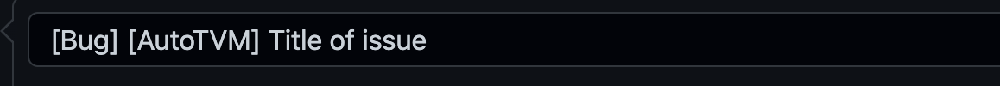
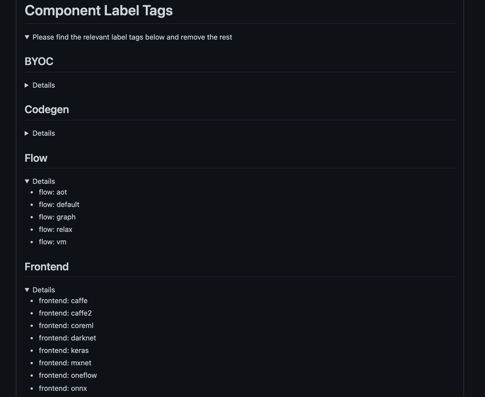

# Issue Triage

* Feature Name: `Update Issue Triage Workflow`
* Co-authored with @areusch, @denise

# **Summary**

This RFC proposes expanding functionality to the existing “New Issue” templates in order to allow for more a precise logging and tracking system for GitHub Issues. The updated templates will be leveraging a new `triage-bot` to automatically add relevant labels and cc the appropriate person(s). This RFC also includes establishing more current labels while discontinuing the use outdated labels (see bottom of the RFC for the list).

# **Motivation**

Currently, it is sometimes difficult to find and organize TVM’s GitHub Issues due to the lack of specificity. More specifically, our current means of classifying GitHub Issues is the `label` attribute, and many of the labels help only to identify the kind of issue (bug, feature, docs, etc). Most of our labels only vaguely correspond to logical components of the TVM codebase (for instance: `type: backend` — which backend?) and no longer aligns with the latest dev efforts. It is currently difficult, for example as a BYOC owner, to identify issues that the community believes should be resolved through changes to a BYOC implementation in TVM.

As the codebase grows, there is increasingly a need to be able to organize Issues according to the logical component of the codebase affected. Doing this allows folks with specific expertise and ownership to focus on a smaller set of issues. It also allows us as a community to more concretely establish issue triage as a role, increasing opportunity for advancement through non-code contribution.

GitHub Issue Templates can help with this, but in TVM these are primarily organized around the issue type (bug, feature, docs, etc) rather than sorting an issue by component.

This RFC hopes to more naturally organize TVM’s GitHub Issues by introducing new labels and leveraging a new `triage-bot` which can parse the issue title and body to assign labels and cc the appropriate contributors.

The overall goal of this RFC is to simplify and strengthen the issue triage workflow, in turn allowing the TVM community to more easily navigate and contribute to the project.

# **Guide-level explanation**

## Label Reorganization

Firstly, this RFC proposes to deprecate a number of the labels we currently use to identify codebase components and add a new set. The new set is much larger than the previous set; however, we believe the new set corresponds to the logical structure of TVM with more granularity. As discussed above, we think it’s important that folks volunteering to maintain a component have an easy way to identify the set of tasks/issues that need their attention.

To that end, we suggest the a new set of labels. We also suggest to modify `[CONTRIBUTORS.md](http://CONTRIBUTORS.md)` to reflect each Reviewer and Committer’s expertise in terms of these labels. As future work, the Auto-CC subscription tracker can then automatically better tag those with relevant expertise on relevant issues.

## GitHub Issue Templates

This RFC plans to phase out **`Update CI Docker Image`** going forward as there is no longer a strong need for it. The rest of the templates will stay.

The figure below shows the templates TVM uses now. We suggest to modify all remaining templates to assign a `needs-triage` label by default. This new label will alert either the new `triage-bot` or TVM contributors to sort the issue.

When a new issue is created with the `needs-triage` label, the `triage-bot` will parse the issue’s title or text body (see below for a discussion of options) for label tags. If one or more is found, `triage-bot` will remove `needs-triage` and add the found labels to the issue.

This RFC proposes to modify the :bug: **Bug Report** and :wrench: **Feature Tracking** templates to add instructions encouraging users to self-select which component an issue should belong to. These templates will link to a Markdown doc (checked into TVM) that lists all the label tags and includes a small description for the scope of each one. This will help the users find the appropriate label tags to use.

### Example User Workflow

In these templates, the `triage-bot` will parse the issue’s text body for tags in bullet form.

For example, when creating an issue concerning a bug in `autotvm` , the process would be -

1. The user would select the **Bug Report** template and will see a section shown in body to list the tags they would like to use. It will include a link to the document mentioned above which lists all the label tags.
2. The user would then add the relevant tags. In this case, they would add `autotvm`. In the case that the issue creator is unsure of which label tags to use, they can simply leave the label tag section blank. This template will add the `needs-triage` label by default which can alert other TVM contributors who can assist in properly sorting the issue.
3. After filling out the quick summary of the issue, they would post it. It will look like shown in this [example here](https://drive.google.com/file/d/12IHgPFcijcSsbHrY5IY9ACqDlpl2AbP9/view?usp=sharing) and will trigger the `triage-bot` to parse the issue body and add the appropriate label.
4. Then, the `triage-bot` removes the `needs-triage` label and adds the appropriate label. In this example, it would add `autotvm`.

If `triage-bot` is unable to find any labels, it will leave the issue alone. The `needs-triage` label will continue to indicate issues which need manual triage. We hope by establishing this category that it encourages more community members to work together to triage issues by consolidating those that need it into a single location.

### Rationale

This will improve quality of the issue tracking and make it easier to drill down on specific pain points for different components. Users will be able to quickly sort the issues by their areas of interests and needs.

Issues can have multiple labels tagged, although we ask community members to exercise their judgement and file issues in as few components as the situation necessitates.

Contributors can propose a new label by posting on the Discuss forum. Requests should include adequate scoping to justify the label, as was done in this doc. Labels can similarly be retired via a proposal on Discuss.

### Migration Work

After adding the new labels, we will take a couple of migration steps to ensure parity with other codebase descriptions:

1. Re-sort open issues into the new labels.
2. Modify `[CONTRIBUTORS.md](http://CONTRIBUTORS.md)` to identify committer areas of knowledge by reference to the labels.

# **Drawbacks**

While the changes this RFC is proposing can be beneficial, they can be confusing if used inexactly.

Possible pitfalls include improper tagging in issues leading to incorrect labels or lack of labels all together. This can create a time sink for other contributors who will need to correct the titles and/or labels.

Another risk is creating bloated issues with far too many labels. This RFC relies on the community’s best judgement when opening issues with the hope that an issue will not have excessive labels.

The net amount of labels this RFC proposes to deprecate and add will result in more labels than before. This can cause some confusion among the community. One way to mitigate is to publish a list of the new labels and a quick description for each one. The document can be referenced by the community.

# **Rationale and alternatives**

As the TVM community grows with diversifying components and interests, it is important to build and maintain a simple but robust issue tracking workflow.

While the current process works, it can sometimes be tedious to manually assign labels and cc appropriate people. This can cause issues that slip through the triage process and fail to be assigned to the right person(s).

This RFC hopes to scale up the issue tracking workflow, introduce more automation and reduce time spent on manual triaging.

## Alternatives

### Label Schema

There are a few alternatives to the proposed schema that might shorten the label schema and make for easier typing:

1. **Less aggressive grouping**. Specifically: remove `tune:` , `dev:`, `vert:` labels
2. **Fewer subcomponents**. Specifically: group `relay:ir`, `relay:op`, `relay:parser`, `relay:printer` into `relay:core`. Also group `tir:analysis` and `tir:arith` into `tir:analysis`, and `tir:ir`, `tir:op`, `tir:printer`, `tir:parser` into `tir:core`.

### Issue Filing Flow

1. **Title** - Instead of including the label tags in the issue body, the user can include them in the issue title. The `triage-bot` will then parse the title as opposed to the issue body. This plan will still include a document that lists all the label tags with short descriptions. Pros: Can be more intuitive to some users. It will also lead to a shorter issue template since the “Triage” section won’t be needed anymore. Cons: Adding multiple label tags will result in a long issue title making it harder to read.

2. **Dropdown** - The dropdown approach will still only introduce one template that will include drop downs sections for each high-level component (see example below). The user will remove the tags that are irrelevant leaving behind only ones that are needed.Pros: Remove the need to refer to the documentation that lists all the label tags.Cons: The issue template will be long due to all the label tags being listed.

3. **Component Specific Issue Templates** - This approach requires that each high level component such as “frontend” or “codegen” (identified in the labels below with `<component>:` prefixes) have its own issue template. Each of these high level component templates will include a list of its sub-components in the issue body that the user can prune to only post sub-components that are relevant to their post. Pros: Remove the need for another page with all the label tags and their descriptions. Can also provide some organization structure from the start of the triage process. Cons: Limits opportunities to open issues that include multiple high-level components. Results in a long list of issue templates and can look bloated to some users.

# **Future possibilities**

The goal is to establish a solid issue triage workflow that will be flexible to the community’s needs as well. As TVM continues to grow, the labels used will also evolve.

As a possible next step, it would be beneficial to gather a more comprehensive roster of responsible person(s) for each component and automatically assign them to issues. A [roster](https://github.com/apache/tvm/issues/10317) exists now that would need to be updated and formalized to take this effort further.

It would also be helpful to change the [auto-subscription cc tracker](https://github.com/apache/tvm/issues/10317) to use this list of labels as the list of topics that can be subscribed.

## New Labels

This section sketches most of the labels we anticipate creating. Upon initial triage (or in response to community feedback), we may create more.

* `byoc:<*codegen_backend*>` for each BYOC codegen backend in the compiler. Possible labels shown below:

|Label|Scope|
| --- | --- |
|byoc:ethosu|python/tvm/relay/op/contrib/|
||src/relay/backend/contrib/|
||src/relay/op/contrib/|
||src/runtime/contrib/|
||src/tir/contrib/|
|byoc:dnnl|python/tvm/relay/op/contrib/dnnl.py|
||src/relay/backend/contrib/dnnl|
||src/runtime/contrib/dnnl|
|byoc:cudnn|python/tvm/contrib/cudnn.py|
||python/tvm/relay/op/contrib/cudnn.py|
||src/relay/backend/contrib/cudnn|
|byoc:cmsis_nn|src/relay/backend/contrib/cmsis_nn|
|byoc:codegen_c|src/relay/backend/contrib/codegen_c|
|byoc:codegen_json|src/relay/backend/contrib/codegen_json|
|byoc:cublas|src/relay/backend/contrib/cublas|
|byoc:cudnn|src/relay/backend/contrib/cudnn|
|byoc:cutlass|src/relay/backend/contrib/cutlass|
|byoc:dnnl|src/relay/backend/contrib/dnnl|
|byoc:ethosn|src/relay/backend/contrib/ethosn|
|byoc:ethosu|src/relay/backend/contrib/ethosu|
|byoc:example_target_hooks|src/relay/backend/contrib/example_target_hooks|
|byoc:libtorch|src/relay/backend/contrib/libtorch|
|byoc:tensorrt|src/relay/backend/contrib/tensorrt|
|byoc:uma|src/relay/backend/contrib/uma|
|byoc:verilator|src/relay/backend/contrib/verilator|
|byoc:vitis_ai|src/relay/backend/contrib/vitis_ai|

* `backend:*<builds>`* for each possible backend in TVM (covers codegen and emitted `runtime::Module`). Possible labels shown below:

|Label|Scope|
| --- | --- |
|backend: aocl|src/target/source/codegen_aocl.cc|
||src/runtime/opencl/aocl|
|backend: aocl_sw_emu|src/target/source/codegen_aocl.cc|
|backend: c|src/target/source/codegen_c.cc|
|backend: cuda|src/target/opt/build_cuda_on.cc|
||src/runtime/cuda|
|backend: hybrid||
|backend: llvm|src/target/llvm/|
||src/runtime/library_module.cc|
|backend: metal|src/target/source/codegen_metal.cc|
||src/runtime/metal|
|backend: nvptx|src/target/llvm/codegen_nvptx.cc|
|backend: opencl|src/target/source/codegen_opencl.cc|
||src/runtime/opencl|
|backend: rocm|src/target/llvm/codegen_amdgpu.cc|
||src/runtime/rocm|
|backend: sdaccel|src/target/source/codegen_vhls.cc|
||src/runtime/opencl/sdaccel|
|backend: stackvm|src/target/stackvm/codegen_stackvm.cc|
||src/runtime/stackvm|
|backend: vulkan|src/target/spirv/build_vulkan.cc|
||src/runtime/vulkan|
|backend: webgpu|src/target/spirv/build_vulkan.cc|

* `core:<part>` for each core piece of TVM

|Label|Scope|
| --- | --- |
|core:ffi|python/tvm/_ffi|
||src/runtime/packed_func.cc|
|core:object|python/tvm/runtime/object.py|
||src/runtime/object.cc|
|core:rpc|src/runtime/rpc|
||src/runtime/minrpc.|

* `dev:<*category*>` for each category of developer infrastructure in TVM. Possible labels shown below:

|Label|Scope|
| --- | --- |
|dev:ci|issues regarding TVM CI, including scripts living in the TVM repo and configurations living in other public repositories|
|dev:test-infra|issues regarding test helpers within TVM, e.g. helpers within unit or integration test code|
|dev:tools|issues regarding TVM developer-facing tools, e.g. code within tools after the dev tools reorg lands|

* `docs` for any issues regarding TVM’s documentation.
* `flow:<*codegen_path*>` for each graph-level codegen flow in the compiler. Possible labels shown below:

|Label|Scope|
| --- | --- |
|flow:aot|src/relay/backend/aot_executor_codegen.cc|
|flow:graph|src/relay/backend/graph_executor_codegen.cc|
|flow:vm|src/relay/backend/vm/*|

* `flow:<*lowering_path*>` for each lowering flow in the compiler. Possible labels shown below:

|Label|Scope|
| --- | --- |
|flow:relay|The overall lowering flow for tvm.relay.build, including BYOC core. Excludes the TIR portion of the flow in flow:tir. python/tvm/relay/build_module.py, src/relay/backend not covered by other flow execution paths|
|flow:tir|The overall lowering flow for schedules and TIR (tvm.build). python/tvm/driver, src/driver.|

* `frontend:<*framework*>` for each importer in TVM. Possible labels shown below:

|Label|Scope|
| --- | --- |
|frontend:caffe|python/tvm/relay/frontend/caffe*|
|frontend:coreml|python/tvm/relay/frontend/coreml.py|
|frontend:darknet|python/tvm/relay/frontend/darknet.py|
|frontend:keras|python/tvm/relay/frontend/keras.py|
|frontend:mxnet|python/tvm/relay/frontend/mxnet*|
|frontend:nnvm|python/tvm/relay/frontend/nnvm_common.py|
|frontend:oneflow|python/tvm/relay/frontend/oneflow.py|
|frontend:onnx|python/tvm/relay/frontend/onnx.py|
|frontend:pytorch|python/tvm/relay/frontend/*torch*|
|frontend:tensorflow|python/tvm/relay/frontend/tensorflow*|
|frontend:tflite|python/tvm/relay/frontend/tflite*|

* `relay:<*component*>` for each component of `relay`. Possible labels shown below:

|Label|Scope|
| --- | --- |
|relay:analysis|src/relay/analysis|
|relay:collage|src/relay/collage|
|relay:ir|src/relay/ir|
|relay:op|src/relay/op|
|relay:parser|Relay parser: src/parser|
|relay:printer|Relay printer: src/printer/relay_text_printer.cc|
|relay:qnn|src/relay/qnn|

* `rpc` for the RPC protocol and its common implementation (across C and c++ runtimes).
* `runtime:<*library*>` for each runtime library. Possible labels shown below:

|Label|Scope|
| --- | --- |
|runtime:c|C runtime: src/runtime/crt, excluding RPC.|
|runtime:c++|C++ runtime: src/runtime, excluding crt and RPC|

* `topi` for templated operators in `python/tvm/topi`.
* `tir:<*component*>` for each component of `tir`. Possible labels shown below:

|Label|Scope|
| --- | --- |
|tir|any TIR core issues which don’t fit into any of the following categories (include/tvm/tir, src/tir)|
|tir:analysis|src/tir/analysis excluding src/tir/analysis/contrib|
|tir:arith|src/arith|
|tir:ir|src/tir/ir, and wrappers in python/tvm/tir|
|tir:op|src/tir/op, and wrappers in python/tvm/tir|
|tir:printer|TIR printer:python/tvm/script, src/printer/tir_text_printer.cc, src/printer/tvmscript_printer.cc|
|tir:parser|TIR parser: python/tvm/script|
|tir:schedule|S-TIR and utilities: src/tir/schedule and python/tvm/tir/schedule|
|tir:transform|TIR transforms: src/tir/transforms and python/tvm/tir/transforms|

* `tune:<*tuner*>` for each tuning technology. Possible labels shown below:

|Label|Scope|
| --- | --- |
|tune:auto_scheduler|src/auto_scheduler, python/tvm/auto_scheduler|
|tune:autotvm|src/autotvm, python/tvm/autotvm|
|tune:meta_schedule|src/meta_schedule, python/tvm/meta_schedule|

* `vert:<*component*>` for each vertical component of TVM. Possible labels shown below:

|Label|Scope|
| --- | --- |
|vert:android|issues affecting Android vertical|
|vert:hexagon|issues affecting Hexagon vertical|
|vert:ios|issues affecting iOS deployment vertical|
|vert:micro|MicroTVM: src/runtime/micro, src/runtime/crt, apps/microtvm|
|…|(additional added on request or initial triage)|

## Proposed Labels to Deprecate

*High-level component : specific section*

1. Backlog
2. Core complier reorg
3. microtvm:arch
4. priority:high
5. priority:low
6. priority:medium
7. status: api design review
8. inactive
9. status: need experimental markup
10. status: review in progress
11. status: RFC
12. status: stale
13. status: superseded
14. status: vote
15. type: backend
16. type: installation
17. type: perf-regression
18. type: question
19. type: topi (move to `topi` label)
