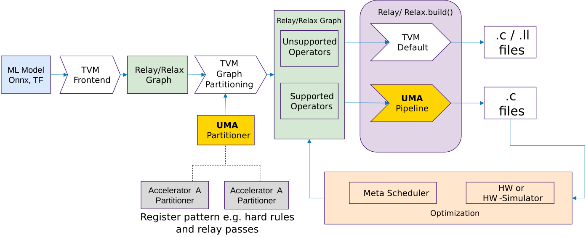
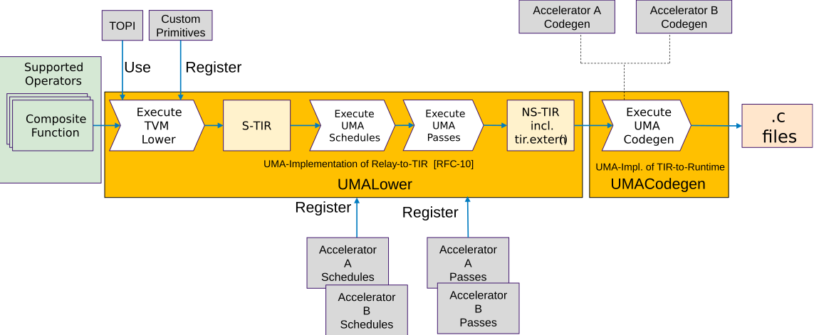

# UMA: Universal Modular Accelerator Interface

    Feature Name: Universal Modular Accelerator Interface (UMA)
    Start Date: 2022 February
	Authors: 
	  Paul Palomero Bernardo @paulpb, Christoph Gerum @cgerum - University of Tübingen
      Michael J. Klaiber @mjklaiber, Ingo Feldner - Bosch Research
      Philipp van Kempen @philippvk, Rafael Stahl @r.stahl, Daniel Müller-Gritschneder - Technical University of Munich
	  Johannes Partzsch - TU Dresden
	  Andrew Stevens - Infineon Technologies
    RFC PR: TBD
    GitHub Issue: TBD

## Summary


The goal of **UMA (Universal Modular Accelerator Interface)** is to create a unified infrastructure for easily integrating external accelerators into TVM. 
UMA provides file structures, Python interface classes and an API for accelerator integration. These interfaces and API are accessible from Python and are part of the components *UMA Partitioner*, *UMA Lower* and *UMA Codgen*. 
The features and proposals of *Target registered compiler flow customization* [TVM-RFC0011] and [TVM-RFC0010] are considered, with the difference that UMA tries to provide a more general interface for integrating new accelerators and one specific implementation of the hooks described in [TVM-RFC0011]. 


<br clear="left"/>

<sub><sup> Image Source:  https://www.flickr.com/photos/luvi/234261205 under CC BY-NC-ND 2.0</sup></sub>


##  Goal and Motivation

A number of accelerators have already been integrated into TVM, e.g. VTA, ARM EthosU. 
These are similar in both the structure of their build flow and the operations that they can offload.
Nonetheless, due to incremental independent development, the TVM interfaces and processing steps used are quite different with little commonality.  A consistent, unified, infrastructure would simplify accelerator integration making it accessible to smaller, hardware-focused, development teams.

The **goal** of UMA is to establish two API layers with a different target groups of users:

**Porcelain Layer**: UMA
  - Straight-forward, *Python-only* and stable API wrapper of plumbing layer
  - Easy and clearly-defined template for integration of accelerators
  - Short learning period for hardware/software engineers new to TVM

**Plumbing Layer**: 
  - Collage-like API [COLLAGE-RFC](https://github.com/mbs-octoml/mbs-tvm-rfcs/blob/mbs-rfcs-collage/rfcs/xxxx-collage.md) + other TVM APIs
  - Powerful API to core-compiler + other TVM features
  - Target audience is experienced TVM users/developers
  - C++ and Python APIs


## Focus

UMA's primary objective is to enable straight-forward TVM integration of loosely-coupled processor/microcontroller controlled accelerators.  That is, accelerators capable of executing complete tensor operations or operation-graphs without host processor intervention.
Secondary objectives are:

* Support for closely-coupled accelerators (those offload parts of  CPU computation for significant elements of tensor operations)
* Compatibility with both run-time or ahead-of-time compilation
* Support for heterogeneous execution utilizing accelerators optimized for specific operations or data types

Accelerator support or optimization functions **outside** the scope of UMA are:

* Parallel execution on multi-accelerator architectures (to be handled by executor/run-time and customized layer splitting)
* Real-time execution (to be handled by executor/run-time)
* High-level support for parameter conversion like quantization or sparsity exploitation (to be realized via model pre-processing or in accelerator backends)

## Guide-level explanation 


### Flow description 


The figure below describes the UMA interface from a top level. An *Accelerator Partitioner* which is a specialization of the *UMA Partitioner* takes the Relay graph and matches for supported and unsupported operators. Unsupported operators are processed with the default TVM flow. Supported operator are processed with **UMA Pipeline**.
In the following the tasks and the functionality of each block in the figure below is described:



UMA Partitioner: 
* Register relay passes
* Register patterns - supported sub-graph operations
* Order: pre-partitioning passes, Graph partitioning, post-partitioning passes
* API level:
    * UMA Partitioner creates a wrapper API to TVM core-compiler APIs
    * *UMAPartitioner* baseclass (Python only) has to be inherited by accelerator-specific Partitioners (e.g. Accelerator A Partitioner, etc)

The figure below described the *UMA Pipeline*. The blocks are described below:



UMA Pipelining:
* Consists of UMALower and UMACodgen, which implement the target hook Relay-to-TIR and TIR-to-Runtime (proposed in [TVM-RFC0010])
* UMALower
  * Input: Partitioned composite functions
  * Custom primitives can be registered
  * Lowering from Relay to S-TIR, using TOPI or custom primitives 
  * Interface for registering accelerator-specific schedules and passes
  * Execution of UMA schedules and passes on S-TIR
  * Output:  NS-TIR(including tir.extern calls)
  * UMALower baseclass (Python only) has to be inherited by accelerator-specific Lower classes (e.g. Accelerator A Lower, etc)
* UMACodegen
  * Input: NS-TIR(including tir.extern calls)
  * Defaults to standard TVM codegen
  * Intend is to provide a Python interface to insert/emit target code
  * UMACodegen baseclass has to be inherited by accelerator-specific Codegen classes (e.g. Accelerator A Codegen, etc)
  * Output: Target .c files

The intention is to use TensorIR with MetaScheduler for optimization and Relax (a possible succesor of Relay [video link](https://www.youtube.com/watch?v=xVbkjJDMexo)) in later versions.


Abbreviations:
S-TIR: Schedulable TIR
NS-TIR: Non-Schedulable TIR

### Adding a New Custom Accelerator

A custom accelerator is added by inheriting the `UMABackend`. New elements (e.g., passes, schedules) are added using a registration machanism.
```python
"""UMA backend for the UltraTrail accelerator"""

class UltraTrailBackend(UMABackend):
    def __init__(self):
        super(UltraTrailBackend, self).__init__()
        
        # Configuration parameters
        self._register_config({"partitioning.enable_MergeCompilerRegions": False}) # Example config parameter

        # Relay to Relay function registration
        self._register_pattern("conv1d_relu", conv1d_relu_pattern())

        self._register_relay_pass(1, ConfigGenerator())
        self._register_relay_pass(2, BufferScopeAnnotator())

        # Relay to TIR function registration
        self._register_operator_strategy("nn.conv1d", custom_conv1d_strategy, plevel=9)

        self._register_tir_schedule(insert_extern_calls)

        self._register_tir_pass(0, CodegenGenerateConfig())
        self._register_tir_pass(0, CodegenGenerateConstants())

        # TIR to runtime function registration
        self._register_codegen(format="c", includes=None, constants=None, replace_call_extern=None)

    @property
    def target_name(self):
        return "ultra_trail"
```

## Reference-level explanation 


### File and class structure and Snippets as example for integration
UMA provides a mostly python-based API. On the C++ side, new targets are registered using target hooks (RFC #0010). A generic `codegen.cc` handles the calls to the python side.
```
.
├── codegen.cc
└── targets.cc
```
```cpp
TVM_REGISTER_TARGET_KIND("accelerator_A", kDLCPU)
    .set_attr<FTVMRelayToTIR>("RelayToTIR", relay::contrib::generic::RelayToTIR("accelerator_A"))
    .set_attr<FTVMTIRToRuntime>("TIRToRuntime", relay::contrib::generic::accelerator_A::TIRToRuntime);

TVM_REGISTER_TARGET_KIND("accelerator_B", kDLCPU)
    .set_attr<FTVMRelayToTIR>("RelayToTIR", relay::contrib::generic::RelayToTIR("accelerator_B"));
    .set_attr<FTVMTIRToRuntime>("TIRToRuntime", relay::contrib::generic::accelerator_B::TIRToRuntime);
```
The python API is structured as shown below. The base class `UMABackend` functions as the core API. It uses the API points described in the [flow description](#flow-description) to register elements for the different stages.
```
.
├── backend.py
├── api
│   ├── codegen.py
│   ├── lower.py
│   ├── partitioner.py
│   └── utils.py
├── accelerator_A
│   ├── backend.py
│   ├── codegen.py
│   ├── passes.py
│   ├── patterns.py
│   ├── schedules.py
│   └── strategies.py
└── accelerator_B
    └── ...
```

### UMABackend class

Once a `UMABackend` is registered (as shown in Guide-level explanation), it hooks into the usual `relay.build` process to create the code for the target accelerator.
```
# Load model
mod, params = relay.frontend.from_pytorch(scripted_model, [("input_data", input_shape)])

# Register a UMA backend
UltraTrailBackend().register()
mod = UltraTrailBackend().partition(mod)

# Relay build (AOT C target)
TARGET = tvm.target.Target("c")
RUNTIME = tvm.relay.backend.Runtime("crt")
EXECUTOR = tvm.relay.backend.Executor("aot", {"unpacked-api": True})

with tvm.transform.PassContext(
    opt_level=3, config={"tir.disable_vectorize": True}, disabled_pass=["AlterOpLayout"]
):
    module = relay.build(mod, target=TARGET, runtime=RUNTIME, executor=EXECUTOR, params=params)
```

#### UMABackend References

#### _register_config
```python
UMABackend._register_config(parameters: dict)
```
The following ```parameters``` are allow to be passed via ```_register_config```.

Table of supported parameters:

|Parameter name|Type|Default|Description|
|--------------|-----------|-----------|-----------|
|partitioning.enable_MergeCompilerRegions|bool |True |MergeCompilerRegions pass is used for partitioning

This list is not complete and it is the intend of **THIS RFC** to find a small set of necessary parameters. 

Example usage:
```python
UMABackend._register_config({"partitioning.enable_MergeCompilerRegions": False})
```

#### _register_pattern
```python
UMABackend.self._register_pattern()
```
TODO