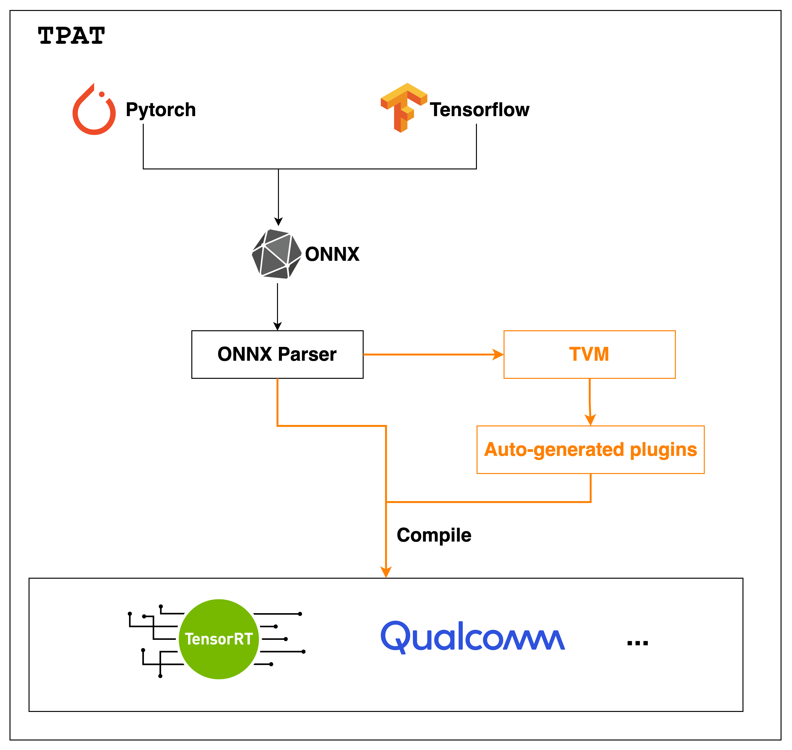
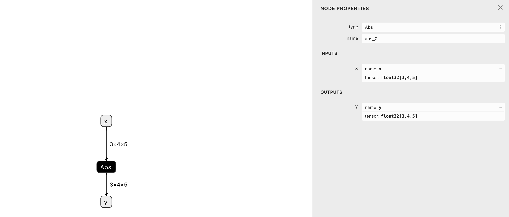
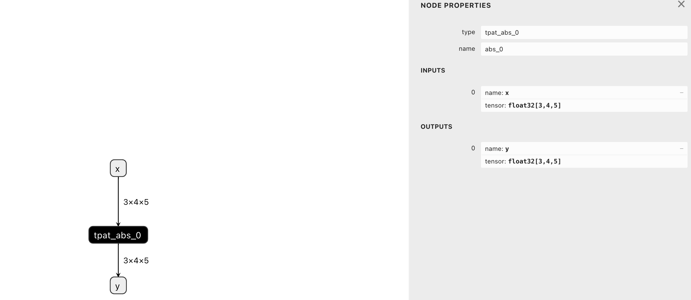

- Feature Name: (TPAT, TVM Plugin Autogen Tool)
- Start Date: (2023-08-11)
- RFC PR: [apache/tvm-rfcs#0103](https://github.com/apache/tvm-rfcs/pull/0103)
- GitHub Issue: [apache/tvm#0000](https://github.com/apache/tvm/issues/0000)

# Summary

This RFC introduce TPAT, which stands for **T**VM **P**lugin **A**utogen **T**ool. It utilizes TVM to generate optimized plugins/extensions for vendor-specific acceleration library, in this way, we can effectively to combine the strengths of both TVM and vendor library to achieve optimal performance.

# Motivation

Currently, the integration strategy between TVM and vendor library is to offload operators from Relay to vendor library. Ideally, this can provide a performance boost without the need to tune schedules. However, at practice, the partition strategy is not perfect now, I've noticed that as the number of subgraphs increases, the performance gap between this method and purely vendor library increases (I think one of the reasons is that an excessive number of subgraphs cannot fully utilize the L1/L2 cache, see [issue](https://github.com/apache/tvm/issues/15379)). After some research, I find [TPAT](https://blogs.nvidia.cn/2022/07/19/tencent-teg-tensorrt-plugin-autogen-tool/), which developed by Tencent and Nvidia, they also have a [talk](https://www.youtube.com/watch?v=qNyFrtcGd7k) at TVMCon 2021, though they haven't synchronized it with the upstream for a long time, but it's an awesome idea, and it is here again!

Vendor-specific acceleration libraries like TensorRT, QNN often represent the state-of-the-art (SOTA) capabilities of their respective platforms. Additionally, both TensorRT and QNN provide the capability to incorporate user-defined operator implementations through plugins. Natuarally, By leveraging TVM to optimize specific operators and dynamically inserting them into the vendor's acceleration library, it is believed that this approach can effectively combine the strengths of both TVM and the vendor-specific acceleration library to achieve optimal performance levels.

# Guide-level explanation

Taking TensorRT as an example, currently the integration strategy between TVM and TensorRT is to offload as many operators as possible from Relay to TensorRT, this way, TensorRT is kinda like a **plugin library** for TVM.

Contrarily, TPAT works the other way around. It centers around vendor-specific acceleration libraries like TensorRT, QNN, but using *TVM* as a plugin library.

And the big picture of TPAT is like:



## Inputs

The inputs for TPAT are as follows:

- An ONNX file.
- A list of nodes to be tuned by TVM.
- Tunning option, including tunning method, trial count, etc.
- The target vendor library, like TensorRT, QNN, etc.

## Outputs

The outputs for TPAT are as follows:

- Path of the output ONNX file which has been modified.
- A list of paths where the plugins are saved.

## API

Different vendor library targets have different entry.

- The entry for TensorRT should be `python/tvm/tpat/cuda/pipeline.py`.
- The entry for Qualcomm should be `python/tvm/tpat/qnn/pipeline.py`.

But they have a similar API.

```py
def pipeline(
    onnx_file: str, node_names: list[str], enable_tunning: bool, tunning_option: object, output_onnx: str
) -> Tuple[str, list[str]]:
    """Generate plugins for specified nodes in an ONNX model.
    This function is the entry point for generating plugins for specific nodes as requested by users.
    Parameters
    ----------
    onnx_file : str
        Path to the input ONNX file.
    node_names : list[str]
        Names of the nodes to be generated as TensorRT plugins.
    enable_tunning : bool
        Flag indicating whether tunning is enabled.
    tunning_option : object
        Tunning option provided for ms.relay_integration.tune_relay, you don't need to specify mod, params and target.
    output_onnx : str
        Path to the output ONNX file where the modified model will be saved.
    Returns
    -------
    Tuple[str, List[str]]
    A tuple containing the path to the output ONNX file and a list of generated plugin paths.
    """
```

## An example

Still, taking TensorRT as the example.

Here is an `Abs` operator.



After generating plugin using `pipeline` method, the modified ONNX model will look like:



And it will generate plugin named `tpat_abs_0.so`, later users can register it into TensorRT.

# Reference-level explanation

The ultimate goal of TPAT is provide a unified interface to automatically generate plugins/extensions for vendor-specific acceleration libraries like TensorRT, QNN, etc using TVM.

Take TensorRT as an example. The general steps are as follows:

1. Load ONNX model from file.
2. Retreive all nodes which need to be tunned.
3. For each node:
   1. Extract this node from original model to a seperate ONNX submodel.
   2. Use TVM to autotune this submodel, get the build module and graph executor.
   3. Fill in the template, this will use data such as the cuda source code, the number and shape of output, workspace size, invoke order of kernel functions, params order of each kernel function,  thread config of each kernel, etc.
   4. Use NVCC to compile the template and generate shared library for later use.

## Detailed description

### TensorRT

#### Plugin Template

**Header file:**

At `python/tvm/tpat/cuda/plugin/trt8.0_plugin_h.template`.

<details>
  <summary>Click me to expand</summary>
  
  ```cpp
  #include "NvInfer.h"
  #include <iostream>
  #include <cstring>
  #include <vector>
  #include <assert.h>

  namespace nvinfer1
  {
  namespace plugin
  {

  class {{plugin_name}}: public IPluginV2DynamicExt {
  public:
      {{plugin_name}}() {}
      
      {{plugin_name}}(const void *buffer, size_t length) {
      }

      virtual size_t getSerializationSize() const noexcept override {
          return 0;
      }
      virtual void serialize(void *buffer) const noexcept override {}
      
      //! The combination of kLINEAR + kFLOAT is supported.
      bool supportsFormatCombination(int pos, const PluginTensorDesc* inOut, int nbInputs, int nbOutputs) noexcept override
      {
          bool condition = true;
          if (pos == {{ loop.index0 }}){
              //std::cout << (inOut[pos].format == nvinfer1::TensorFormat::k{{tensor_format.format}}) << ", " << (inOut[pos].type == nvinfer1::DataType::k{{tensor_format.type}}) << std::endl;
              condition &= inOut[pos].format == nvinfer1::TensorFormat::k{{tensor_format.format}};
              condition &= inOut[pos].type == nvinfer1::DataType::k{{tensor_format.type}};
          }
          
          return condition;
      }

      nvinfer1::IPluginV2DynamicExt* clone() const noexcept override {
          return new {{plugin_name}}();
      }
      int getNbOutputs() const noexcept override {
          //std::cout << __FUNCTION__ << std::endl;
          return {{plugin_output_number}};
      }
      nvinfer1::DimsExprs getOutputDimensions(int outputIndex, const nvinfer1::DimsExprs* inputs, int nbInputs, nvinfer1::IExprBuilder& exprBuilder) noexcept override {
          //std::cout << __FUNCTION__ << std::endl;
          if (outputIndex == {{ loop.index0 }}){
              nvinfer1::DimsExprs output_shape;
              output_shape.nbDims = {{tensor_dims.nbdims}};
              output_shape.d[{{loop.index0}}] = exprBuilder.constant({{s}});
              
              return output_shape;
          }
          
      }
      nvinfer1::DataType getOutputDataType(int index, const nvinfer1::DataType* inputTypes, int nbInputs) const noexcept override{
          //std::cout << __FUNCTION__ << std::endl;
          if (index == {{ loop.index0 }}){
              return nvinfer1::DataType::k{{type}};
          }
          
      }
      size_t getWorkspaceSize(const nvinfer1::PluginTensorDesc* inputs, int nbInputs, const nvinfer1::PluginTensorDesc* outputs, int nbOutputs) const noexcept override{
          return {{plugin_workspace_size}};
      }
      int enqueue(const nvinfer1::PluginTensorDesc* inputDesc, const nvinfer1::PluginTensorDesc* outputDesc, const void* const* inputs, void* const* outputs, void* workspace, cudaStream_t stream) noexcept override;

      void configurePlugin(const nvinfer1::DynamicPluginTensorDesc* in, int nbInputs, const nvinfer1::DynamicPluginTensorDesc* out, int nbOutputs) noexcept override {}
      int initialize() noexcept override {return 0;}
      void terminate() noexcept override {}
      void destroy() noexcept override { delete this; }
      void setPluginNamespace(const char* szNamespace) noexcept override {mNamespace = szNamespace;}
      const char* getPluginNamespace() const noexcept override {return mNamespace.c_str();}
      const char* getPluginType() const noexcept override {return "{{plugin_name}}";}
      const char* getPluginVersion() const noexcept override {return "1";}
      void attachToContext(cudnnContext * /*cudnn*/, cublasContext * /*cublas*/, nvinfer1::IGpuAllocator * /*allocator*/) noexcept {}
      void detachFromContext() noexcept {}

  private:
      const char* mPluginNamespace;
      std::string mNamespace;
  };

  class {{plugin_name}}Creator: public nvinfer1::IPluginCreator {
  public:
      {{plugin_name}}Creator(){
      mFC.nbFields = mPluginAttributes.size();
      mFC.fields = mPluginAttributes.data();
      }
      nvinfer1::IPluginV2DynamicExt* deserializePlugin(const char* name, const void* serialData, size_t serialLength) noexcept override {
          {{plugin_name}}* obj = new {{plugin_name}}{serialData, serialLength};
          obj->setPluginNamespace(mNamespace.c_str());
          return obj;
      }
      
      const char* getPluginName() const noexcept override {return "{{plugin_name}}";}
      const char* getPluginVersion() const noexcept override {return "1";}

      void setPluginNamespace(const char* szNamespace) noexcept override {mNamespace = szNamespace;}
      const char* getPluginNamespace() const noexcept override {return mNamespace.c_str();}
      
      const nvinfer1::PluginFieldCollection* getFieldNames() noexcept override {
          //std::cout << __FUNCTION__ << std::endl;
          return &mFC;
      }
      nvinfer1::IPluginV2DynamicExt* createPlugin(const char* name, const nvinfer1::PluginFieldCollection* fc) noexcept override {
          //std::cout << __FUNCTION__ << std::endl;
          {{plugin_name}}* obj = new {{plugin_name}}{};
          obj->setPluginNamespace(mNamespace.c_str());
          return obj;
      }
  private:
      std::string mNamespace;
      static PluginFieldCollection mFC;
      static std::vector<PluginField> mPluginAttributes;
  };

  } // namespace plugin

  } // namespace nvinfer1
  ```

</details>

This will register class `{{plugin_name}}`, whose base class is `IPluginV2DynamicExt`, and class `{{plugin_name}}Creator`, whose base class is `IPluginCreator`.

The parameters need by header file are:

1. **plugin_name:** used by `constructor`, `destructor`, `clone`, `getPluginType` in class `{{plugin_name}}`, and `constructor`, `deserializePlugin`, `getPluginName`, `createPlugin` in class `{{plugin_name}}Creator`, this should be the same with the modified name of ONNX node, in this way TensorRT can automatically register it.
2. **plugin_tensor_format:** used by `supportsFormatCombination` method in class `{{plugin_name}}`, TensorRT invokes this method to ask if the input/output indexed by pos supports the format/datatype specified by `inOut[pos].format` and `inOut[pos].type`, see [docs](https://docs.nvidia.com/deeplearning/tensorrt/api/c_api/classnvinfer1_1_1_i_plugin_v2_dynamic_ext.html#aea845140b27ee59c08f6304b84addc72) for detailed description.
3. **plugin_output_number:** used by `getNbOutputs` method in class `{{plugin_name}}`, which returns the output number.
4. **plugin_output_shape:** used by `getOutputDimensions` method in class `{{plugin_name}}`, which returns the output shape.
5. **plugin_output_type:** used by `getOutputDataType` method in class `{{plugin_name}}`, which returns the output type.
6. **plugin_workspace_size:** used by `getWorkspaceSize` method, which returns the workspace size required by the layer.

**Source file:**

At `python/tvm/tpat/cuda/plugin/trt8.0_plugin_cu.template`.

<details>
  <summary>Click me to expand</summary>
  
  ```cpp
  #include "{{plugin_name}}.h"
  #include <cuda_runtime.h>
  #include <thread>
  #include <stdio.h>
  #include <nvfunctional>
  #include <chrono>

  #define BLOCKSIZE_X 16
  #define BLOCKSIZE_Y 16

  using namespace nvinfer1;
  using namespace plugin;

  // CUDA Runtime error messages
  #ifdef __DRIVER_TYPES_H__
  static const char *_cudaGetErrorEnum(cudaError_t error)
  {
    return cudaGetErrorName(error);
  }
  #endif

  template <typename T>
  void check(T result, char const *const func, const char *const file,
            int const line)
  {
    if (result)
    {
      fprintf(stderr, "CUDA error at %s:%d code=%d(%s) \"%s\" \n", file, line,
              static_cast<unsigned int>(result), _cudaGetErrorEnum(result), func);
      exit(EXIT_FAILURE);
    }
  }
  #define checkCudaErrors(val) check((val), #val, __FILE__, __LINE__)


  {{plugin_kernels_body}}

  PluginFieldCollection {{plugin_name}}Creator::mFC{};
  std::vector<PluginField> {{plugin_name}}Creator::mPluginAttributes;

  int {{plugin_name}}::enqueue(const nvinfer1::PluginTensorDesc* inputDesc, const nvinfer1::PluginTensorDesc* outputDesc, const void* const* inputs, void* const* outputs, void* workspace, cudaStream_t stream) noexcept {
      
      const {{constant.type}} constant_{{constant.index}}[{{constant.length}}] = { {{constant.value}} };
      checkCudaErrors(cudaMemcpyAsync({{constant.pos}}, &constant_{{constant.index}}, {{constant.length}} * sizeof({{constant.type}}), cudaMemcpyHostToDevice, stream));
      
      dim3 dimBlock, dimGrid;
      
      dimGrid = dim3{{kernel.grid_dim}};
      dimBlock = dim3{{kernel.block_dim}};
      {{kernel.name}}<<<dimGrid, dimBlock, 0, stream>>>({{kernel.enqueue_params}});
      
  }

  REGISTER_TENSORRT_PLUGIN({{plugin_name}}Creator);
  ```

</details>

The parameters need by source file are:

1. **plugin_name:** used to specify class name.
2. **plugin_kernels_body:** the cuda source code.
3. **plugin_constant_init"** the constants params which should be initialized.
4. **plugin_kernels_params:** the kernel functions configuration, including invoke order, grid dim and block dim, params order, etc.

#### Makefile

At `python/tvm/tpat/cuda/plugin/Makefile`.

Users should change `CUDA_PATH`, `CUDNN_PATH`, `TRT_PATH` and `ARCH`.

<details>
  <summary>Click me to expand</summary>
  
  ```makefile
  # Variables need to be defined by Users
  CUDA_PATH   = /path/to/cuda
  CUDNN_PATH = /path/to/cudnn
  TRT_PATH = /path/to/TensorRT
  ARCH = sm_86
  ########################################

  CUDA_INC_PATH = $(CUDA_PATH)/include
  CUDA_LIB_PATH  = $(CUDA_PATH)/lib
  CUDA_COM_PATH = $(CUDA_PATH)/samples/common/inc

  CUDNN_INC_PATH = $(CUDNN_PATH)/include
  CUDNN_LIB_PATH = $(CUDNN_PATH)/lib

  TRT_INC_PATH   = $(TRT_PATH)/include
  TRT_LIB_PATH = $(TRT_PATH)/lib

  GCC = g++
  NVCC = $(CUDA_PATH)/bin/nvcc
  CCFLAGS = -w -std=c++11
  INCLUDES := -I. -I$(CUDA_COM_PATH) -I$(CUDA_INC_PATH) -I$(CUDNN_INC_PATH) -I$(TRT_INC_PATH) -I/usr/include

  LDFLAGS := -L$(CUDA_LIB_PATH) -L$(CUDNN_LIB_PATH) -L$(TRT_LIB_PATH)
  LDFLAGS += -lnvinfer -lcudart -lcuda

  LDFLAGS += -Wl,-rpath=$(CUDA_LIB_PATH)
  LDFLAGS += -Wl,-rpath=$(CUDNN_LIB_PATH)
  LDFLAGS += -Wl,-rpath=$(TRT_LIB_PATH)

  SO = $(plugin_name).so
  OBJ = $(shell find . -name '*.o')
  DEP = $(OBJ:.o=.d)

  SRCDIR := ./src
  OBJDIR := ./obj
  LIBDIR := ./lib

  all: $(SO)

  $(plugin_name).so: $(plugin_name).o

  -include $(DEP)

  clean:
    rm -rf $(LIBDIR)/$(SO) $(OBJDIR)/*

  %.o: $(SRCDIR)/%.cpp
    $(AT)if [ ! -d $(OBJDIR) ]; then mkdir -p $(OBJDIR); fi
    $(GCC) $(CCFLAGS) -fPIC -MD -MP $(INCLUDES) -o $@ -c $<

  %.o: $(SRCDIR)/%.cu
    $(AT)if [ ! -d $(OBJDIR) ]; then mkdir -p $(OBJDIR); fi
    $(NVCC) $(CCFLAGS) -M -MT $@ $(INCLUDES) -o $(@:.o=.d) $<
    $(NVCC) $(CCFLAGS) $(INCLUDES) -Xcompiler -fPIC -arch=$(ARCH) -o $@ -c $<

  $(SO):
    $(GCC) $(CCFLAGS) -shared -o $@ $+ $(LDFLAGS)
    $(AT)if [ ! -d  $(LIBDIR) ]; then mkdir -p $(LIBDIR); fi
    $(AT) mv *.o   $(OBJDIR)/
    $(AT) mv *.d   $(OBJDIR)/
    $(AT) mv *.so $(LIBDIR)/
  ```

</details>

## QNN

- [ ] **TODO**, I'm not familiar with QNN yet.

# Drawbacks

N/A

# Rationale and alternatives

N/A

# Prior art

Tencent TEG and NVIDIA jointly developed TPAT and published it at [TVMCon 2021](https://www.youtube.com/watch?v=qNyFrtcGd7k), but they don't update it for a long time.

# Unresolved questions

- Support Relax frontend
- Support AutoTVM and AutoScheduler
- Improve the API on the C++ side
- Explore dynamic batch support
- QNN plugin template

# Future possibilities

- Given an ONNX model, provide the ability to automatically search better performance nodes and generate plugins for it.
